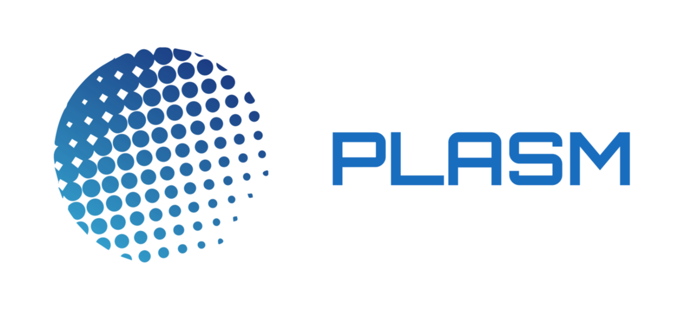

# 欢迎 💁

## Welcome to the Plasm Network documentation!

Plasm Network是可拓展可交互式的Web3.0基础构架。使用[Parity’s Substrate framework](https://www.substrate.io/)搭建，Plasm Network未来将成为作为可拓展化智能合约平台的[Polkadot](https://polkadot.network/) **平行链**。由于[Polkadot](https://polkadot.network/)中继链并不支持智能合约，这让Plasm Network成为极具潜力的解决方案：拓展性是DApp开发者所面临的最巨大挑战；而理想情况下，未来开发者在Plasm Network上开发应用将无需再担心拓展性问题。

社区贡献运维地址：
[https://github.com/stakedtechnologies/Plasm](https://github.com/stakedtechnologies/Plasm)

Plasm Network是一个开源项目。欢迎大家参与!

## 希望了解更多? 请访问 👇



## 希望在Plasm Network上进行开发? 请访问 👇



## 希望运行一个节点? 请访问 👇



