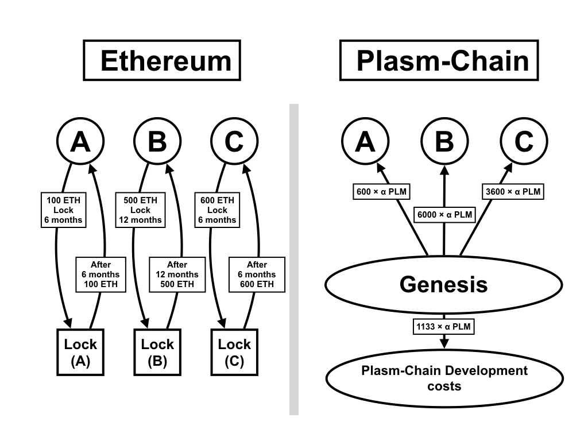

# Plasm Chain Token Design

In this chapter, we describe the Plasm token economic design. The Plasm leverages a token model called [Lockdrop](https://blog.edgewa.re/full-details-on-the-edgeware-lockdrop/) which is invented by [Edgeware](https://edgewa.re/). To participate in the lockdrop, individuals need to lock ETH (or DOT) for their selected duration of the lockdrop. After that, the same amount of ETH (or DOT) will be returned. Based on the amount they locked, they can get PLM tokens because they collateralized the opportunity costs. We extend this token model as described below. 

## Lockdrop Overview

The Plasm has the first lockdrop by collateralizing the opportunity cost of ETH. Hence, this explanation is based on the lockdrop on Ethereum. However, the lockdrop should be possible on any blockchains that have a TimeLock function.

**The First Lockdrop Processes**

1. Ethereum token holders are able to lock their ETH on a LockContract for their selected duration. (e.g. 3 months) The longer the timelock is, the more Plasm tokens they get.
2. Plasm tokens are distributed on the genesis block to the participants who locked their ETH. A participant gets  `Locked ETH × Locked duration × α` Plasm tokens.
3. The genesis block of Plasm chain distributes 10% ( `The total amount of distributed tokens × 1/9`) Plasm tokens  to the Plasm team.
4. After the selected locked time, the locker receives exactly the same number of ETH.

Ethereum token holder has opportunity costs depending on the locked amount and the locked duration. Plasm tokens are issued relying on their values.  We don't decide the total supply of Plasm at the first point because we intend to do two lockdrops (in total three lockdrops) after the genesis and distribute tokens more equally.  More specifically, the token distribution model is written below.

## Multi-Lockdrops

The total supply of Plasm tokens is not decided at the genesis. Technically speaking, it is determined at the 3rd lockdrop. There are two reasons why we do lockdrops three times. First, if the Plasm distributes all the remaining tokens at once and there are not enough participants, it may be possible for malicious attacker to get a large portion of the Plasm network and eventually attacks it. Second, we intend to expand the Plasm network step by step by maintaining fairness. At first, the Plasm is manageable chain to a certain extent to become a scalable and secured public blockchain in the end. The strong security of a public blockchain is realized thanks to a large number of validators and widespread token holders. It is challenging to get such a vast ecosystem from scratch. Therefore, the Plasm is organized by authorized parties in the beginning. Then, becomes more decentralized and permissionless through other two lockdrops. 

In every lockdrop, the system decides a fixed number `α` to calculate Plasm tokens that participants can receive.  There are some conditions:

- The round of a lockdrop: `i = {1, 2, 3}`
- `α(i)` : `α` in the round `i`
- `α(i) > α(i+1)`
- `n(i)` : The number of participants in the round `i`
- `j` : j-th participant
- `LockedETH (i, j)` : `j` 's locked ETH in the round `i`
- `LockedTime (i, j)` : `j` 's locked duration in the round `i`

The total amount of issued Plasm tokens in the round `i`

The Plasm has 3 lockdrops. The total supply is calculated as follows:

 (Mining rewards are excluded)

Given that we fixed the total supply at the genesis, we would need to decide the percentage of each lockdrop. (e.g. 1st round: 30%, 2nd round: 30%, 3rd round: 30%, Plasm team: 10%)

Assuming the number of participants in the round `i` is more than the one in the round `i - 1`, the first mover advantage could be more exorbitant than it actually is. This is not the thing which all contributors want. Therefore, the total supply is determined after the 3rd lockdrop.  

## Advantages

- No ICO. We DON'T keep your assets.
- The participants get Plasm tokens by collateralizing the opportunity cost of ETH (or DOT). Though they can't withdraw their locked tokens during a lockdrop, the participants will have access to two utility tokens, ETH and PLM at the end of the lockdrop. This is not a problem for long term ETH (or DOT) holders.
- After the locking duration, ETH (or DOT) will have been returned to the original holder.  
Even when Plasm chain got a malicious attack or exploited, the participants would still retain their ETH (or DOT).
- Every ETH (or DOT) holder can participate in our lockdrop through any hardware accounts (e.g. Ledger, Trezor) or software accounts (e.g. Metamask). All participant have to do is just send ETH (or DOT) to a lockdrop contract and receive PLM.