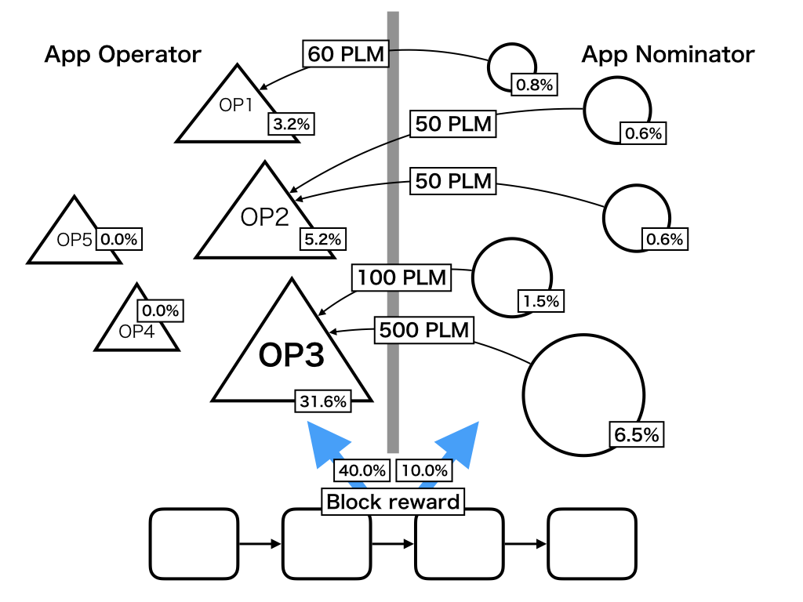

# Plasm Treasury

50% of the block reward on the Plasm chain is distributed to DApps developers who increase the value of the network. PLM holders can stake not only on a validator but also on a Plasma application operator (Plapp operator), the person who manages a child chain and an application on that chain. 

Plapps nominator stakes Plasm tokens on Plasma application operator.

Definition

- BlockReward: The block reward per a block
- `n`: The number of Plapp operators
- `m_i`: The number of Plapps nominators for i-th Plapp operator
- `stake_{i,j}`: The total staking amount of j-th Plapps Nominator for the i-th Plasma operator
- `Plapps Nominator_{i,j}`: j-th Plapps nominator who stakes on i-th Plapp operator

In this case,  `Plapps Nominator_{i,j}` gets the following block reward. 

Note:  `Plapps Nominator_{i,j} = Plapps Nominator_{k,l} (i≠k)` is possible. 

A staked Plapp operator can get the following block reward.

The reward of Plapps nominator is in proportion to the staking amount of the Plapps operator regardless of the selected operator. On the other hand, a Plapp operator can get rewards in proportion to the staked amount and  in inverse proportion to the total staked amount. Plapps nominator tends to stake his tokens on an application which enhances the value of the Plasm network because the price of PLM is increased by the valuable application. In addition to that, Plapps operators are able to get semipermanent block rewards through this incentive design. In general, traditional DApps creators are definitely contributing to the ecosystem, but what they are actually doing is paying costs like gas and get few rewards. We solve this problem by fixing basic low layer functions. 

An operator can make some malicious attacks, but fortunately, Plasma has a method to prevent  such operator's behaviors. When an operator commits a fraud, any user on the plasma chain can submit the fraud proof as evidence and the operator's block reward will be slashed as well as the Plapps nominator's staked tokens once the evidence is successfully approved. In other words, every Plapps nominator has a risk to lose it's token when his operator commits a fraud. A stakeholder who owns a large portion of the network stakes tokens on his Plapps operator, the operator will be slashed. 

  Assuming that there is the slashing mechanism, a nominator tends not to stake on an unstable operator. If all nominators stake their tokens on stable operators, the network will be centralized.  As a solution, the Plasm has an alternative incentive mechanism. Every nominator who stakes PLM on an operator who operates his application within three months prior to the birth has a right to get an additional bonus. This right can be executed for three months if the operator runs his application for more than a year.  

 `x^{old}` is the rate of `x` when a nominator stakes PLM. The nominator will get the reward calculated below. 

This means that the nominator can get bonus in proportion to the operator's rewards.