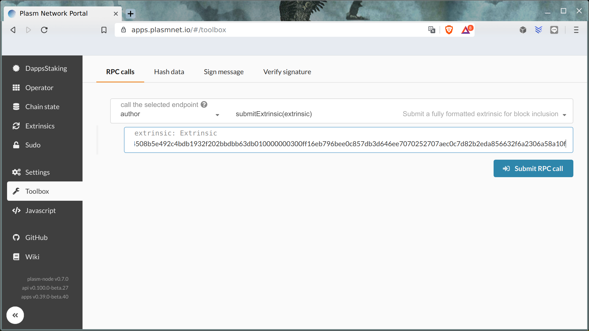

Plasm Testnet Lockdrop
======================

To prevent errors and meet users with lockdrop scenario we decide to held lockdrop in Plasm Testnets.
Testnet Lockdrop is also final tests of lockdrop sourcecode before mainnet launch.

First (Ropsten) lockdrop
------------------------

Currency: Ropsten `ETH`
Dates: 13 Dec - 20 Dec 2019.
The Aim: initial token distribution for `Plasm Testnet V3`.
URI: https://lockdrop.plasmnet.io/

This lockdrop was held in Ethereum Testnet before Plasm Testnet version 3 was launched.
PLM tokens in Plasm Testnet was distributed in [genesis](https://github.com/staketechnologies/Plasm/blob/952165972b479bb2ee55211a67048f698561b3cc/bin/node/cli/src/chain_spec.rs#L247) according to `Lock` events
in [Lockdrop smart contract](https://github.com/staketechnologies/ethereum-lockdrop/blob/master/contracts/Lockdrop.sol).

## Claim Testnet v3 PLM using Subkey

Private key manipulation utility is supplied in Plasm repository and could be installed with the following command.

    cargo install --force --git https://github.com/staketechnologies/Plasm --tag v0.7.1 subkey 

Once you have finished installing the subkey utility, let’s try using it. For this article, we’re mainly interested in the transfer command, which has the following options.

```bash
$ subkey transfer --help
subkey-transfer 
Author and sign a Node pallet_balances::Transfer transaction with a given (secret) keyUSAGE:
    subkey transfer <from> <to> <amount> <index> --genesis <genesis>FLAGS:
    -h, --help       Prints help information
    -V, --version    Prints version informationOPTIONS:
    -g, --genesis <genesis>    The genesis hash or a recognised chain identifier (dev, elm, alex).ARGS:
    <from>      The signing secret key URI.
    <to>        The destination account public key URI.
    <amount>    The number of units to transfer.
    <index>     The signing account's transaction index.
```

### Create extrinsic

By using the transfer command, it is possible to create RAW Extrinsics from a valid Ethereum account, which can be used for node RPC or the UI. The main benefit of this is that we can create extrinsics offline without having to provide our private key to the Plasm UI or any other nodes.

You can do this with the following command.

    subkey -k transfer 0x2F9C34E12950FC8EC9F73EBC9337CBC6EA29556EB462E8AD30B981784B9F907E 5Cakru1BpXPiezeD2LRZh3pJamHcbX9yZ13KLBxuqdTpgnYF 42000000 0 -g ac0090073a92ae1a68c049e84d5b3671d9156833f18f30031c1066eb2f1278a6

Before we go to the results, please allow me to dissect this long string of command.

* The first hex that looks like this: `0x2F9C34E12950FC8EC9F73EBC9337CBC6EA29556EB462E8AD30B981784B9F907E` which is the lockdrop Ethereum private key.
* The next line that looks like `5Cakru1BpXPiezeD2LRZh3pJamHcbX9yZ13KLBxuqdTpgnYF` is the destination Plasm Network account.
* `42000000` is the value of tokens (1 PLM = 10¹⁵), this value should be followed by a `0` to show that this is the first transaction
* Finally, the string of hash followed by the `-g` flag is the Testnet V3 genesis hash.

If you copy and paste the long command, you should get the following results printed in your terminal.

    Using a genesis hash of ac0090073a92ae1a68c049e84d5b3671d9156833f18f30031c1066eb2f1278a6
    0x310284ffe28153d70c05ebce1758dfd58356b05ff6bcb90fae903e27b00baa9bdfb9fd2f0210c5ecce7198b3adf13dece166a277890c189c05e5e061240cfacd8b9e2e9b497be46283d20ae801c784e1ec962a64644508b5e492c4bdb1932f202bbdbb63db010000000300ff16eb796bee0c857db3d646ee7070252707aec0c7d82b2eda856632f6a2306a58a10f

You’ll notice that the first line of hash is familiar from what we have seen before. It’s the genesis hash! But the important part is the second line, which is the hex-encoded raw extrinsic. We’ll be needing this in a short while so please copy this.

### Send extrinsic

To make things easy, please use the official [UI Toolbox](https://apps.plasmnet.io/#/toolbox) provided by Stake Technologies.

The link above should redirect you directly to the toolbox page shown in the following image.



Now we just copy the hex string to the extrinsic field and push the **Submit RPC call** button. The transfer transaction will be sent immediately. You can check the results from the [account balances](https://apps.plasmnet.io/#/accounts) page.

Second (Live Testnet) lockdrop
------------------------------

Currency: Testnet `BTC`
Dates: 15 Feb - 15 Mar 2020.
The Aim: Live lockdrop for `Plasm Testnet V3`.
URI: https://apps.plasmnet.io/

This lockdrop will held in already launched Plasm Testnet to show 
how to participate in Live lockdrop using Testnet BTC.
