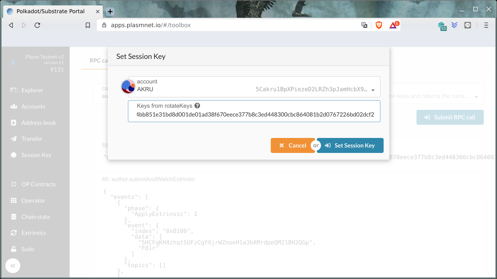

Plasm Validator Program
=======================

> This short guide explain step by step how to become a Plasm Testnet validator.

- Install node **v0.7.0** and above in accordance with [README](https://github.com/staketechnologies/Plasm#building-from-source).
- Launch node plasm-node --validator --name node-name --rpc-cors all
- Wait for syncing up.


- Open [Setting](https://apps.plasmnet.io/#/settings) and select local node.


- Open [Accounts](https://apps.plasmnet.io/#/accounts) and create new account.


- Share your validator account address and with **Stake Technologies** team in [Discord](https://discord.gg/Z3nC9U4).
- Get some tokens for transactions in [Discord](https://discord.gg/Z3nC9U4) **faucet** channel.
- Open Toolbox window and call `rotateKeys()` RPC call or use curl command:

```bash
curl -H "Content-Type: application/json" -d '{"id":1, "jsonrpc":"2.0", "method": "author_rotateKeys", "params":[]}' http://localhost:9933
```


- Save result for next step usage.
- Click "Session Key" button and paste result for validator account.



### Conclusion

When you finish this tutorial please wait a bit while **Stake Technologies** team approve your account as validator. Thank you for Plasm Network contribution and let's make Plasm better together!
