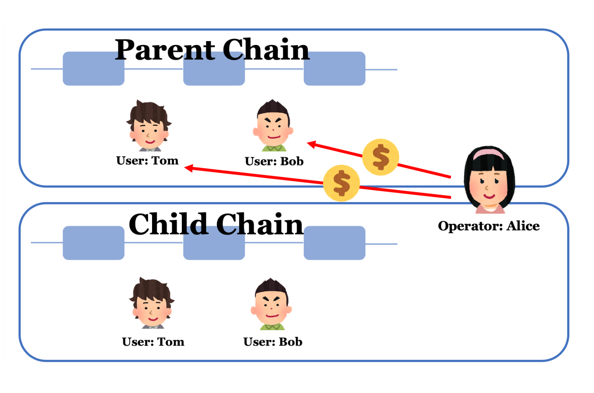
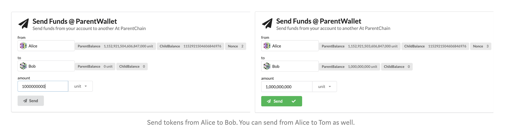
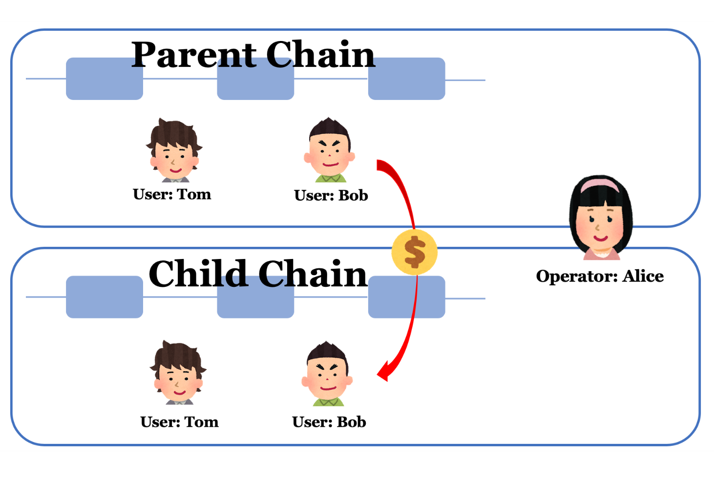
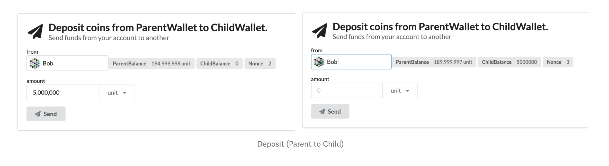
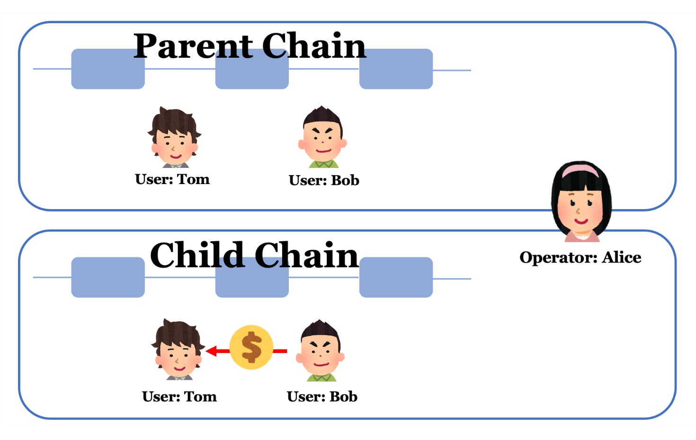
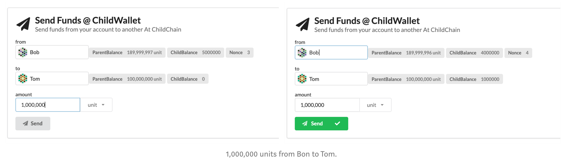
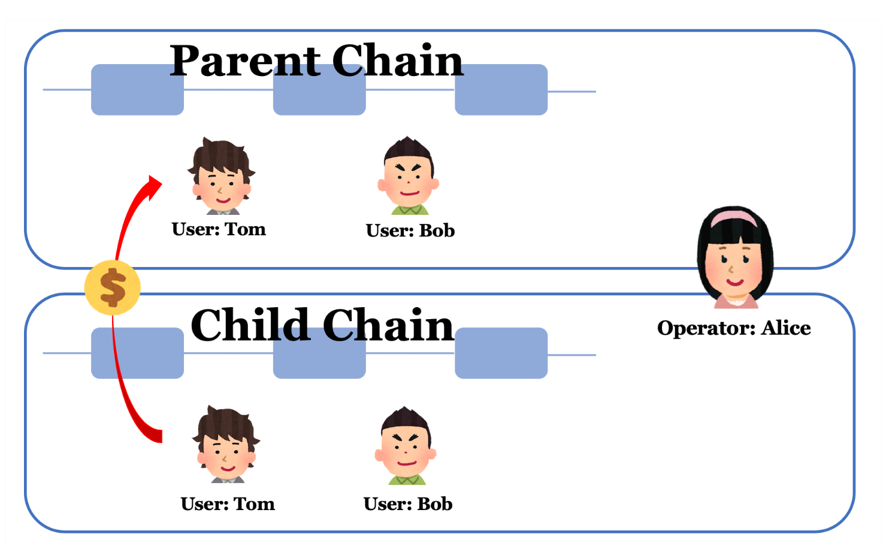
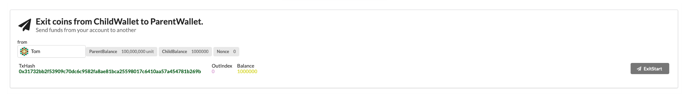
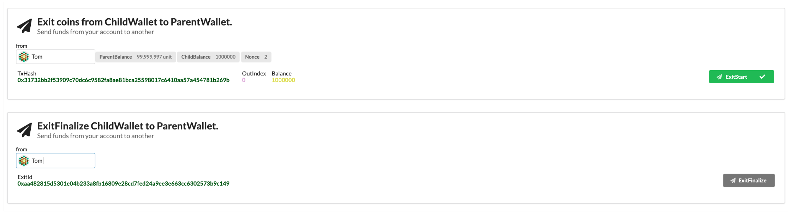
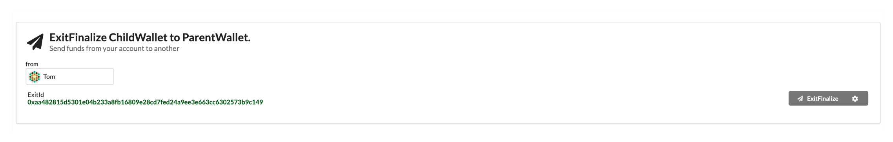

# Try Plasm

Let's try Plasm contracts on [Polkadot.app](https://polkadot.js.org/apps/).
*- Coming soon.*

Now, you can make a Plasma chain with Substrate.

## Let's make a Plasma chain with Plasm and Substrate

In this chapter, we will show you how to make Plasma chains with Plasm and Substrate.

Plasm ver0.2.0 is a prototype which has the following functions.

- Plasma MVP implementation
  - Plasm-Parent provides the parent chain’s specification. Mainly
    Plasm-Parent has the logic of each exit game.
  - Plasm-Child provides the child chain’s specification.
  - Plasm UTXO/Merkle provides the data structure which manages transactions.
- Plasma Client implementation
  - Plasm Util is a wrapper function to call the endpoint of blockchains.
  - Plasm Operator is monitoring a parent chain and a child chain to make the deposit/exit successful.
  - Plasm CLI is a CLI tool to call the endpoint.
  - Plasm Wallet is an application to send, withdraw and receive tokens.

As a next step, let’s make a wallet demo application on your laptop and see what’s happening.

### Step1

Clone Plasm from our GitHub repository.

```bash
git clone https://github.com/stakedtechnologies/Plasm.git
cd Plasm
git checkout v0.2.0
```

### Step2

Build Plasm Node. After a successful build, you can run Plasma nodes.

```bash
cargo build
./target/debug/plasm-node --dev
```

### Step3

Open another terminal and clone Plasm-Client from our GitHub.

```bash
git clone https://github.com/stakedtechnologies/plasm-client.git
cd plasm-client
git checkout v0.2.0
```

### Step4

Start Plasm Operator. The operator is monitoring both the parent chain and the child chain. When the parent chain deposits tokens to the child chain or the child chain exits tokens to the parent chain, the operator writes the root hash of the child chain on the parent chain.

```bash
cd packages/operator
cp ../../env.sample .env
yarn install
yarn start
```


If you can see the output below, this project has been successful.


Great, you've made it! But what's actually happening? (You can skip if you want. This is complicated, so we will publish another article focused on this topic.)

>Plasm-Operator gets an event which the plasma child/parent chain issues and processes the following steps.
>Parent chain’s events
>
>- When an operator receives a Submit event, she finalizes >the status of the child chain.
>- When an operator receives a Deposit event, she sends tokens to the issuer.
>- When an operator receives an ExitStart event, she deletes the UTXO which was used for exiting on the child chain.
>Child chain’s events.
>When an operator receives a Submit event, she submits the ?root hash to the parent chain. The Submit event on a child chain is issued regularly. （You can decide this logic. For this time, 1 time in 5 blocks.)

### Step5

Open another terminal and move to plasm-client root directory. Then, start Plasm Wallet UI Demo Application.

```bash
cd packages/wallet
yarn install
yarn dev
```


After that, let’s go to localhost:8000 on your browser.
We will create 2 different accounts and send/receive tokens by using the wallet application I mentioned above.

## Account Registration

First, you need to register your demo account. Since a default operator is Alice, you should add //Alice ①. Then, create an account ②. You can check Alice’s balance ③.


To send tokens from Alice to Bob, Alice to Tom and Bob to Tom, generate Bob’s and Tom’s account as well.


## Token Transfer on Parent Chain

As a next step, we will send tokens from Alice to Bob and Alice to Tom on the parent chain.




Enter the account name and decide the amount of token. Then, click the “Send” button. Keep your eye on the “ParentBalance” next to the account name. After a successful transaction, you will notice that Bob’s amount is increasing. Currently, we collect the exchange fee from the sender on the parent chain. So, Bob and Tom need to have some tokens on the parent chain.

## Deposit (Deposit tokens from Parent Wallet to Child Wallet.)



Third, we will send tokens from the parent chain to the child chain. For this time, Bob deposits 5,000,000 tokens to the child chain. Just keep in mind, it takes time to increase ChildBalance because the operator checks the event and executes a transaction.



## Token Transfer on Child Chain



Fourth, let’s send some tokens from Bob to Tom on the child chain.



Bob has 5,000,000 tokens. He sent 1,000,000 tokens out of 5,000,000 to Tom.

## Exit Part1（Exit tokens from ChildWallet to ParentWallet.）



Exit tokens from Tom’s account on the child chain to his account on the parent chain. If you type your account name, you can find UTXO lists you have. A child chain has all transaction histories you made and tokens are exited based on UTXO.



Press the ExitStart button so that you can exit your tokens to the parent chain.



BUT, you have to wait about 60 seconds. It is a Plasma challenge period which we decided. Full node holders can challenge the legitimacy of exits in it.

## Exit Part2（ExitFinalize ChildWallet to ParentWallet.）

Click `ExitFinalize`.



Then,


Finally, the exit is successful. Well done! This is a simple demo, but it’s one giant leap for the Polkadot/Substrate community!
