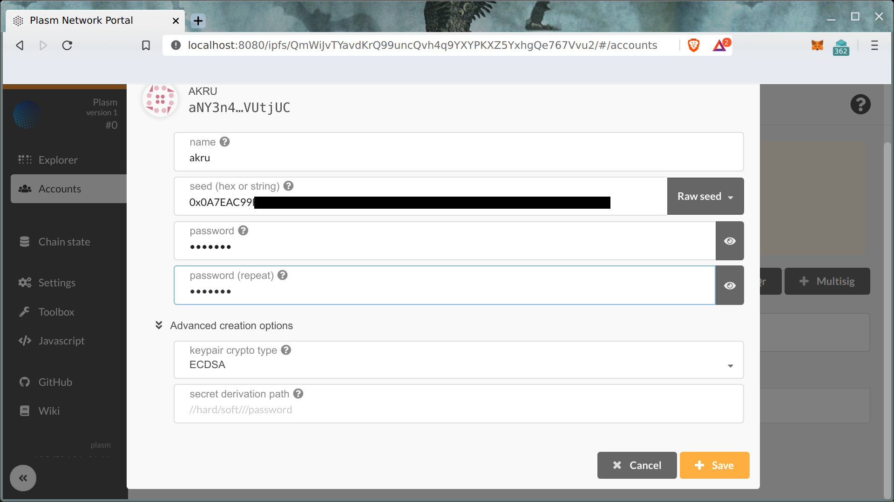

# Import Ethereum Seed

**Disclaimer**

Please make any manipulation with Ethereum Private key at your own risk.

## Plasm Network Portal

* [IPFS Link](https://ipfs.io/ipfs/QmWiJvTYavdKrQ99uncQvh4q9YXYPKXZ5YxhgQe767Vvu2)

> IPFS as content-oriented distributed storage is a most safe place for sensitive code. Any changes in code will change URI and makes this code unavailable.

We recommend to use local installed [IPFS node](https://github.com/ipfs-shipyard/ipfs-desktop). And IPFS Companion extension for your browser:

* Chrome: https://chrome.google.com/webstore/detail/ipfs-companion/nibjojkomfdiaoajekhjakgkdhaomnch
* FireFox: https://addons.mozilla.org/ru/firefox/addon/ipfs-companion/

Let's try to open Plasm Network Portal!

## Import Ethereum Seed

> Prepare your Ethereum Lockdrop account seed (hex-string or mnemonic). [Metamask guide](https://metamask.zendesk.com/hc/en-us/articles/360015289632-How-to-Export-an-Account-Private-Key).

Let's create account in Plasm Network using your seed at **Accounts** -> **Add account**:

Please choose **ECDSA** type of keypair and hex-string for seed (if you export Metamask key by [guide](https://metamask.zendesk.com/hc/en-us/articles/360015289632-How-to-Export-an-Account-Private-Key)).

Fill another fields including password as save account.

As result you should see your PLM tokens on balance. Congrats! 

