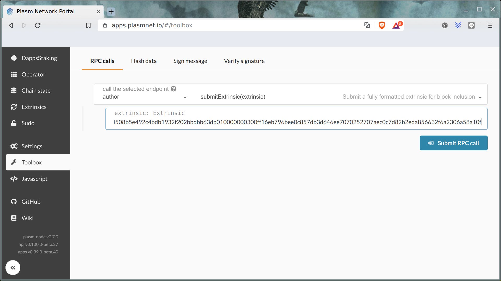

[日本版はこちら](https://medium.com/stake-technologies/plasm-network-lockdrop-%E3%81%B8%E3%81%AE%E5%8F%82%E5%8A%A0%E3%82%AC%E3%82%A4%E3%83%89%E3%83%A9%E3%82%A4%E3%83%B3-1ed3b2d6a698).

# How to Participate in the Lockdrop

First, make sure that you have a Web3 wallet browser extension (i.e. MetaMask) installed to your browser. Without this, we cannot communicate with the contract through normal means.
Next head on to [https://lockdrop.plasmnet.io/](https://lockdrop.plasmnet.io) to start the application. The actual demo below is done via a local chain on a local server, but the one from the above URL will give you a working version with the contract deployed to Repsten testnet. The main net contract is not yet deployed.


If you have properly installed your wallet extension, you should be greeted with the following loading screen and a prompt from your wallet. Make sure to allow the connection.


The lockdrop page will be dived into two sections; the input form and the global locks. The form is straight forward. You just have to input the amount you want to lock in ETH, the duration that you want to lock it for (the participant is able to choose from 30, 100, 300, and 1000 days), and the public address of your introducer. The last input requires special care as the form will only accept public addresses that are part of the affiliation program. If you leave this part empty, the introducer will default to `0x0000000000000000000000000000000000000000`. Furthermore, the introducer address input field will reject any invalid address hashes so please keep that in mind.
The global lock section will listen to every `Locked` event and display them as a list, giving participants immediate feedback for every lock.


Now let’s try locking some tokens! For this lock, I won’t provide any introducer to the form and only lock a certain amount for 300 days.


You can see that the wallet is asking for your permission to interact with the contract. Click confirm to make the transaction.


Given that everything went well, you can see a green toast popping on the side announcing that it was successfully locked.


You can also see that we have locked our tokens to the blockchain with the address of the lock by looking at the global lock tracker. You can also notice that because we didn’t provide any introducer, the list shows that we don’t have any.


This time, let’s try locking a token with an introducer’s address. The address above is a mock affiliated address so it won’t work on the real thing.


Furthermore, if you try to input an address that is not affiliated with the program or your own public address, the client will not accept the input.


Now we can start locking, and as you can see our introducer is properly displayed on the list.

# How-to claim genesis lockdrop PLM

Private key manipulation utility is supplied in Plasm repository and could be installed with the following command.

    cargo install --force --git https://github.com/staketechnologies/Plasm --tag v0.7.1 subkey 

Once you have finished installing the subkey utility, let’s try using it. For this article, we’re mainly interested in the transfer command, which has the following options.

```bash
$ subkey transfer --help
subkey-transfer 
Author and sign a Node pallet_balances::Transfer transaction with a given (secret) keyUSAGE:
    subkey transfer <from> <to> <amount> <index> --genesis <genesis>FLAGS:
    -h, --help       Prints help information
    -V, --version    Prints version informationOPTIONS:
    -g, --genesis [genesis]    The genesis hash or a recognised chain identifier (plasm, dusty).ARGS:
    <from>      The signing secret key URI.
    <to>        The destination account public key URI.
    <amount>    The number of units to transfer.
    <index>     The signing account's transaction index.
```

## Create extrinsic

By using the transfer command, it is possible to create RAW Extrinsics from a valid Ethereum account, which can be used for node RPC or the UI. The main benefit of this is that we can create extrinsics offline without having to provide our private key to the Plasm UI or any other nodes.

You can do this with the following command.

    subkey -k transfer 0x2F9C34E12950FC8EC9F73EBC9337CBC6EA29556EB462E8AD30B981784B9F907E 5Cakru1BpXPiezeD2LRZh3pJamHcbX9yZ13KLBxuqdTpgnYF 42000000 0

Before we go to the results, please allow me to dissect this long string of command.

* The first hex that looks like this: `0x2F9C34E12950FC8EC9F73EBC9337CBC6EA29556EB462E8AD30B981784B9F907E` which is the lockdrop Ethereum private key.
* The next line that looks like `5Cakru1BpXPiezeD2LRZh3pJamHcbX9yZ13KLBxuqdTpgnYF` is the destination Plasm Network account.
* `42000000` is the value of tokens (1 PLM = 10¹⁵), this value should be followed by a `0` to show that this is the first transaction

> For Dusty network command should be extended by `-g dusty` sentence.

If you copy and paste the long command, you should get the following results printed in your terminal.

    Using a genesis hash of ac0090073a92ae1a68c049e84d5b3671d9156833f18f30031c1066eb2f1278a6
    0x310284ffe28153d70c05ebce1758dfd58356b05ff6bcb90fae903e27b00baa9bdfb9fd2f0210c5ecce7198b3adf13dece166a277890c189c05e5e061240cfacd8b9e2e9b497be46283d20ae801c784e1ec962a64644508b5e492c4bdb1932f202bbdbb63db010000000300ff16eb796bee0c857db3d646ee7070252707aec0c7d82b2eda856632f6a2306a58a10f

You’ll notice that the first line of hash is familiar from what we have seen before. It’s the genesis hash! But the important part is the second line, which is the hex-encoded raw extrinsic. We’ll be needing this in a short while so please copy this.

## Send extrinsic

To make things easy, please use the official [UI Toolbox](https://apps.plasmnet.io/#/toolbox) provided by Stake Technologies.

The link above should redirect you directly to the toolbox page shown in the following image.



Now we just copy the hex string to the extrinsic field and push the **Submit RPC call** button. The transfer transaction will be sent immediately. You can check the results from the [account balances](https://apps.plasmnet.io/#/accounts) page.

# Conclusion

We’ve looked into how the lockdrop for Plasm Network will work and how to use the lockdrop application. Given that you have enough tokens, it is fairly straight forward to use. With this, you should be able to participate in the lockdrop, and get your hands on some fresh PLMs!
