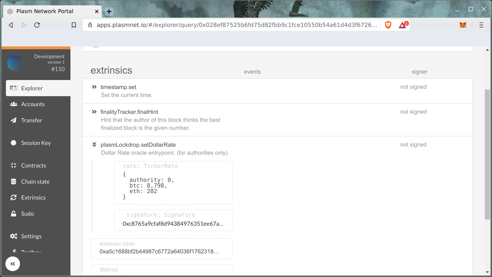
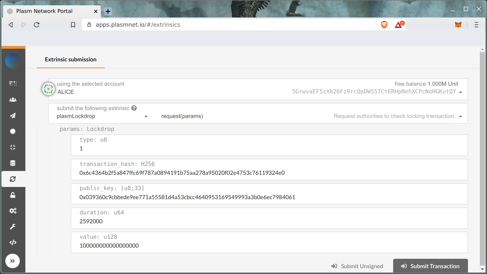
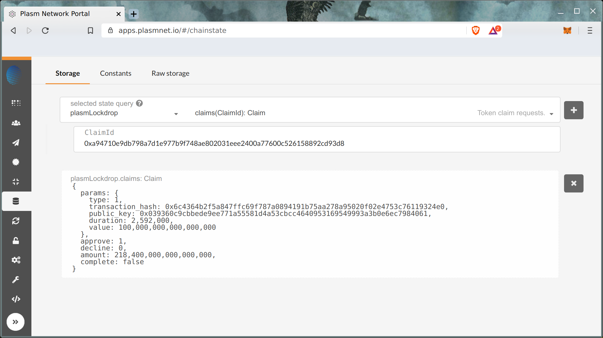

# Plasm Lockdrop Module

> This is experimental module, some features couldn't work or work with issues, feel free to report any problems [on GitHub](https://github.com/staketechnologies/Plasm/issues/new/choose).


## Quick Install

1. Install dependencies according to [README](https://github.com/staketechnologies/Plasm/tree/plasm-real-time-lockdrop#building-from-source).

2. Fetch custom lockdrop branch of plasm-node.

```
git clone https://github.com/staketechnologies/Plasm -b plasm-real-time-lockdrop && cd Plasm
```

3. Build Plasm binary.

```
cargo build --release
```

4. Wait for build process.

## Preparing for tests 

1. Launch node in development mode:

```
./target/release/plasm-node --dev
```

> Previous versions of db should be removed before launch: `./target/release/plasm-node purge-chain --dev`

2. Open Plasm Portal [Settings page](https://apps.plasmnet.io/#/settings).
    1. Choose remote endpoint to `Local Node`.
    2. On `Developer` tab put followed custom types:

```json
{
  "ClaimId": "H256",
  "Lockdrop": {
    "type": "u8",
    "transaction_hash": "H256",
    "public_key": "[u8; 33]",
    "duration": "u64",
    "value": "u128"
  },
  "TickerRate": {
    "authority": "u16",
    "btc": "DollarRate",
    "eth": "DollarRate"
  },
  "DollarRate": "u128",
  "AuthorityId": "AccountId",
  "AuthorityVote": "u32",
  "ClaimVote": {
    "claim_id": "ClaimId",
    "approve": "bool",
    "authority": "u16"
  },
  "Claim": {
    "params": "Lockdrop",
    "approve": "AuthorityVote",
    "decline": "AuthorityVote",
    "amount": "u128",
    "complete": "bool"
  }
}
```

## Price oracle

After launch authority node starts periodically fetch and send into chain current prices of BTC and ETH in USD.
Opening [explorer](https://apps.plasmnet.io/#/explorer) you can see set dollar rate extrinsics in each imported module.
This dollar rate used in lockdrop pallet for issue amount estimation.



## Lockdrop request

Especially for test purposes we deploy Lockdrop smart contract into Ethereum Ropsten network:

* https://ropsten.etherscan.io/address/0xeed84a89675342fb04fafe06f7bb176fe35cb168

Let's send treansaction into lockdrop smart contract using Etherscan and metamask:


After locking let's create request in Plasm development chain:



Used test data below:

```
0x6c4364b2f5a847ffc69f787a0894191b75aa278a95020f02e4753c76119324e0
0x039360c9cbbede9ee771a55581d4a53cbcc4640953169549993a3b0e6ec7984061
2592000
100000000000000000
```


And results available on chain:


