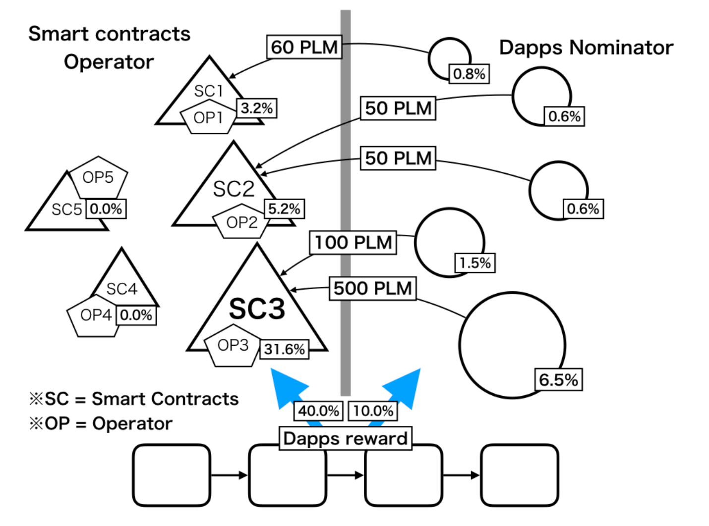
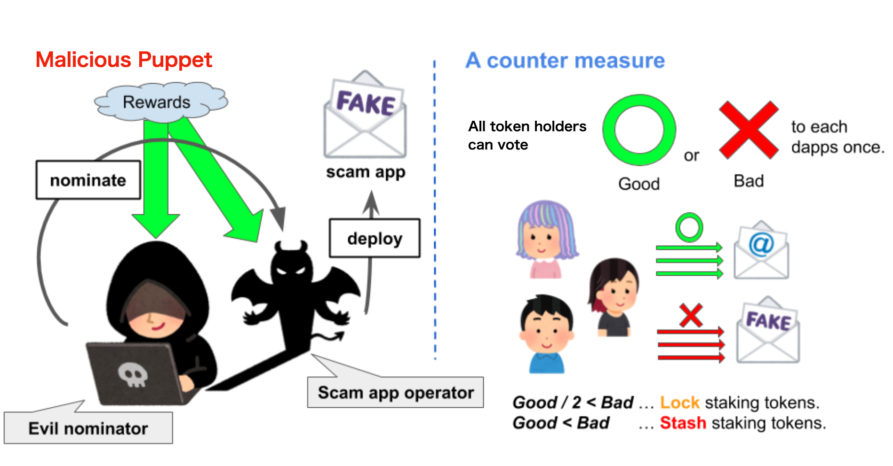
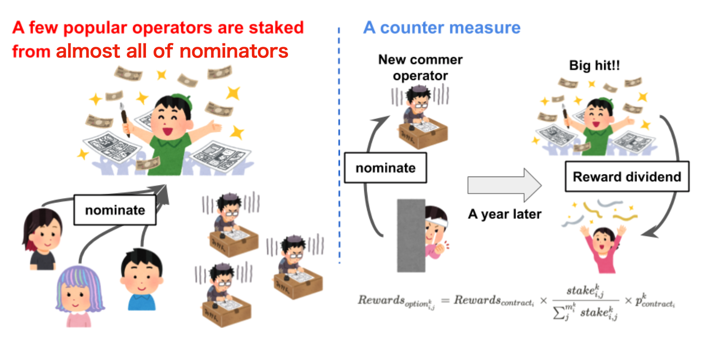

# Награды приложений  DApps🍭

Это механизм вознаграждения для разработчиков или администраторов смарт-контрактов. Половину наград за участие в стекинге Plasm Network получают разработчики приложений, которые повысили ценность сети. Plasm позволяет назначить администратора смарт-контракта, называемого оператором. Операторы могут быть номинированы другими номинантами приложений. Как показано ниже, оператор смарт-контракта, получающий номинаций, может претендовать на награду в PLM токенах.

この報酬を Operator と Nominator にそれぞれどのように分配するかを定義していきます。次の変数を定義します。

*  $$Rewards_{nominate}$$ : Nominator に割り振られた報酬の合計
*  $$Rewards_{contract}$$ : スマートコントラクトに割り振られた報酬の合計
* $$Rewards_{nominate_{i,j}}$$ : i 番目のスマートコントラクトに対する j 番目の Nominate で得られる報酬
* $$Rewards_{contract_i}$$ : i 番目のスマートコントラクトの Operator が得られる報酬
* $$n$$ : スマートコントラクトの数
* $$m_i$$ : i 番目のに対する Nominate の数
* $$stake_{i,j}$$ : i 番目のスマートコントラクトに対する j 番目の Nominate により Stake したトークンの量

この時、この Stake について $$Nominate_{i,j}$$ により以下の報酬が得られます。

$$
Rewards_{nominate_{i,j}}=Rewards_{nominate}\times\frac{stake_{i,j}}{\sum_i^n\sum_j^{m_i}stake_{i,j}}
$$

Nominator は選んだスマートコントラクトに関わらずスマートコントラクトに対するStake総量のうち自信のStake量が占める割合に比例した報酬を得ることができます。Stake を受けた contract\_i の Operator は以下の報酬が得られます。

$$
Rewards_{contract_i}=Rewards_{contract} \times \frac{\sum_{j}^{m_i}stake_{i,j}}{\sum_i^n\sum_j^{m_i}stake_{i,j}}
$$

一方、Operator はスマートコントラクトに対するStake総量のうち自身が所有するスマートコントラクトのStake量が占める割合に比例した報酬を得ることができます。これにより、Nominator は単純にトークンの価値を向上させると思われるスマートコントラクトに対して Stake するインセンティブが発生します。また、Operator は自信が管理するスマートコントラクトに Stake を受けることで半永続的に報酬を受取ることができます。これはチェーン上のアプリケーション開発者\(管理者\)のマネタイズが難しい問題に対する革新的な解決策となることを期待しています。ここで、この Operator/Nominator が報酬を実際に受取るには一定の期間を待つ必要があります。

しかしながら、このシステムは以下の悪いケースを考えることが出来ます。

### Malicious Puppet

悪意のある Operator または Nominator が価値のないスマートコントラクトに Stake して報酬を得る問題です。

これは図のように、一人一票の Good/Bad Voting システムを導入することで解決します。この投票は、トークンを Staking しているすべてのユーザが各スマートコントラクトごとに一票のみ行うことができます。Operator に対する投票に応じて以下のような罰則を受けます。

* Good の数が Bad の数の4倍以上且つそのスマートコントラクトが一定期間以上 Running している場合、そのスマートコントラクトの運用は健全であるとみなし Operator は正常に報酬を受け取ることができます。
* Good の数が Bad の数の4倍未満またはスマートコントラクトが一定期間以上 Running していない場合、その Operator と Nominate は報酬を受け取ることができません。
* **Good の数が Bad の数の2倍未満である場合、そのスマートコントラクトに Stake されているトークンはすべてロックされます。**
* Good の数が Bad の数未満である場合、そのスマートコントラクトに Stake されているトークンはすべて Slash されます。

ここで、Voting するユーザがシビルアタックできることに注意してください。しかしながら、Voting をするにはトークンを保有し Staking する手間がかかります。また、Voting という行為はそれを行うユーザに利益をもたらしません。故に、十分多くの善良なユーザがいれば、シビルアタックをして投票を独占するコストに対してインセンティブが無いためそのようなケースは問題無いといえます。例えば、100万トークンを使い100万人に分身して Good を押して自作自演をするよりも 100 万トークンを普通に Stake した方が合理的です。また、実際にはトランザクション手数料も発生するため100万人に分身するにはもっとトークンが必要になります。

### A few popular operators are staked from almost all of nominators

上記のような Slash システムを導入した時、多くのユーザーが既に安定して稼働しているアプリケーションに対して Stake することになるでしょう。そのような問題に対する解決策を示します。

図のように、スマートコントラクトへの Stake に先行者利益を付与します。スマートコントラクトに対する Stake には別途でボーナス報酬を得る権利\(オプション\)を加えます。これは Stake による報酬を受け取った $$r(le0)$$ 日後までの期間に以下の報酬を得る権利を行使することができます。ここで $$x^{k}$$ はある時点 $$k$$での $$x$$ を表します。まず、次の変数を導入します。

* $$Rewards_{optoion^k_{i,j}}$$ : ある地点 $$k$$ における $$i$$ 番目のスマートコントラクトに対する $$j$$ 番目の Nominate で得ることができる option を行使したときの利益
* $$Rewards_{contract_i}$$ : option 権利行使時点での $$i$$ 番目のスマートコントラクトの Operator が得られる報酬
* $$stake^{k}_{i,j}$$ : ある地点 $$k$$ における $$i$$ 番目のスマートコントラクトに対する $$j$$ 番目の Nominate により Stake したトークンの量
* $$m^k_i$$ : ある地点 $$k$$ における $$i$$ 番目のスマートコントラクトに対する Nominate の数
* $$p^k_{contract_i}$$ : ある地点 $$k$$ における i 番目のスマートコントラクトに Nominate した際に得られるオプション報酬を決定するための係数パラメータ、スマートコントラクトのOperator が定義することができる

$$
Rewards_{option_{i,j}^{k}}=Rewards_{contract_{i}}\times \frac{stake_{i,j}^k}{\sum^{m_i^k}_jstake_{i,j}^k}\times p^k_{contract_i}
$$

ここで $$Rewards_{contract_i}$$ と $$Rewards_{option_i^{k}}$$ が示す Operator が等しいことに注意してください。 $$p$$ は Operator が 0.2 以下の数値を指定することが出来ます。

この権利を行使した時、その時点での Operator の報酬の $$p*100$$ **%** から、 $$k$$ 時点でのそのスマートコントラクトに対する Stake の占有率分だけ Operator から報酬を分配してもらうことができます。平易に表現すると、 $$sum^{m_i^k}jstake{i,j}^k$$ は $$k$$ 時点でのスマートコントラクト $$i$$ の人気度とも言えます。人気度が低いうちからそのスマートコントラクトに対して Stake を多くしておくと、将来的にそのスマートコントラクトの人気度が増加した際に獲得できるオプション利益が多くなります。

この権利を行使された際は Operator の貰える報酬がその分だけ減少します。故に Operator は値 $$p$$ をコントロールすることができます。 $$r$$ , $$p$$ について Operator が最初に指定することが出来ます。

**※ r, p の制約はこの機能を悪用して不当に Staking 報酬を大量に受け取るだけのアプリが現れるのを防ぐためです。**

例えば、0日目に p = 0.1, r=200 のOperatorBobに 合計100PLM が Stake されているとします。Alice はそのうちの 50 PLM を Stake していました。この時、Alice は r日目までにそのOperatorの受け取る報酬の **0.5 × 0.1 = 0.05** 倍を受け取ることができる権利を得ます。100日目にOperator Bobが 1000PLM の報酬を受け取っていました。Alice は権利を行使して **1000 × 0.05 = 50 PLM** を得る事ができました。

スマートコントラクトへの Staking は Validator への Staking よりもリスクが高いです。機械的に Slash の判定がなされる Validator よりも、Voting による Slash が行われるスマートコントラクトのほうが予測がしづらいからです。さらに、報酬を得るまでにある程度時間もかかります。故に上記のような仕組みを加えました。また、スマートコントラクトへの Stake は上級者向けであるため初めに記した 4:1 の Staking 割合を理想としています。

質問があれば、[Tech Chat](https://discord.gg/Cyjnrxv)の日本語チャネルでご質問ください。

