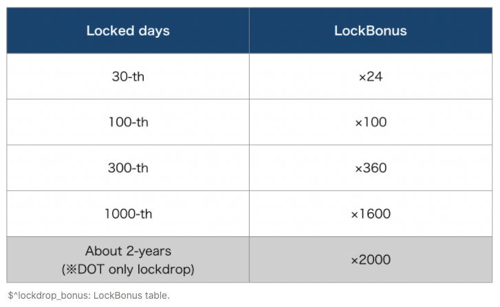
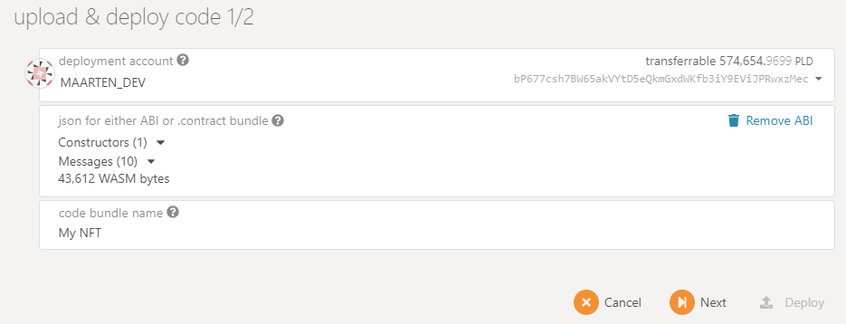

# Lockdrop

### Участвующие в Lockdrop, могут получить токен PLM здесь 

[https://lockdrop.plasmnet.io/\#/lock-form](https://lockdrop.plasmnet.io/#/lock-form)

### Введение

Lockdrop - это новый механизм экономического стимулирования с низким уровнем риска, использующий альтернативные токены в качестве обеспечения. [Plasm Network](https://www.plasmnet.io/) использует этот механизм для распределения своих токенов. В этом разделе объясняется механизм распределения токенов [Plasm Network](https://www.plasmnet.io/). Lockdrop был впервые придуман компанией [Edgeware](https://edgewa.re/) и реализация в [Plasm Network](https://www.plasmnet.io/) является его расширением. Нативный токен, используемый в [Plasm Network](https://www.plasmnet.io/) обозначается символом PLM и произносится как "PLUM". PLM будет использовать только 15 десятичных знаков и отсекать любые меньшие числа. Для получения дополнительной информации о роли токена PLM, пожалуйста, обратитесь к разделу "Экономика токенов PLM".



### Lockdrop обзор

Первый Lockdrop использовал токены Ethereum в качестве залога. Lockdrop - алгоритм, который может быть реализован в любой цепочке, поддерживающей функцию TimeLock. На рисунке ниже показано, как lockdrop будет работать в [Plasm Network](https://www.plasmnet.io/)

Lockdrop работает следующим образом:

1. Владельцы токена Ethereum, указывают количество ETH которые будут отправленны в lockdrop и выбирают продолжительность блокировки токенов в контракте LockContract, развернутом в блокчейне Ethereum.
2. Количество PLM вычисляется следующим образом: `количество заблокированного вами ETH × бонус за продолжительность блокировки × α`. Для каждого участника, токены PLM будут записаны в генезис блок[ Plasm Network](https://www.plasmnet.io/)
3. Команда Plasm распределит `общее количество × 15%` PlasmTokens в генезис блоке.
4. По истечении срока блокировки, все токены ETH будут возвращены обратно участникам.

Предполагается, что альтернативные издержки владельца токена Ethereum пропорциональны количеству заблокированных токенов и продолжительности блокировки. PLM способен генерировать ценность, используя эти альтернативные издержки в качестве обеспечения. Окончательная поставка токенов еще не определена. Это справедливо по отношению к токенам, выпущенным после генезис блока. 15% от общего количества токенов, отчеканенных с помощью lockdrop, пойдут команде Plasma в качестве гонорара. Последующие распределения будут происходить для поддержания баланса токенов.

### Multi−Lockdrop

Multi-Lockdrop - это механизм блокировки, повторяемый несколько раз. Максимальное конечное количество токенов Plasm Network's не будет жестко определено в genesis блоке. Токены будут распределяться в каждом из трех lockdrop, а дополнительные токены будут чеканиться с использованием функции "Staking", который будет определен позже.



Multi-lockdrop имеет два преимущества:

Во-первых, он предотвращает неравномерное распределение токенов и противодействует "китам", если начальное предложение очень мало. Откат состояния блокчейна, в случае появления подобной проблемы, разрушает целостность сети. В блокчейне необходимо обдуманно определить правила еще до запуска. Мы решаем эту проблему с помощью распределения переменного количества токенов в генезис.

Во-вторых, он позволяет оценивать качество распределения токенов, чтобы команда могла гарантировать, что [Plasm Network](https://www.plasmnet.io/) будет масштабированным и децентрализованным. Безопасность и целостность блокчейна зависит от распределения узлов и держателей токенов. Не стоит рисковать безопасностью после официального запуска. Проведение lockdrop в три этапа, позволяет нам понять распределение токенов между держателями, а также снизить затраты на техническое обслуживание. Это соответствует нашей цели - сделать [Plasm Network](https://www.plasmnet.io/) полностью публичным блокчейном.

Plasm Network будет принимать следующие токены в течение локдропов.

* 1-ый: ETH
* 2-ой: ETH, ~~BTC~~
* 3-ий: ETH, BTC, DOT

После распределения 2-го и 3-го lockdrop, Stack Technologies - основная компания-разработчик зарезервирует 35% выпущенных токенов для маркетинга, листинга, грантов и так далее.

### **Определения**

初めに最初の Lockdrop で配布される PLM の総量を以下のように定義します。

これらを発行比率\(IssueRatio\)に応じて Lockdrop に参加したユーザに対して分配します。**IssueRatio** は

* **DollarRate\_token：**ロックしたトークンの総量をPLMトークン発行時のドルとロックしたトークンとの変換レート
* ロックした日数に 1.0005 を日数\(Days\)乗したものを掛けたものに近似されます。

> ここで 1.0005 は Polkadot の金利を参考にしました。Polkadot のデフォルト最大平均年利は 20%と定義されています。これを複利込みの日利に直した際の近似解が 0.05% となります。

ユーザ実際にはロックする期間を次の4種類（3回目のLockdropのみ5種類）から選ぶことができます。ロック期間に応じて ロックしたトークンの価値をドル換算した値に以下の**LockBonus**を掛けたものが **IssueRatio** となります。

上記をもとに **IsseRatio** を以下のような式で定義されます.ここで

* **Locked\_token**： Lockdrop の対象の token を Lock した量
* **DollarRate{token}** ：1token のドル建て価格
* **LockBonus\_day**： days 日間ロックしたときの**LockBonus**を示します

算出された **IssueRatio** を元に、配られるトークン数が決定します。トークン配布量の決定アルゴリズムは以下のようになります。

* **n** : Lockdrop を行ったユーザ数
* **IssueRatio\_i**：ユーザ iの IssueRatio

総発行トークンのうち15%\(17/20\)はPlasm Network運営チームに移譲されます。この時、ユーザ **i** の 得られる**PLM\_i**は以下になります。

つまり、全体の **IssueRatio** のうち自分の **IssueRatio** が占める割合だけPLMが分配されます。ここで、IssueRation の総和である **TotalIssueRatio** を定義します。

また、1回目の Lockdrop における単位 **IssueRatio**あたりのPLM発行量をここで **α\_1**とおきます。これは2回目以降の Lockdrop における PLM 発行量を決めるための重要な値となります。

2回目、3回目のLockdropにおける単位 **issueRatio**あたりの PLM 発行数を α\_2, α\_3と以下の等式を満たすように定義します。

上記から2回目、3回目のユーザ i に配られるPLMの量は以下になります。

こうすることで、2回目以降の Lockdrop のおいてユーザは単に **IssueRatio** に比例した量のトークンを得ることができます。これにより、2回目以降に Lockdrop を行うユーザが非常に増えた場合、ユーザが取得できる PLM の量が全体の割合に対して過度に少なくなってしまう問題を解決します。

質問があれば、[Tech Chat](https://discord.gg/Cyjnrxv)の日本語チャネルでご質問ください。

