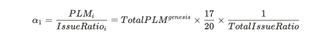

# Lockdrop

### Участники Lockdrop могут получить токен PLM здесь 

[https://lockdrop.plasmnet.io/\#/lock-form](https://lockdrop.plasmnet.io/#/lock-form)

### Введение

Lockdrop - это новый механизм экономического стимулирования с низким уровнем риска, использующий альтернативные токены в качестве обеспечения. [Plasm Network](https://www.plasmnet.io/) использует этот механизм для распределения своих токенов. В этом разделе объясняется механизм распределения токенов [Plasm Network](https://www.plasmnet.io/). Lockdrop был впервые придуман компанией [Edgeware](https://edgewa.re/) и реализация в [Plasm Network](https://www.plasmnet.io/) является его расширением. Нативный токен, используемый в [Plasm Network](https://www.plasmnet.io/) обозначается символом PLM и произносится как "PLUM". PLM будет использовать только 15 десятичных знаков и отсекать любые меньшие числа. Для получения дополнительной информации о роли токена PLM, пожалуйста, обратитесь к разделу "Экономика токенов PLM".



### Lockdrop обзор

Первый Lockdrop использовал токены Ethereum в качестве залога. Lockdrop - алгоритм, который может быть реализован в любой цепочке, поддерживающей функцию TimeLock. На рисунке ниже показано, как lockdrop будет работать в [Plasm Network](https://www.plasmnet.io/)

Lockdrop работает следующим образом:

1. Владельцы токена Ethereum, указывают количество ETH которые будут отправленны в lockdrop и выбирают продолжительность блокировки токенов в контракте LockContract, развернутом в блокчейне Ethereum.
2. Количество PLM вычисляется следующим образом: `количество заблокированного вами ETH × бонус за продолжительность блокировки × α`. Для каждого участника, токены PLM будут записаны в генезис блок[ Plasm Network](https://www.plasmnet.io/)
3. Команда Plasm распределит `общее количество × 15%` PlasmTokens в генезис блоке.
4. По истечении срока блокировки, все токены ETH будут возвращены обратно участникам.

Предполагается, что альтернативные издержки владельца токена Ethereum пропорциональны количеству заблокированных токенов и продолжительности блокировки. PLM способен генерировать ценность, используя эти альтернативные издержки в качестве обеспечения. Окончательная поставка токенов еще не определена. Это справедливо по отношению к токенам, выпущенным после генезис блока. 15% от общего количества токенов, отчеканенных с помощью lockdrop, пойдут команде Plasma в качестве гонорара. Последующие распределения будут происходить для поддержания баланса токенов.

### Multi−Lockdrop

Multi-Lockdrop - это механизм блокировки, повторяемый несколько раз. Максимальное конечное количество токенов Plasm Network's не будет жестко определено в genesis блоке. Токены будут распределяться в каждом из трех lockdrop, а дополнительные токены будут чеканиться с использованием функции "Staking", который будет определен позже.



Multi-lockdrop имеет два преимущества:

Во-первых, он предотвращает неравномерное распределение токенов и противодействует "китам", если начальное предложение очень мало. Откат состояния блокчейна, в случае появления подобной проблемы, разрушает целостность сети. В блокчейне необходимо обдуманно определить правила еще до запуска. Мы решаем эту проблему с помощью распределения переменного количества токенов в генезис.

Во-вторых, он позволяет оценивать качество распределения токенов, чтобы команда могла гарантировать, что [Plasm Network](https://www.plasmnet.io/) будет масштабированным и децентрализованным. Безопасность и целостность блокчейна зависит от распределения узлов и держателей токенов. Не стоит рисковать безопасностью после официального запуска. Проведение lockdrop в три этапа, позволяет нам понять распределение токенов между держателями, а также снизить затраты на техническое обслуживание. Это соответствует нашей цели - сделать [Plasm Network](https://www.plasmnet.io/) полностью публичным блокчейном.

Plasm Network будет принимать следующие токены в течение локдропов.

* 1-ый: ETH
* 2-ой: ETH, ~~BTC~~
* 3-ий: ETH, BTC, DOT

После распределения 2-го и 3-го lockdrop, Stack Technologies - основная компания-разработчик зарезервирует 35% выпущенных токенов для маркетинга, листинга, грантов и так далее.

### **Подробности.**

Мы определили общее количество токенов PLM \( $$TotalPLM^{genesis}$$ \), распределяемых на первом локдропе следующим образом.

Все токены будут распределены между участниками lockdrop в соответствии с коэффициентом эмиссии токенов \(IssueRatio\). IssueRatio пропорционален количеству заблокированных токенов, обменному курсу заблокированных токенов на момент lockdrop-a в долларах $$DollarRate^{token}$$ и количеству дней $$Days∗1.0005 ^{Days}$$. Коэффициент 1.0005 основан на процентной ставке Polkadot. \([ссылка](https://research.web3.foundation/en/latest/polkadot/Token%20Economics.html)\). Если перевести этот коэффициент в дневную ставку со сложными процентами мы получим приблизительное значение 0,05%.

Пользователи имеют возможность выбрать продолжительность локдропа из следующих 4 + 1 вариантов. $$IssueRatio$$будет определен исходя из продолжительности блокировки и оценки стоимости заблокированных токенов.


Вариант на  2-года доступен только для блокировки токенов DOT. Более подробную информацию можно найти в разделе **Polkadot auctions Lockdrop.**


IssueRatio будет определяться следующим образом:

* $$​Locked_{token} ​$$ ​- это количество заблокированных в локдропе токенов
* $$DolalrRate_{token}$$ - это стоимость 1 токена в $ 
* $$LockBonus_{days}$$ - это бонус участников в зависимости от продолжительности блокировки

$$IssueRatio=Locked_{token} × DollarRate_{token} ​ × LockBonus_{days}​ (token∈{ETH,BTC,DOT})$$ 

Количество токенов, которое получит участник локдропа можно вычислить следующим образом:

* $$​n$$ -  количество участников локдропа 
* $$​IssueRatio_{i}$$ -  IssueRatio $$i$$-го участника
* Мы выделили 15% \(3/20\) всего распределения команде в качестве оплаты за разработку.
* $$PLM_{i}$$ - количество токенов, которое может получить $$i$$-ый участник  

Токены PLM будут распределены в соответствии с вашим IssueRatio по отношению к общему IssueRatio. Будет выделено 75 000 000 PLM, что составляет 3/20 общего распределения, в качестве оплаты за разработку. Определим TotalIssueRatio как сумму IssueRatio.

Пусть α1 - количество PLM, выделенное на единицу IssueRatio в первом локдропе. Это важное значение, на основе которого определяется количество PLM, выделенных для второго и последующего локдропов

Определим количество PLM, выделенное на еденицу IssueRatio во втором и третьем локдропе, как α2 и α3 соответственно. Тогда верно следующее соотношение:

Отсюда следует, что количество токенов PLM, выделенное на второй и третий локдропы i-ому участнику следующее:

Это позволяет участникам получать токены пропорционально IssueRatio на втором и последующем локдропах. Это обеспечит качественное распределение PLM.

На следующем рисунке показан пример изменения распределения токенов для нескольких локдропов. DollarRate зафиксирован.  

