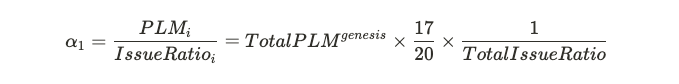

# Multi-Lockdrop

### Lockdropとはなにか？

Lockdropとは機会損失を利用し、その機会損失に応じてトークンの配分を決める方法です。多くのユーザが低リスクでトークンを受け取ることができるという点で革新的なトークン発行メカニズムです。トークンを獲得したい人は、ETHのような暗号資産をPlasm Networkチームが作成したスマートコントラクト上にロックします。このスマートコントラクトはEthereumのメインネットにデプロイされており、誰でも見ることができます。

Lockdropのスマートコントラクト👇



ロックをしたETHは選択された期間中、引き出すことができません。つまり使うことができなくなります。このロックした期間とロックされた量に応じて、Plasm NetworkのネイティブトークンであるPLMを手に入れることができます。

なぜロック期間と量に応じたPLMを手に入れることがでしょうか？それはロックをしている期間中に機会損失が発生しているからです。参加者がLockdropに**参加しなかった場合**、そのETHを使用してステーキングに回すとか、Compoundに貸し出しをして利子を稼ぐといった選択肢があります。それによって1 ETHを貸し出したのであれば将来的にそれが1.1 ETHになったり1.2 ETHになったりと増えます。スマートコントラクトにロックするということは、その機会を「損失」していると言えます。その損失に対してPlasm Network上のトークンであるPLMは発行されます。**ロック期間の終了後、ロックしたETHは返却されます。つまり上記の例でいうと、1 ETHから利子によって増えるはずだった0.1 ETHや0.2 ETHを担保にPLMが発行されていることになります。**

### **3つのキーポイント**

* スマートコントラクトを使っているので、誰でも見れ、誰でも検証可能であり、誰にも管理されていない**トラストレスな仕組み。ロックを引き出せるのはロックをした本人のみなので**参加者はコードを読み、理解できれば運営者を一切信頼する必要がありません。
* Lockdropという手法を用いることで極めて高い確率でPlasm Networkに関心のある、貢献をしている（しようと思っている）人々にトークンを配布できるます。

* この方法は限りなく透明性が高く、限りなくフェアです。VCであれ個人の参加者であれ同じ条件で同じように参加をすることができます。

### Multi−Lockdropとは？

Multi-Lockdrop は前述した Lockdrop を複数回行うための仕組みです。Plasm Network では 3度の Lockdrop を行います。Plasm Network ではトークンの総発行量がジェネシスブロックで決まりません。3度の Lockdrop によりその都度トークンが発行され、後述する "Staking" の利回りとしてもトークンが発行され続けます。

Lockdrop を複数回に分ける理由は2つあります。

1つ目は先行者利益が肥大化することを避けるためです。1度の Lockdrop で全てのトークンを分配すると、仮に最初の Lockdrop の参加者が少なかった場合にトークンの大半を保有するホルダーが現れるかもしれません。そして、そのようなことが発生した後にロールバックを行うことはチェーンの信頼性を損ないます。ブロックチェーンでは予め提示したルールに基づいてこのような問題を避ける施策を打つ必要があります。

2つ目は Plasm Network が安全にスケール/分権化するために序盤はある程度管理可能で実験的な振る舞いが出来るようにするためです。ブロックチェーンの強固なセキュリティシステムは大量のノード参加者と広く分散化されたトークンホルダーが存在することで成り立っています。起動直後からこのセキュリティを担保することは極めて難しいです。序盤は信頼できる機関がある程度管理可能な状態であるほうが好ましいでしょう。そこで 3 度の Lockdrop を設けることにより、全てのトークン発行前に不用意なトークン価値の高騰を抑えることで管理コストを下げます。私達は最終的に Plasm Network を完全なパブリックチェーンとすることを前提として安定して動作するまでの準備期間を設けるために複数回の Lockdrop を行います。

また、Plasm Network では3回のLockdrop についてそれぞれ以下のトークンで Lockdrop が可能になります。

* 1st: ETH
* 2nd: ETH, BTC
* 3rd: ETH, BTC, DOT

### **Lockdropのアルゴリズム**

初めに最初の Lockdrop で配布される PLM の総量を以下のように定義します。

これらを発行比率\(IssueRatio\)に応じて Lockdrop に参加したユーザに対して分配します。**IssueRatio** は

* **DollarRate\_token：**ロックしたトークンの総量をPLMトークン発行時のドルとロックしたトークンとの変換レート
* ロックした日数に 1.0005 を日数\(Days\)乗したものを掛けたものに近似されます。

> ここで 1.0005 は Polkadot の金利を参考にしました。Polkadot のデフォルト最大平均年利は 20%と定義されています。これを複利込みの日利に直した際の近似解が 0.05% となります。

ユーザ実際にはロックする期間を次の4種類（3回目のLockdropのみ5種類）から選ぶことができます。ロック期間に応じて ロックしたトークンの価値をドル換算した値に以下の**LockBonus**を掛けたものが **IssueRatio** となります。

上記をもとに **IsseRatio** を以下のような式で定義されます.ここで

* **Locked\_token**： Lockdrop の対象の token を Lock した量
* **DollarRate{token}** ：1token のドル建て価格
* **LockBonus\_day**： days 日間ロックしたときの**LockBonus**を示します

算出された **IssueRatio** を元に、配られるトークン数が決定します。トークン配布量の決定アルゴリズムは以下のようになります。

* **n** : Lockdrop を行ったユーザ数
* **IssueRatio\_i**：ユーザ iの IssueRatio

総発行トークンのうち15%\(17/20\)はPlasm Network運営チームに移譲されます。この時、ユーザ **i** の 得られる**PLM\_i**は以下になります。

つまり、全体の **IssueRatio** のうち自分の **IssueRatio** が占める割合だけPLMが分配されます。ここで、IssueRation の総和である **TotalIssueRatio** を定義します。

また、1回目の Lockdrop における単位 **IssueRatio**あたりのPLM発行量をここで **α\_1**とおきます。これは2回目以降の Lockdrop における PLM 発行量を決めるための重要な値となります。

2回目、3回目のLockdropにおける単位 **issueRatio**あたりの PLM 発行数を α\_2, α\_3と以下の等式を満たすように定義します。

上記から2回目、3回目のユーザ i に配られるPLMの量は以下になります。

こうすることで、2回目以降の Lockdrop のおいてユーザは単に **IssueRatio** に比例した量のトークンを得ることができます。これにより、2回目以降に Lockdrop を行うユーザが非常に増えた場合、ユーザが取得できる PLM の量が全体の割合に対して過度に少なくなってしまう問題を解決します。

質問があれば、[Tech Chat](https://discord.gg/Cyjnrxv)の日本語チャネルでご質問ください。

