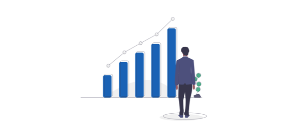

# Operator Trading

Operator Trading は**コントラクトの所有者を管理する機能です。コントラクトを資産として移転することが可能になります**。Dapps Reward の仕組みにより、Operator は恒常的に利益を得ることができます。



よりよく Operator の運営を行えるならばその Operator を別の相手に譲ることも一つの案でしょう。当然、Operator は常時売買されるわけではありません。Operator は自身に対してついた値に対して妥当だと思われる値をつけた相手に対してその権利を譲るでしょう。Operator の権利を譲り受けた対象は Operator としての報酬を受け取ることができます。この時、実際に運用を交替する必要はありません。しかし、Operator を売り渡した側は既にその Oeprator を誠実に運用するインセンティブを失うため必然的に譲渡先の新しい Operator の保有者が Operator の運用を行うことになります。

質問があれば、[Tech Chat](https://discord.gg/Cyjnrxv)の日本語チャネルでご質問ください。

