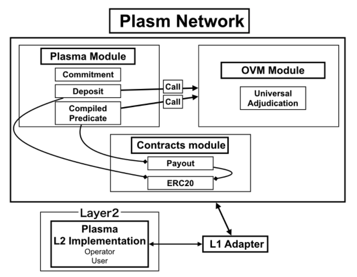

# Оптимистичная Виртуальная машина \(OVM\)  🌔

### **Что такое Optimistic Virtual Machine?**

Попросту говоря, OVM \(Оптимистичная виртуальная машина\) - это виртуальная машина, разработанная Ethereum Foundation Plasma Group для поддержки всех протоколов Layer R2. Это возможное объединение всех конструкций масштабируемости layer2. Это означает, что Plasm Network будет совместим с любыми приложениями и протоколами Layer 2, например Lightning Network или любыми другими протоколами 2-го уровня.

Plasm Network станет платформой, на которой могут быть размещены все масштабируемые решения второго уровня- layer 2. Пользователи могут выбрать, какое решение использовать, и сделать возможным их использование с минимальными накладными расходами.

### **Узнайте больше**

OVM - это мощная концепция для разработки приложений второго уровня. Мы можем выразить сложную логику взаимодействия простым языком OVM, и этот язык содержит [Оптимистичную Семантику Игры \(OGS\).](https://plasma.group/optimistic-game-semantics.pdf)

Например, мы можем выразить Plasma чекпоинты \(checkpoint\) и выходы \(exits\) из заявок с помощью двух простых определений \(мы называем это «свойством\(property\)»\) с помощью OGS. Plasm Network отделяет OVM от смарт-контракта и подготавливает его как модуль, чтобы OVM можно было использовать проще и удобнее.

### **OVM в Plasm Network**

OVM и его окружающая архитектура показаны на рисунке ниже.



Plasma приложения \(Plapps\) можно создавать и запускать с помощью специального адаптера L1 клиентского приложения. Plapps состоят из модулей OVM, Plasma и Contracts в Plasm Network.

В случае с приложениями Plasma на Ethereum все, что предусмотрено в этих модулях, управляется смарт-контрактами. Однако, в этом случае существует проблема, заключающаяся в том, что трудно предсказать стоимость gas при запуске Plasma приложения, содержащего сложную логику. Кроме того, создание приложений, объединяющих несколько контрактов, может сбивать с толку разработчиков.

По этой причине Plasm Network рассмотрела лаконичную и простую для понимания конфигурацию, разделив роли на три модуля. Модуль OVM реализует функцию под названием Universal Adjudication, которая вызывает спор, когда пользователь обнаруживает ошибку в информации на уровне Layer 1. Модуль Plasma поддерживает общую реализацию некоторых важных смарт-контрактов. Модуль Контрактов управляет только реализациями, которые требуют различной логики для каждого приложения.

Эти логики Plasm Network могут быть объединены с реализацией, представленной  Plasma L2 и  описанной выше, для создания приложения.

Вы можете увидеть детали ниже.  


### **Смарт-Контракты**

Смарт-контракты в приложениях Layer 2 для Plasm Networks требуют контрактов ERC20 и контрактов на выплату. Каждый разработчик приложений уровня Layer 2 должен реализовать свой смарт-контракт.

### **ERC20 Контракт**

Контракт ERC20 - это контракт, в котором используются токены, обрабатываемые приложением Layer 2. Они используются когда нужно взаимодействовать с токенами в формате [ERC20.](https://eips.ethereum.org/EIPS/eip-20) Контракт упаковывается и исполняется как контракт с PLM \(токенами системы Plasm Network \) в качестве контракта ERC20 по умолчанию.

### **Контракт WPLM**

Контракт wPLM представляет собой wrapped \(завернутый \) контракт токена PLM. Это токен ERC20,получаемые от блокировки в смарт-контракте токена PLM, базового токен Plasm Network, Другими словами, он имеет то же значение, что и PLM. Это происходит также как с [wETH](https://weth.io/jp/).

### **Payout контракт**

Payout Contract - это контракт, который выражает процесс возврата токенов с уровня  Layer 2 на уровень Layer 1. Разработчики приложения Layer 2 должны реализовать его, поскольку пользователь не может произвести вывод средств без этого контракта. Мы реализовали Ownership payout в качестве Payout контракта по умолчанию.

Вышеуказанный договор может быть реализован независимо от   модулей ovm. Payout контракт должен иметь возможность вызывать метод `finalizeExit`. Это обеспечивается следующей характерной особенностью:

```text
function finalizeExit(
    address depositContractAddress,
    types.Property memory _exitProperty,
    uint256 _depositedRangeId,
    address _owner
)
```

### **Ownership payout контракт**

Ownership payout \(Выплата владельцу\) - это контракт, который владелец токена может отозвать. В частности, если в игре «Испытание» установлено, что «Выход» является истинным, владелец, представленный этим объектом состояния \(в данном случае OwnershipPredicate\), может отозвать токен. Контракт о выплате прав собственности выражается в контракте Ethereum [следующим образом](https://github.com/cryptoeconomicslab/ovm-contracts/blob/master/contracts/Predicate/plasma/OwnershipPayout.sol).

### **Модули**

Операции, связанные с OVM, выполняются модулем среды исполнения \(runtime module\) Substrate. Благодаря этому пользователям не нужно развертывать сложные смарт-контракты. Также, это сделано для того, чтобы сделать затраты на транзакции меньше и легко оцениваемыми. Кроме того, это заставляет разработчиков приложений уровня Layer 2 рассматривать и реализовывать только действительно необходимые "ERC20 контракты" и  "Payment контракты" и свойства, которые указывают на правила перехода состояний.

Затем необходимо рассмотреть специальное хранилище, которое может обрабатывать приложение уровня Layer 2 с модулем среды исполнения \(runtime module\) Substrate. Он обрабатывает одно приложение как один AccountId так же, как и смарт-контракт.

В частности, его можно разделить на модули OVM, которые выполняют общую обработку OVM, и модули Plasma, которые отвечают за обработку, специфичную для Plasma. См. Диаграмму архитектуры для зависимостей каждого модуля и контракта.

### **Модуль OVM**

Модуль OVM описывает обработку, обычно выполняемую в OVM. В частности, логика выполнения Predicate \(предиката\) включена в этот модуль. Кроме того, смарт-контракт выполняется с использованием истинного Predicate \(предиката\) в качестве триггера. Этот модуль является версией [договора универсального решения](https://github.com/cryptoeconomicslab/ovm-contracts/blob/master/contracts/UniversalAdjudicationContract.sol)\(Universal Adjudication contract\) в  Ethereum смарт-контрактах.

### **Типы**

Различные типы использования  OVM модуля.

```text
pub struct Predicate(Vec<u8>);

pub struct Property<AccountId> {
    predicate_address: AccountId,
  // Every input are bytes. Each Atomic Predicate decode inputs to the specific type.
    inputs: Vec<u8>,
}

pub enum Decision {
    Undecided,
    True,
    False
}

pub struct ChallengeGame<AccountId, BlockNumber> {
    property: Property<AccountId>,
    challenges: Vec<u8>,
    decision: Decision,
    created_block: BlockNumber,
}

pub struct Range<Balance> {
    start: Balance,
    end: Balance,
}
```

### **Универсальные решения**

**Константы**

```text
/// During the dispute period defined here, the user can challenge. If nothing is found, the state is determined after the dispute period.
type DISPUTE_PERIOD: T::Moment = 7;
```

**Хранилище**

```text
decl_storage! {
    Predicate get(fn predicate): map T::AccountId => T::Predicate;
    DisputePeriod get(fn dispute_period): T::Moment;
    InstantiatedGames get(fn instantiated_games): map T::Hash => T::ChallengeGame;
}
```

**Модули**

```text
decl_storage! {
    fn deploy(predicate: T::Predicate);
    fn claim_property(claim: T::Property);
    fn decide_claim_to_true(game_id: T::Hash);
    fn decide_claim_to_false(game_id: T::Hash, challenging_game_id: T::Hash);
    fn remove_challenge(game_id: T::Hash, challenging_game_id: T::Hash);
    fn set_predicate_decision(game_id: T::Hash, decision: bool);
    /**
   * @dev challenge a game specified by gameId with a challengingGame specified by _challengingGameId
   * @param _gameId challenged game id
   * @param _challengeInputs array of input to verify child of game tree
   * @param _challengingGameId child of game tree
   */
    fn challenge(game_id: T::Hash, challenge_inputs: Vec<u8>, challenging_game_id);

    /// callable
    fn is_decided(property: T::Property);
    fn get_game(claim_id: T::Hash);
    fn get_property_id(property: T::Property);
}
```

**События**

```text
// (predicate_address: AccountId);
DeployPredicate(AccountId);
// (gameId: Hash, decision: bool)
AtomicPropositionDecided(Hash, bool);
// (game_id: Hash, property: Property, createdBlock: BlockNumber)
NewPropertyClaimed(Hash, Property, BlockNumber);
// (game_id: Hash, challengeGameId: Hash)
ClaimChallenged(Hash, Hash);
// (game_id: Hash, decision: bool)
ClaimDecided(Hash, bool);
// (game_id: Hash, challengeGameId: Hash)
ChallengeRemoved(Hash, Hash);
```

**Модуль Plasma**

Plasma модуль - это модуль, который отвечает за обработку, специфичную для Plasma. Он вызывает модуль OVM и указанную функцию смарт-контракта. Plasma модуль имеет один адрес "Commitment" и  "Deposit" для каждой заявки. Каждый из них определяется `decl_child_storage`. `decl_child_storage!` это макрос, который реализует DB в SubTrie. Это устанавливается в `AccountId` в качестве значения ключа. Это похоже на адрес контракта. В частности, реализуемого со ссылкой на [AccountDb](https://github.com/paritytech/substrate/blob/master/frame/contracts/src/account_db.rs) контрактного модуля.

Это модифицированные [Commitment](https://github.com/cryptoeconomicslab/ovm-contracts/blob/master/contracts/CommitmentContract.sol),[ Deposit](https://github.com/cryptoeconomicslab/ovm-contracts/blob/master/contracts/DepositContract.sol) и[ CompiledPredicate](https://github.com/cryptoeconomicslab/ovm-contracts/blob/master/contracts/Predicate/CompiledPredicate.sol) контракты из Ethereum.

**Типы Plasma модулей**

```text
pub struct StateUpdate<AccountId, Balance, BlockNumber> {
    deposit_contract_address: AccountId,
    ragne: Range<Balance>,
    block_number: BlockNumber,
    state_object: Property<AccountId>,
}

pub struct Checkpoint<AccountId, Balance> {
    subsrange: Range<Balance>,
    state_update: Property<AccountId>,
}

pub struct Exit<AccountId, Range, BlockNumber, Property, Balance, Index> {
    state_update: StateUpdate<AccountId, Range, BlockNumber, Property>,
    inclusion_proof: InclusionProof<AccountId, Balance, Index>
}

pub struct InclusionProof<AccountId, Balance, Index> {
    address_inclusion_proof: AddressInclusionProof<AccountId, Index>
    interval_inclusion_proof: IntervalInclusionProof<Balance, Index>,
}

pub struct IntervalInclusionProof<Balance, Index> {
    leaf_index: Index,
    leaf_position: Index,
    sibilings: Vec<IntervalTreeNode<Balance>>
}

pub struct AddressInclusionProof<AccountId, Index> {
    leaf_index: AccountId,
    leaf_position: Index,
    siblings: Vec<AddressTreeNode<AccountId>>,
}

pub struct IntervalTreeNode<Balance> {
    data: Vec<u8>,
    start: Balance,
}

pub struct AddressTreeNode<AccountId> {
    data: Vec<u8>,
    token_address: AccountId,
}
```

#### **modules**

```text
/// Commitment constructor + Deposit constructor
fn deploy(
    aggregator_address: T::AccountId,
    erc20: T::AccountId,
    state_update_predicate: T::AccountId);
```

### Commitment <a id="commitment"></a>

Commitment - это нечто, необходимое для того, чтобы сохранить Merkle Root, принадлежащий child chain \(детской цепочке\) Plasma. Child storage \( хранилище \) Commitment создается для каждого приложения уровня Layer 2. Это может быть использовано как доступ к смарт-контрактам.

#### Storage <a id="storage"></a>

```text
// Commitment storage: Plapps address => Commitment Child Storage.
Commitment get(fn commitment): T::AccountId => Commitment;
```

```text
decl_child_storage! {
    Commitment {
        // Single operator address: OperatorId
        OperatorAddress get(fn operator_address): T::AccountId;
        // Current block number of commitment chain: BlockNumber
        CurrentBlock get(fn current_block): T::BlockNumber;
        // History of Merkle Root
        Blocks get(fn blocks): map u128 => T::Hash
    }
}
```

### Modules <a id="modules"></a>

```text
decl_modules! {
    fn submitRoot(blk_number: u64, root: T::Hash); 

  /**
   * verifyInclusion method verifies inclusion of message in Double Layer Tree.
   * The message has range and token address and these also must be verified.
   * Please see https://docs.plasma.group/projects/spec/en/latest/src/01-core/double-layer-tree.html for further details.
   * @param _leaf a message to verify its inclusion
   * @param _tokenAddress token address of the message
   * @param _range range of the message
   * @param _inclusionProof The proof data to verify inclusion
   * @param _blkNumber block number where the Merkle root is stored
   */
    fn verifyInclusion(leaf: T::Hash, address, T::AccountId, range: T::Range, inclusionProof: InclusionProof, blk_number);
}
```

### Events <a id="events"></a>

```text
// Event definitions (AccountID: PlappsAddress, BlockNumber, Hash: root)
BlockSubmitted(AccountId, BlockNumber, Hash);
```

### Deposit <a id="deposit"></a>

Перемещение токенов ERC20 со слоя Layer 1 на слой Layer 2. Child storage Депозита создается для каждого приложения уровня 2. Это можно использовать как доступ к смарт-контрактам.

#### **Storage**

```text
// Deposit storage: Plapps address => Deposit Child Storage.
Deposit get(fn deposit): T::AccountId => Deposit;

decl_child_storage! {
    Commitment {
    ERC20 get(fn erc20): T::AccountId;
    CommitmentContract get(fn commitment_contract): T::AccountId;
    UniversalAdjudicatinonContract get(fn universalAdjudicationContract);
    StateUpdatePredicate get(fn state_update_predicate): T::AccountId;

    TotalDeposited get(fn total_deposited): T::Balance;
    DepositedRanges get(fn deposited_ranges): map T::Balance => T::Range;
    Checkpoints get(fn checkpoints): map T::Hash => T::Checkpoint;
    }
}
```

#### Modules <a id="modules"></a>

```text
decl_modules! {
    fn deposit(amount: T::Balance, initial_state: T::Property);
    fn extend_deposited_ranges(amount: T::Balance);
    fn remove_deposited_range(range: T::Range, depositedRangeId: T::Balance);
    fn finalize_check_point(checkpoint_property: T::Property);
    fn finalizeExit(exit_property: T::Property, deposited_range_id: T::Balance);

    /// callable
    fn is_subrange(subrange: T::Range, surroundingRange T::Range);
}
```

#### Events <a id="events"></a>

```text
// (checkpointId: Hash, checkpoint: Checkpoint);
CheckpointFinalized(Hash, Checkpoint);
// (exit_id: Hash)
ExitFinalized(Hash);
// (new_range: Range)
DepositedRangeExtended(Range);
// (removed_range: Range)
DepositedRangeRemoved(Range);
```

### **Compiled Predicate \(Скомпилированный предикат\)**

Роль CompiledPredicate заключается в оптимизации размера заявки путем компиляции сложного предложения в один простой предикат. Plasma модуль запускает приложения уровня Layer 2 через предикат. Обработка вывода PayoutContract, которая существует для каждого приложения Layer 2, может быть вызвана только через скомпилированный предикат. Это позволяет производить вывод  транзакций с Layer 2 так же безопасно, как c уровня Layer 1.

**Storage**

```text
/// predicate address => payout address
PayoutContractAddress get(fn payout_contract_address): map T::AccountId => T::AccountId;
```

#### Modules <a id="modules"></a>

```text
fn decide_true(predicate_address: T::AccountId, inputs: Vec<u8>, witness: Vec<u8>);

/// callable
fn is_valid_challenge(predicate_address: T::AccountId, inputs: Vec<u8>, challenge_inputs: Vec<u8>, challenge: T::Property);
fn decide(predicate_addres: T::AccountId, inputs: Vec<u8>, witness: Vec<u8>);
```

Остались вопросы? Не стесняйтесь, пишите в[ Discord](https://discord.com/channels/644182966574252073/659740674882666506) .  


