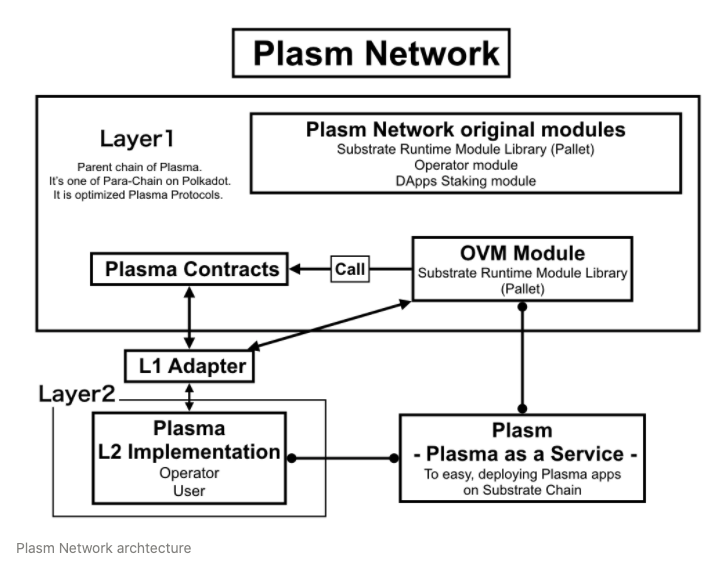

# Структура Plasm 🏯

[Plasm Network](https://www.plasmnet.io/) предоставляет масштабируемые методы создания приложений для всех разработчиков. Такая архитектура позволяет:

Plasm Network - layer1 публичный блокчейн, который разработан на основе Substrate. На Substrate команда Plasm разрабатывает модуль OVM, Plasma модуль и остальной функционал для создания масштабируемых приложений. Plasm Network станет первым Plasma/OVM парачейном Polkadot.

Остались вопросы? Не стесняйтесь, пишите в[ Discord](https://discord.com/channels/644182966574252073/659740674882666506) .

