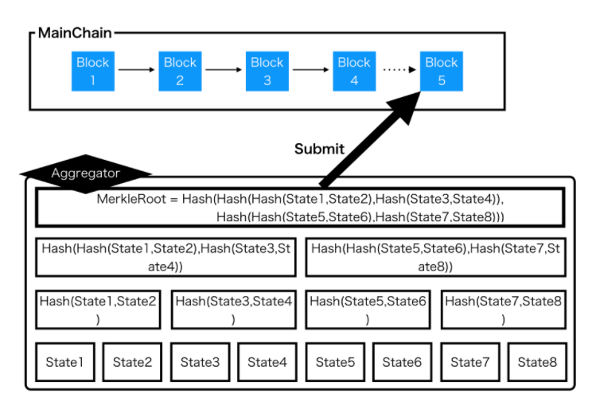
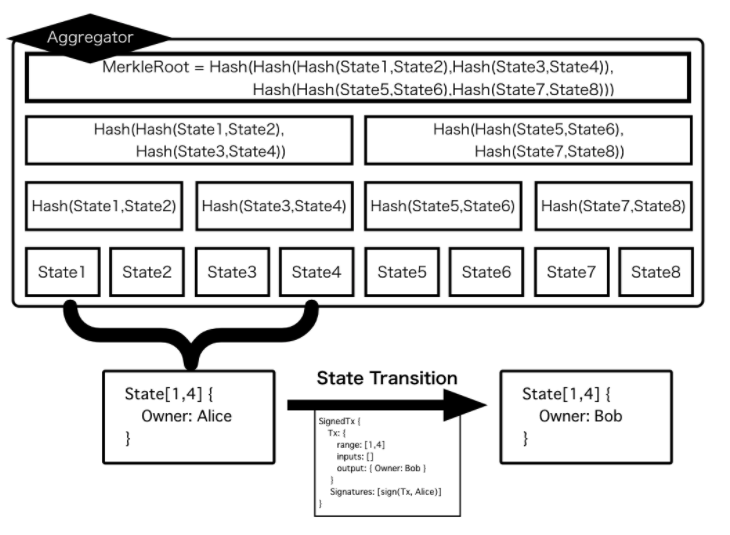

# レイヤー2とPlasma 🚅

### スケーリングの必要性

最も規模の大きいスマートコントラクト機能を搭載したブロックチェーンである Ethereum1.0レイヤー1のトランザクションスループットは秒間[15トランザクション](https://www.coindesk.com/information/will-ethereum-scale)です。一方で世界中に多くのユーザーを保有するVISAやAlipayではそれぞれ秒間[1700トランザクション](%20https://hackernoon.com/the-blockchain-scalability-problem-the-race-for-visa-like-transaction-speed-5cce48f9d44)、[256,000 トランザクション](https://www.barrons.com/articles/alibaba-records-25-3-billion-in-singles-day-sales-1510538618)を処理しています。多くのユーザーが Dapps の恩恵を受けるためには現状の処理性能があまりに不十分であることが分かります。そこでブロックチェーンでは様々なスケーリングソリューションが考え出されました。

### ソリューションの種類

ブロックチェーンのスケーリングソリューションはいくつか存在します。例えば、

* Segwit などのブロックサイズを圧縮するソリューション
* ユーザー同士がオフチェーンでいくつかの取引をまとめて行い最終状態のみをブロックチェーンに記述するState Channel
* 複数のノードでトランザクションの分散処理を行うシャーディング
* そして別のチェーンにトランザクション処理を行わせてルートハッシュのみをメインチェーンに保存する Plasma 

これらのソリューションは大別すると、**レイヤー1でできることを増やそうというレイヤー1スケーリングソリューション**と、**レイヤー1でやることを減らしレイヤー2でやることを増やそうというレイヤー2ソリューション**の2つがあります。

Plasm Networkはその中でもまず、メインチェーンの外でトランザクションを処理するレイヤー2ソリューションに焦点を当てました。レイヤー1 は EthereumやBitcoinと言ったパブリックブロックチェーンのことを指します。それらはトランザクションが飽和している問題を抱えています。このことから、10年後のブロックチェーンの使用法は今までとは大きく異なり、レイヤー1がトラストレイヤー、レイヤー2がトランザクションレイヤーとして使用されることになると予想されます。

Plasm  Networkは最初にPlasmaが実装されたブロックチェーンです。

### Plasma概要

Plasm NetworkにPlasmaが最初に実装された理由は、Plasmaがメインチェーンの処理性能に最も依存しないスケーリングソリューションだからです。Plasma では単一の Aggregator と呼ばれる運営者がサイドチェーンの運営を行います。つまり、合意形成プロセスの不要な中央集権的管理方法で多くのトランザクションを処理することができます。それは、既存の中央集権的システムで使われているスケーリングソリューションをそのまま転用できることを意味するため分散台帳では不可能な高い処理性能を実現することができます。Plasma のアプローチは全ての分散台帳に飛躍的な処理性能の向上を行えるためこの先、必要不可欠な技術になっていくと言えるでしょう。

### Plasmaの詳細

Plasma はブロックチェーンにおけるスケールソリューションの一つです。Plasma の基本的なアイディアは、チェーン外でトランザクションをマークルツリーで管理・高速に処理しマークルルートのみをブロックチェーンに刻むというものです。チェーン外の処理を行いブロックチェーンにハッシュを提出する責任者を Plasma の文脈で Aggregator と呼びます。

Plasm でサポートされている "Plasma" は Plasma-Cash をベースにしたものです。これはマークルツリーの葉でトランザクションではなく1つのNFTの状態を持ちます。状態の遷移を行うためのルールは後述する OVM によって定義できます。下図では状態として所有権を持つ NFT の状態遷移とそれに必要な Transaction の例を示します。

この場合、状態遷移をするためには 

1. "Owner" の署名があること 
2. 新たな状態を output に指定していること 
3. 状態がすでに別の方法で遷移されていないこと 

が必要です。これを Optimistic Virtual Machine（OVM）を用いて記述します。



ここで記述された論理を "Predicate" と呼びます。これは一階述語論理で記述されます。OVM が受理したトランザクションを受け取ったとき、状態を遷移しマークルルートを更新します。

Plasma において 単一の Aggregator がこれらのトランザクションの処理とマークルルートの提出を行います。仮に Aggregator が不正を働いた際にユーザの提出したトランザクションが改ざんされる可能性があります。Plasma ではそのような改ざんに対して先述した OVM と Predicate を用いてメインチェーン上でトランザクション、状態の正しさを紛争することができます。これにより Plasma は単一の Aggregator による高速なトランザクション処理能力とブロックチェーンの持つ強固なセキュリティの両方を兼ね備えることができます。

### Plasmaの問題点

しかしながら、Plasma の運用には未だいくつかの問題を抱えています。一つは Plamsa を使ったアプリケーションで出来ることに制限がある点です。（Plasmaで出来ることは一階述語論理\(以下、Predicate\)で記述可能であることが明らかになりました。）もう一つは Plasma は複数のコンポーネントにより構成されている複雑なシステムであるという点です。単純にスマートコントラクトを記述しデプロイしただけではアプリケーションを構築することは出来ません。具体的にはアプリケーションは親チェーンコントラクト、子チェーン、Aggregator、ユーザーの4つのコンポーネントから成り立っておりそれぞれについて処理を記述しなければならなりません。 

Plasm Networkはこの2つの問題を通して解決していきます。Plasm Network では Predicate を正しく記述できるように標準規格を設けてライブラリ化します。そして最終的に複数のコンポーネントを簡単にデプロイできるためのクラウドサービスを構築します。Plasm Network が提供するプロダクトを通して開発者がアプリケーションを開発する過程を手助けします。

