# \(旧\)ロックドロップチュートリアル


現在Plasm Networkのロックドロップは実施しておりません。第三回ロックドロップのアナウンスをお待ち下さい。開催時期はPolkadotの開発によるため、未定です。


## 第1,2回目のロックドロップの参加方法

最初に、ブラウザにWeb3ウォレットブラウザ拡張機能 [MetaMask](https://metamask.io/) がインストールされていることを確認します。 まだ持っていない方は今すぐインストールしましょう！  
次に、[https://lockdrop.plasmnet.io/](https://lockdrop.plasmnet.io/) に進み、アプリケーションを起動します。 以下の実際のデモは、ローカルサーバー上のローカルチェーンを介して行われますが、実際のLockdropは **Ropsten Test Network** と **Ethereum メインネット**上で誰でも使用できるようになっています。

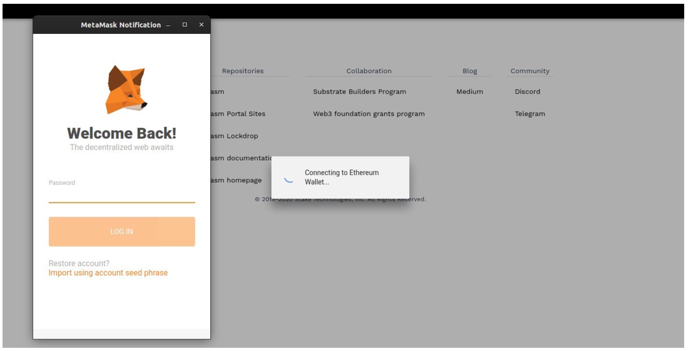

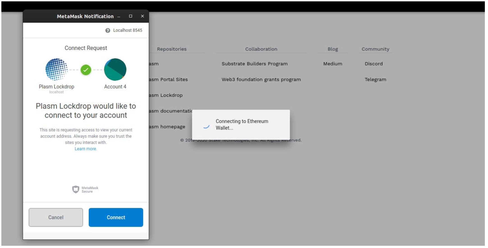

Meatamask を適切にインストールすると、上記のロード画面とウォレットからのメッセージが表示されるので接続を許可してください。

**以下のページはLockdrop期間中に表示されます。**

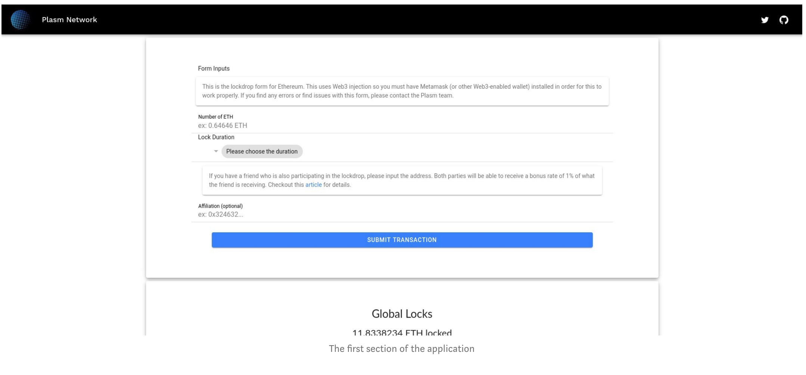

Lockdrop のWebページは2つに分かれています。 上記の画面は入力フォームです。 ETHでロックする量、ロックする期間（参加者は30、100、300、および1000日から選択できます）、および紹介者の公開アドレスを入力するだけです。 紹介者のアドレスはアフィリエイトプログラムにおける正当なパブリックアドレスのみを受け入れます。 この部分を空のままにすると、紹介者はデフォルトで「0x0000000000000000000000000000000000000000」になります。 さらに、紹介者のアドレスは無効なアドレスを拒否しますので、注意してください。

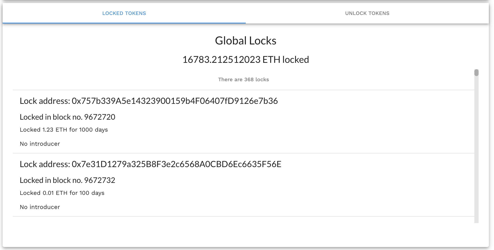

上記の画面は Global Locks です。これはすべての「Locked」イベントを取得し、それらをリストとして表示します。Lockdrop の参加者にすべてのLock 情報をリアルタイムで提供します。

## 実践

それでは、実際にETHをロックしてみましょう！ まずは紹介者を指定せずに、69.696969ETHを300日間ロックします。

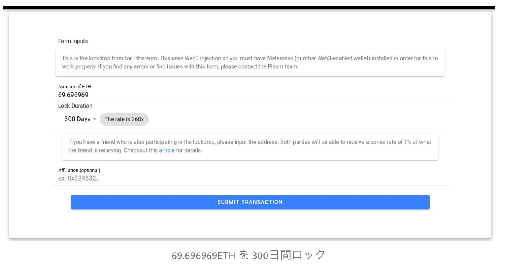

上記のようにフォームに入力したあと”**SUBMIT TRANSACTION”**をクリックします。

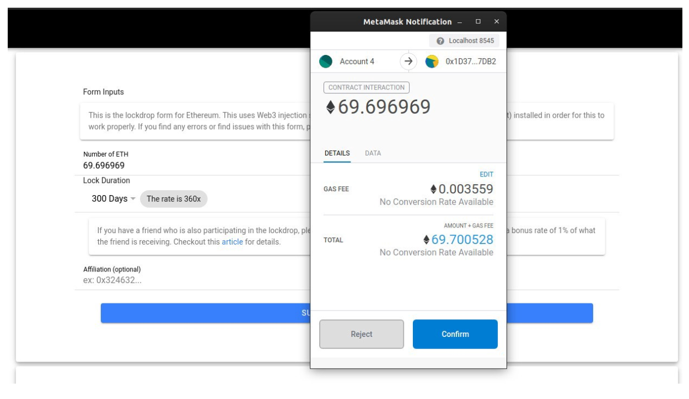

すると、Metamask がスマートコントラクトの実行許可を求めていることがわかります。 **“Confirm”**をクリックしてトランザクションを作成し、発行します。

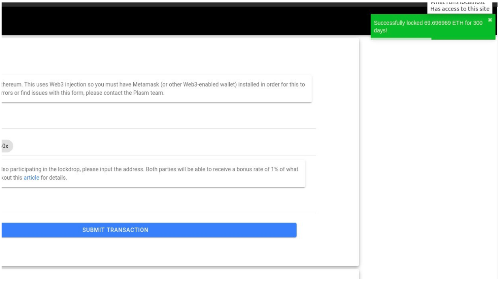

トランザクションの実行に成功すると上記のように正常にロックされたことを知らせる緑色のトーストが側面に表示されます。

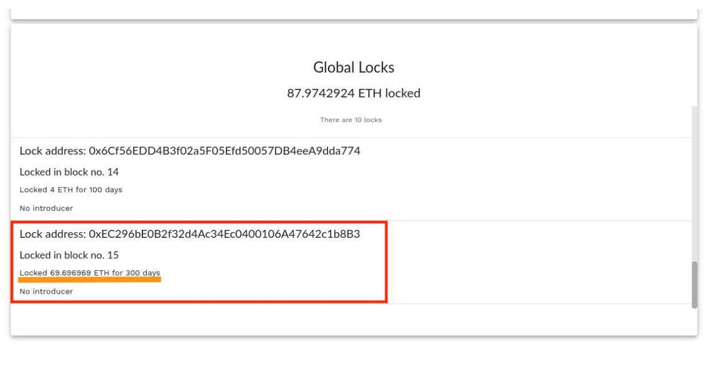

また、Global Locks を見ると、先程実行したトランザクションにより発行された “Lock Event” を見ることが出来ます。また、紹介者を指定しなかったため、リストに”No introducer”と表示されていることがわかります。

今回は、紹介者のアドレスを指定してトークンをロックしてみましょう。

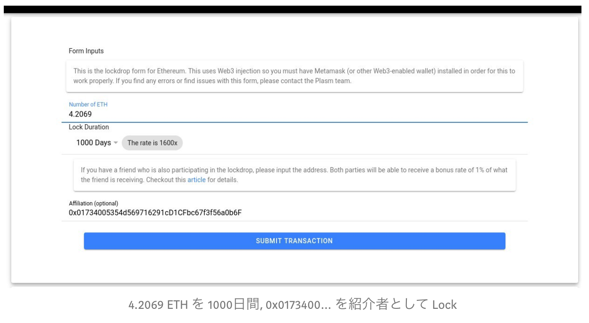

上記のように Affiliation のフォームに紹介者のアドレスを入力します。

※ここで入力されている紹介者のアドレスはテスト用であり本物では機能しません。

その後、先程と同じように “SUBMIT TRANSACTION” -&gt; “CONFIRM” を押してトランザクションを実行します。

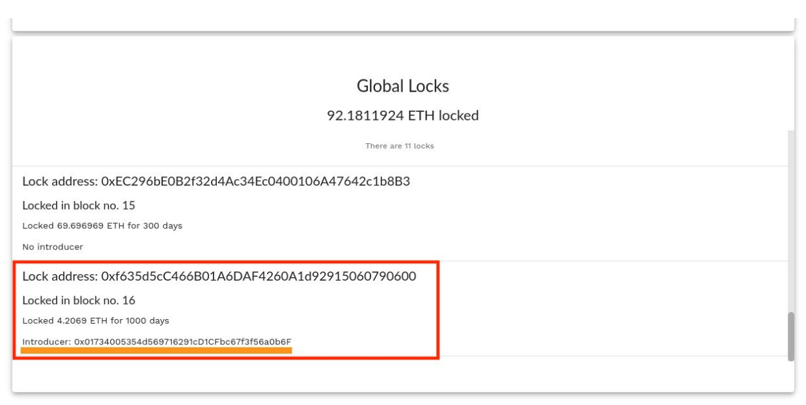

成功すると上記の画像のように、紹介者がリストに正しく表示されています。

失敗した場合は以下のように赤色のメッセージが側面に表示されます。

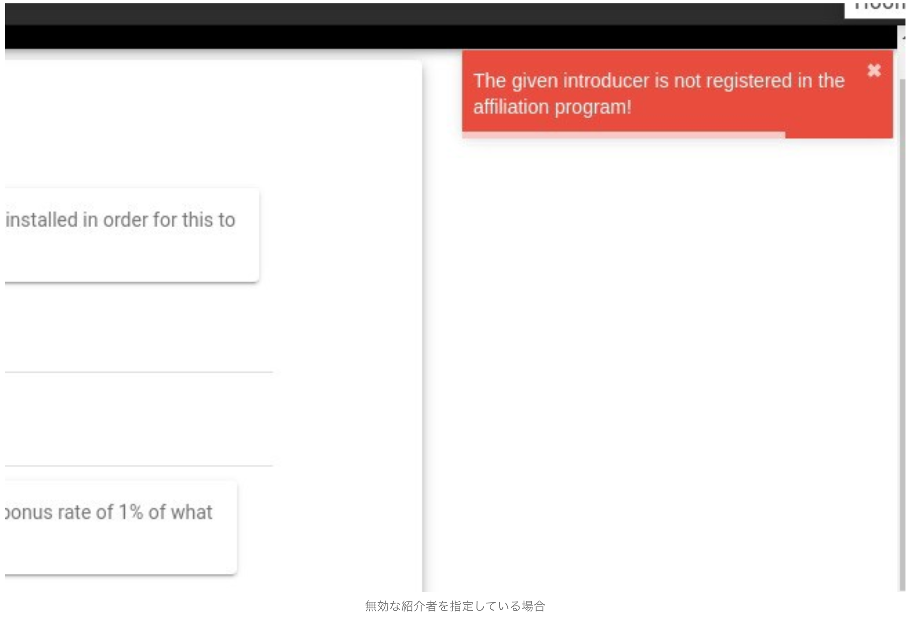

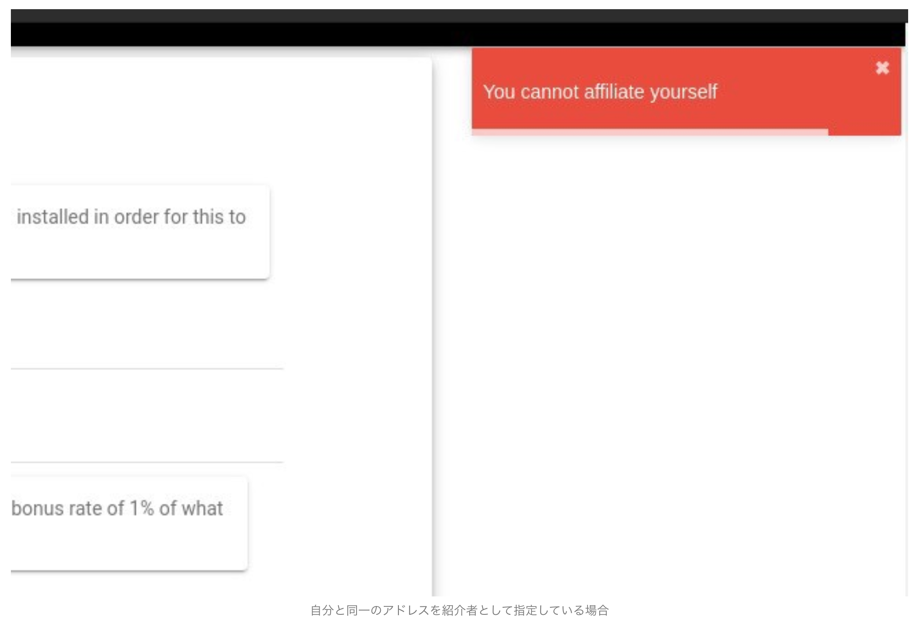

入力が失敗した場合は、トランザクションが実行されないためアドレスを見直して再度送り直してみてください。

質問があれば、[Tech Chat](https://discord.gg/Cyjnrxv)の日本語チャネルでご質問ください。

