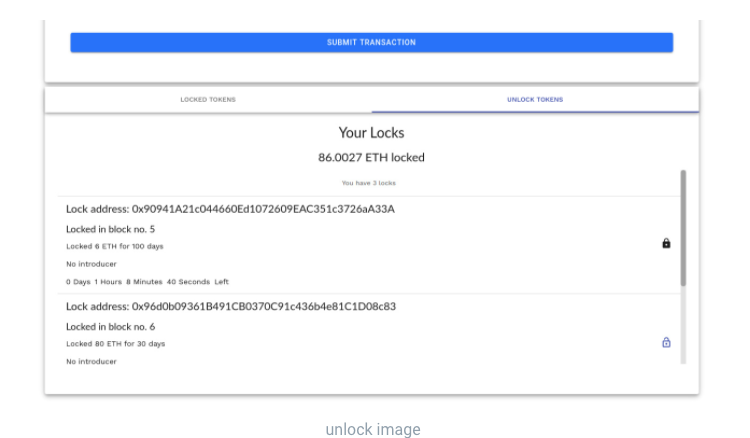

# Unlock Tutorial

## **Unlock ETH but cant sync with Ethereum**

Recently, a lot of our users had problems connecting to Ethereum to unlock their second lockdrop. One of the main issues is syncing to Ethereum. The wheel keeps spinning:


Our WebSocket sometimes gets blocked and in this case, it’s not possible to sync. This issue can be resolved by using a VPN extension in your browser. This tutorial is created for the Chrome browser.

### **Step 1**

Go to the following website and click on the ‘Second lockdrop - ETH Lock’: **** [**https://lockdrop.astar.network**](https://lockdrop.astar.network)****\
****Log in with your MetaMask account! NOTE: connect with the wallet you used to join the lockdrop.


### **Step 2**

If your browser does not sync with Ethereum, you need to install a browser extension to use a VPN connection. I used [VeePN](https://chrome.google.com/webstore/search/veepn?hl=en&\_category=extensions). It’s a free VPN for Chrome.


You only need to install the VeePN extension, and you can see it between all your other extensions listed.

### **Step3**

Open the extension. Select a country you want to use to connect to the lockdrop page. Finally, click on the ON button.\
****


### **Step 4**

You should now see the lockdrop page. If not, please use another region in your VPN settings.\
You can now click on ‘Unlock Tokens’ and continue with unlocking your ETH.\
****


In case you need any support. Feel free to ask for help in our community.\
NOTE: Admins or Ambassadors will never PM first! In case someone approach you to offer support. This is a scam!

## How to unlock by sending a transaction to the smart contract

Lockdrop's Lock Contract contains the following anonymous function.

```
/**
* @dev Withdraw function once timestamp has passed unlock time
*/

function () external payable {
 assembly {
  switch gt(timestamp, sload(0x01))
  case 0 { revert(0, 0) }
  case 1 {
   switch call(gas, sload(0x00), balance(address), 0, 0, 0, 0)
  case 0 { revert(0, 0) }
  }
 }
}
```

This enables the contract to return the locked balance (the entire contract balance) to the original token locker's address by sending an empty transaction to this contract address. The timestamp of the transaction must be greater than the timestamp of the lock including the lock duration. When someone sends a transaction before the duration of the locks is passed, the transaction will return an error.

Sending a transaction to the lock (i.e. unlocking the tokens) can be done by anyone given that they have enough funds to pay for the transaction fee. The locked tokens will only return to the original locker. So it is possible to allow another address to unlock the locked token on behalf of the original locker, but they cannot claim the tokens for themselves.

One point to note is that once the lock duration is over, the contract will not have any transaction rejections, meaning even if the token was returned to the original locker, anyone can still send a transaction to the contract without any errors. Once the token is claimed it will not be able to return any more tokens, as the contract balance will be 0, but it makes it hard for the original locker to check if the tokens were unlocked or not without having to check the contract balance or track their balance, effectively giving a potential issue of wasting transaction fee for attempting to claim the locked tokens that were already unlocked.



The Lockdrop Web Application comes with an intuitive form that displays any lock information. Under the `Unlock Tokens` tab, it will display a list of locks that were locked by the current address in a Web3 enabled browser wallet extension. Once the lock duration is over, the lock icon on the right will change to a lighter color. Clicking this icon will allow you to send the transaction of 0 ETH to the lock address, unlocking the tokens. This form allows you to easily check the lock information, time until the lock is over,  and unlock once it is over. However, as mentioned above, it is hard to check if the lock has been already claimed or not, so even if the locks were successfully claimed, the UI elements will still look the same.

Any questions? Feel free to ask us on [Discord Tech Channel](https://discord.gg/Z3nC9U4).
