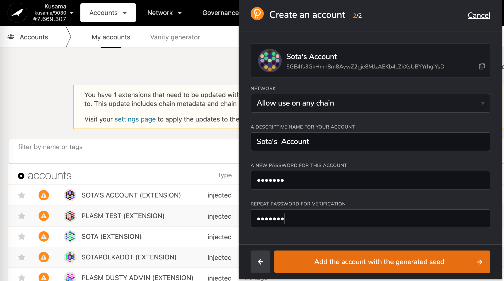

# Polkadot.js

n this section, we are going to walk you through how to join our crowdloan and auction from Polkadot.js.


If you are already familiar with  Polkadot.js, please skip some of the basic sections.



Please check out the [complete list of wallets exchanges for plasm ecosystem](https://forum.plasmnet.io/t/complete-list-of-wallets-exchanges-for-plasm-ecosystem/1215)


## What is Polkadot.js?

[Polkadot.js ](https://polkadot.js.org)is a browser wallet for Polkadot ecosystem maintained by Parity Technologies and community developers. Currently, Polkadot.js is one of the main browser wallets in the ecosystem like Metamask. 

## How to Use Polkadot.js?

First of all, let's install the extension from [here](https://polkadot.js.org/extension/).

Click "Download" and import the extension. 

## Create Your Kusama and Plasm/Shiden Account

Once you open the [Polkadot.js app](https://polkadot.js.org/apps/) page, please click "Accounts" on the top left. Then, 

Currently, you don't  have any accounts since you just imported the Polkadot.js and didn't make an account before. Let's make one! 

Open the Polkadot.js extension and click "+"

Then you can see the following options.

 (1).png>)

**Create new account: **You can make a new account from 12 seed phases. \
**Derive from an account:** You can make a new account from your existing account. The same seed phases are used to make another account.\
**Import account from pre-existing seed:** If you are using other wallets such as Polkawallet and Fearless wallet, you can  import your account to Polkadot.js by using the pre-existing seed phases.\
**Restore account from backup JSON file: **Another way to restore an account is to use a JSON backup file. 

As a next step, click "Create new account" and check the seed phases.


If you already have an account, you can import the account by using seed phases or a JSON file.



Please never share the seed  phases and keep it in a safe place!!  


Then, check the blank and click "Next Step"

Lastly, decide your account name and password. You can specify which network you will use. 

 Your address can be used for all Polkadot networks such as Plasm and Kusama. Native  Substrate address starts from 5 and Polkadot address starts from 1.

Once you can create an account, the account is automatically reflected on the app. 

As you can see above, there is a button to create an account on the app (+ Add account). We recommend users using Polkadot.js to create your account instead of making it on the app.
