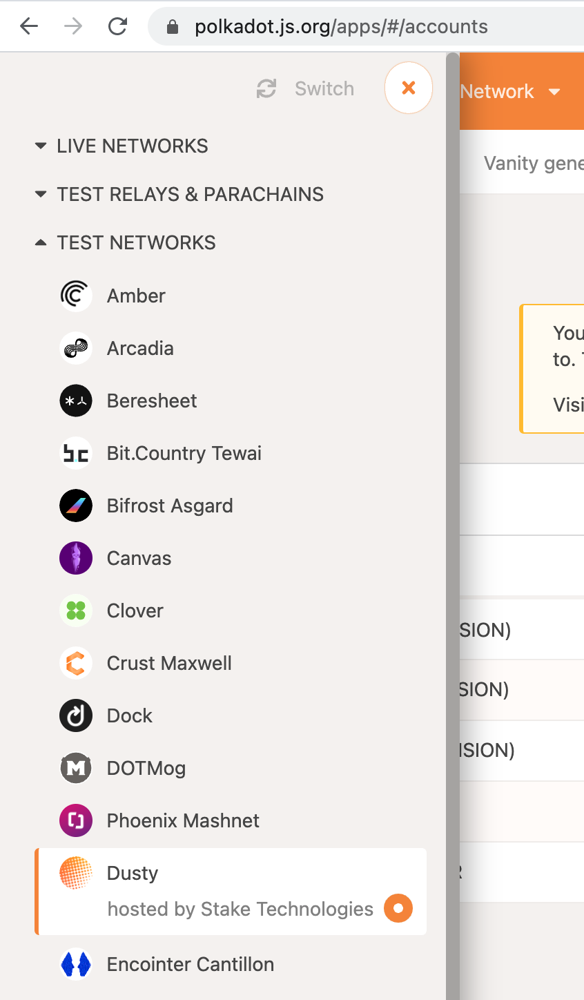
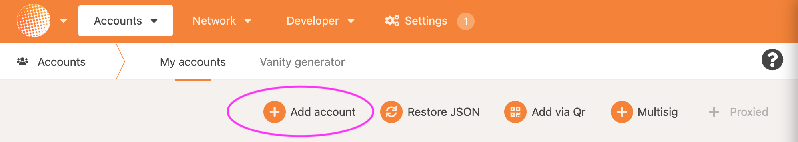

# Configure Node

### 1. Run and Sync your node. 

Type in the place of **YOURNAME**, how you would like to call your node. Here we used ‘**nohup**’ in front of the command to run it in the background. You can also use `screen` or similar commands.

```text
nohup ./plasm --validator --name YOURNAME --rpc-cors all
```

### 2. Check Telemetry

Check on [https://telemetry.polkadot.io/\#/Dusty](https://telemetry.polkadot.io/#/Dusty) to see if your node is fully synced. **Wait until it’s fully synced.** If you want to see what your node is doing in the background you can read out your nohup.out file with this command:

```text
tail -f nohup.out
```

### 3. Get your session key

You now have to call for your ‘Session Key’, use the following command to get your key:

```text
curl -H "Content-Type: application/json" -d '{"id":1, "jsonrpc":"2.0", "method": "author_rotateKeys", "params":[]}' http://localhost:9933
```

The server will answer with a long key, **copy** the long string of hexadecimal numbers 0x9917….b85a

### 4. Connect Browser to Network

Use [PolkadotJS UI](https://polkadot.js.org/apps/#/accounts) and create an account. Make sure you are connected to ‘Dusty’ testnet. You can change from network in the top left menu.



### 5. Setup an Account

On UI chose Add Account.



From a pop-up save the mnemonics and click Next.


The most important part of this form is your mnemonic seed! Write this down, take a screenshot, … just don’t lose it!


Then chose name of the account like GAVIN-VALIDATOR and password. Click on ‘**Next**’ and ‘**Save**’. Store your \*.json file somewhere on your computer, cloud or similar. In case you lose your mnemonic seed you can always restore your account with this file.

### 6. Fund your account

If you are running Dusty Node you can get free PLD tokens. Locate your wallet address, click on your wallet name. Double click on your address and copy it to your clipboard. Use this address on [Plasm Faucet](https://plasm-faucet-frontend.vercel.app/) to get PLD token.

### 7. Register your Validator Node

Share your validator account address with Plasm team via [Google Form](https://docs.google.com/forms/d/e/1FAIpQLSday0ckkK43TzJgKtQmJdzkudQNFDXspZAuUGi5Y5vfjkis3Q/viewform).

Follow your submission in the [Dusty validator sheet](https://docs.google.com/spreadsheets/d/1AYsS6V_Ypwde5lYulhZBMAx1X2vZ1u1zDXni_ddz-6c/edit#gid=2013382367).

### 8. Set Your Session Key

1. On UI Click on ‘**Developer**’ — ‘**Extrinsics**’ — ‘**Session**’ — ‘**setKeys**\(keys, proof\)’
2. Use your validator account
3. Copy the long key you printed in step _"3. Get your Session key"_  and paste it into the `keys` field. 
4. In the `proof` field leave 0x00.
5. Click Submit Transaction

### 9. Verify Your session Keys

1. On UI Click on ‘**Developer**’ — ‘**Chain State**’ — ‘**Session**’ — ‘**nextKeys**\(ValidatorId\)’
2. Use your validator account
3. Click on plus sign on the right side
4. You should see your key entered in step '_8. Set Your Key'_

**Congratulations! Your Validator node is up and running!**

