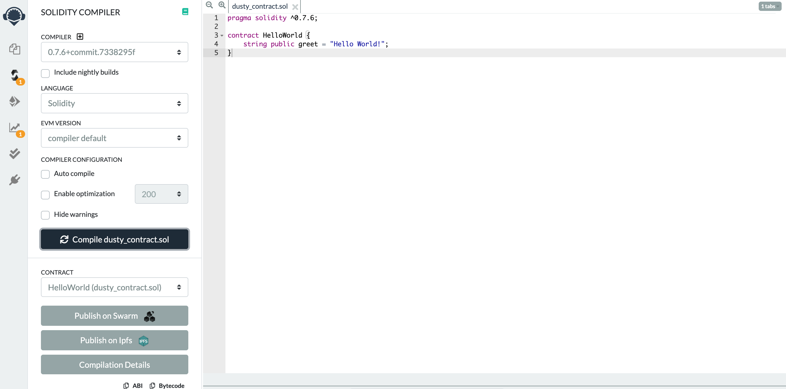
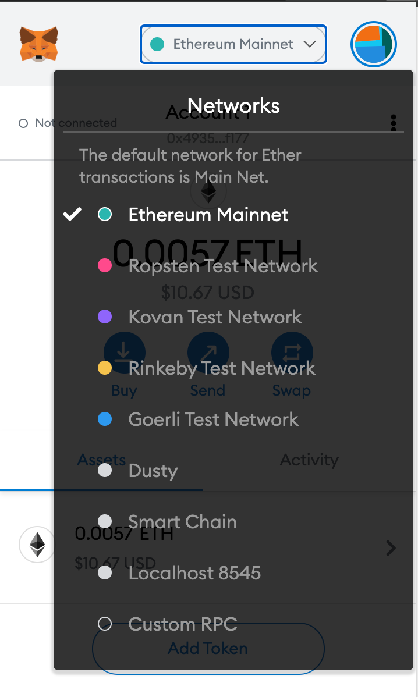
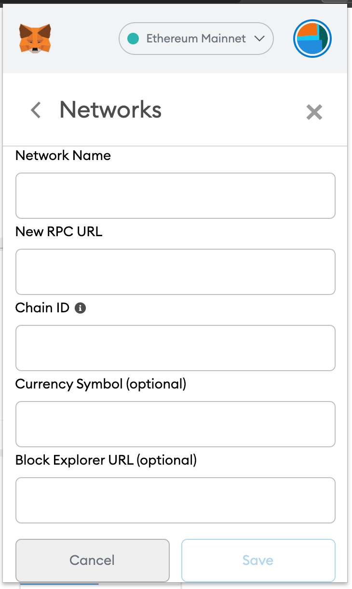
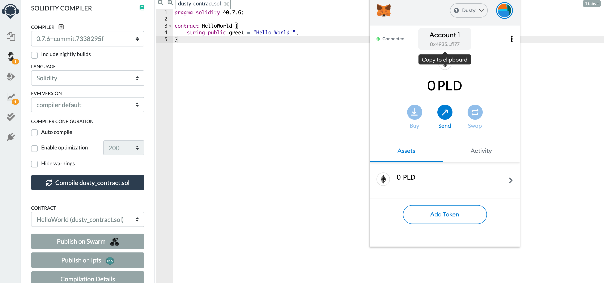
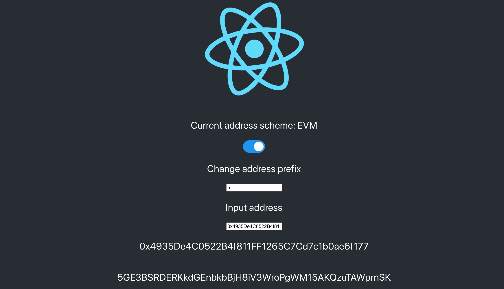
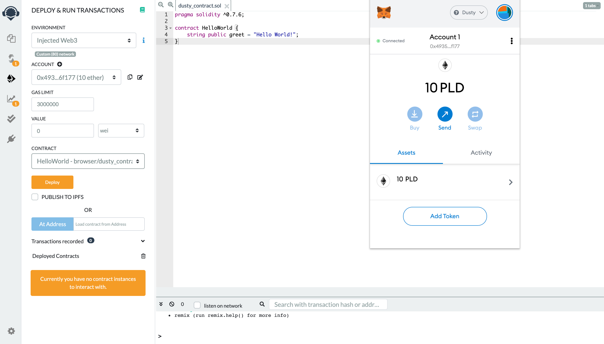

# Ethereum Contract on Dusty Network

In this section, I am going to walk through how to deploy Ethereum smart contracts on Dusty Network. 


Check out our demo below




First of all, let's open [Remix](https://remix.ethereum.org) and create a new file. 

As a next step, write your Solidity or Vyper contract and compile it. To deploy your contract on Dusty Network, you need to set up your Metamask.  




Click the tab  and select "Custom RPC"

then enter the following values:

**RPC server Dusty:**\
****Network Name: Dusty\
New RPC URL: https://rpc.dusty.plasmnet.io:8545\
Chain ID: 80\
Currency Symbol: PLD




Fill out the blanks as follows

* Network Name: Dusty
* New RPC URL: [https://rpc.dusty.plasmnet.io:8545](https://rpc.dusty.plasmnet.io:8545)
* Chain ID: 80
* Current Symbol: PLD



Then your Metamask is connected to Dusty Network. 

Currently, you don't have any PLDs and all you can see on Metamask is your Ethereum address. 

But no worries. Hoon Kim, our core developer made a [converter from Ethereum address to Plasm address](https://hoonsubin.github.io/evm-substrate-address-converter/index.html).

Once you put your Ethereum address, you can see your Dusty Network address. (In my case, it is `"5GE3BSRDERKkdGEnbkbBjH8iV3WroPgWM15AKQzuTAWprnSK"`)

Lastly, please let us know your Dusty Network address on [Discord](https://discord.gg/PTtZZFxneP) so that we can send PLDs to your wallet. 

The last thing is to deploy your contract on the network. Select "Injected Web3" and click "deploy" 

Once Metamask is launched and you press "Confirm", you can deploy the contract to the network. 
