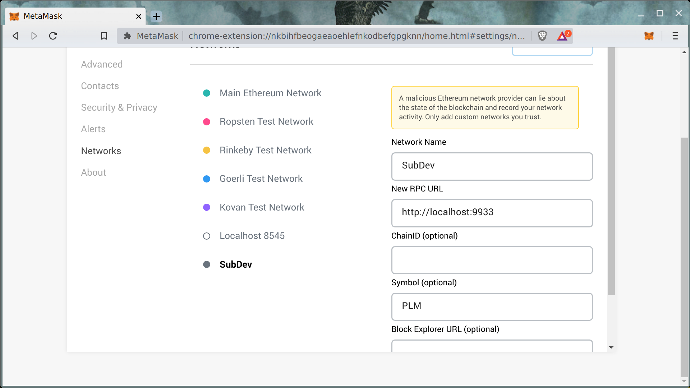
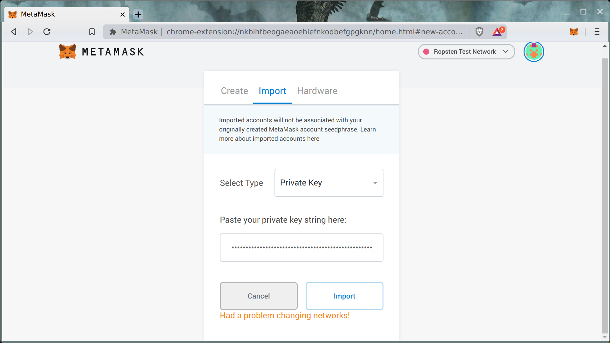
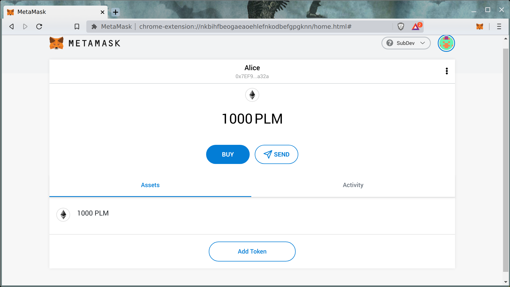
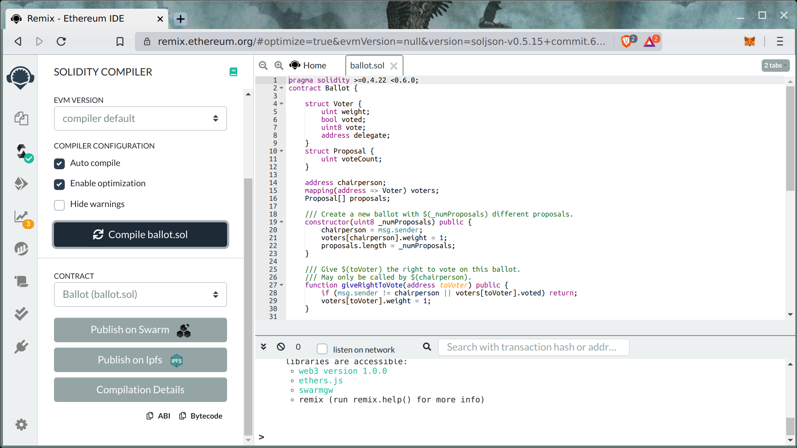
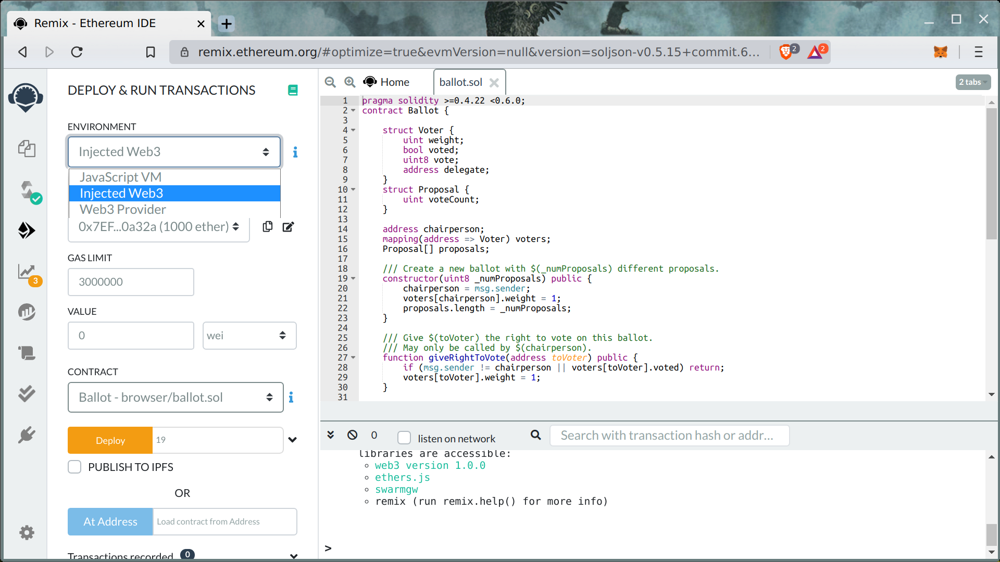

# Ethereum Contract in Your Local Environment



Here is  a quick demo on how to use  EVM.




EVM \(Ethereum Virtual Machine\) is the most popular VM for smart contracts. EVM has a rich ecosystem for developers, testers, and users. **Plasm Network fully supports EVM-based smart contracts as L1 contracts.**

## Deploy your EVM smart contract

In this article, you will deploy a smart contract on the Plasm local development environment.

### Install a Plasm Node

To use a  local development environment, a Plasm node is necessary. Please install the latest Plasm node from here: [https://github.com/staketechnologies/Plasm/tree/dusty](https://github.com/staketechnologies/Plasm/tree/dusty) \([build instruction](https://github.com/staketechnologies/Plasm/tree/dusty#building-from-source)\).

The next step is to launch a node in the development environment.

```text
plasm-node --dev -l evm=debug
Oct 14 15:07:56.998  WARN Running in --dev mode, RPC CORS has been disabled.    
Oct 14 15:07:56.998  INFO Plasm Node                                                                                           
Oct 14 15:07:56.998  INFO ✌️  version 1.6.0-1dc78cce-x86_64-linux-gnu    
Oct 14 15:07:56.998  INFO ❤️  by Stake Technologies <devops@stake.co.jp>, 2019-2020    
Oct 14 15:07:56.998  INFO 📋 Chain specification: Development     
Oct 14 15:07:56.998  INFO 🏷  Node name: skillful-war-1171    
Oct 14 15:07:56.998  INFO 👤 Role: AUTHORITY
```

Now, the node is available on Metamask. Ta-da! Sounds good, doesn't it?



The next step is to import the developer account seed:

> `0x60ed0dd24087f00faea4e2b556c74ebfa2f0e705f8169733b01530ce4c619883`





Keep in mind that PLM is not ERC20! 

### Deploy contracts by using Remix

When the account is ready and corrected, it is time to deploy some sample contracts from Remix.






If everything goes well in the Plasm node, you will see the following lines:

```text
Oct 15 13:09:30.009 DEBUG apply_extrinsic: Execution Succeed(Returned) [source: 0x7ef99b0e5beb8ae42dbf126b40b87410a440a32a, value: 0, gas_limit: 320315, used_gas: 320315, actual_fee: 3523465000000000]    {ext}                                             
Oct 15 13:09:30.009 DEBUG apply_extrinsic: Inserting code (938 bytes) at 0x66bb595bc60c8af0a306aa86edf96a88d3a59e9a    {ext}   Oct 15 13:09:30.009 DEBUG apply_extrinsic: Updating storage for 0x66bb595bc60c8af0a306aa86edf96a88d3a59e9a [index: 0x0000000000
000000000000000000000000000000000000000000000000000000, value: 0x0000000000000000000000007ef99b0e5beb8ae42dbf126b40b87410a440a3
2a]    {ext}                                                                                                                   
Oct 15 13:09:30.009 DEBUG apply_extrinsic: Updating storage for 0x66bb595bc60c8af0a306aa86edf96a88d3a59e9a [index: 0x0000000000
000000000000000000000000000000000000000000000000000002, value: 0x00000000000000000000000000000000000000000000000000000000000000
0a]    {ext}
Oct 15 13:09:30.009 DEBUG apply_extrinsic: Updating storage for 0x66bb595bc60c8af0a306aa86edf96a88d3a59e9a [index: 0xc8f9a9dfd7
9ec8caa983b729134bf933685749347f774048aeeda9f0685a095f, value: 0x00000000000000000000000000000000000000000000000000000000000000
01]    {ext}
```

 `0x66bb595bc60c8af0a306aa86edf96a88d3a59e9a` is the contract instance address!

We will make a demo and make this much more user-friendly!

### Deploy contracts by using truffle


