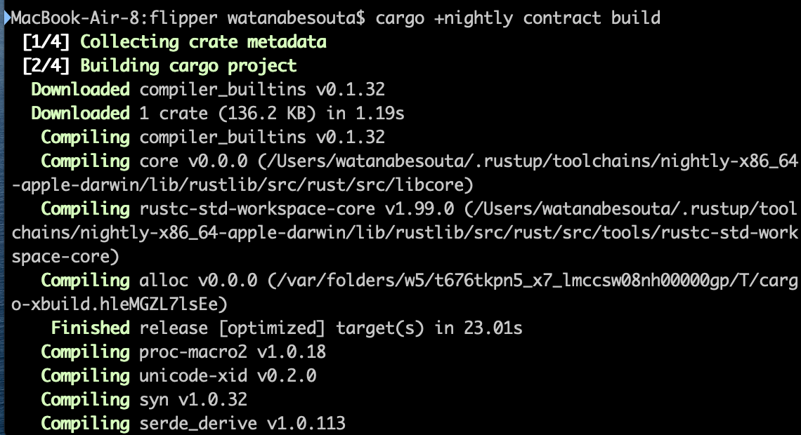
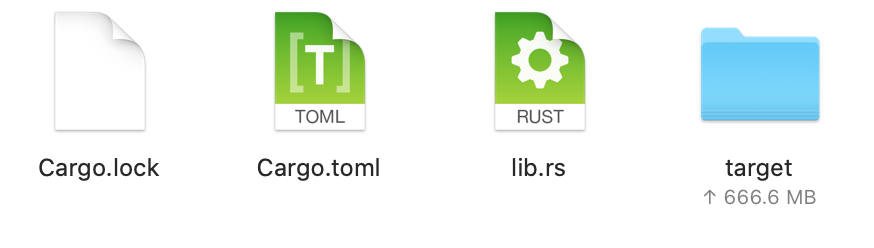

# Build

Let's compile the smart contract.

```text
cargo +nightly contract build
```

Then, you can see something like this: 



After compiling, you can find the `target` folder which contains  this  `wasm` file on your directory.



### Contract Metadata

As a next step,  we will generate the contract metadata.

```text
cargo +nightly contract generate-metadata
```

The metadata is also known as contract ABI.

 Now, you can find a `metadata.json` file in the same directory.

Any questions? Feel free to ask [us](https://discord.gg/kH3Njpr).

