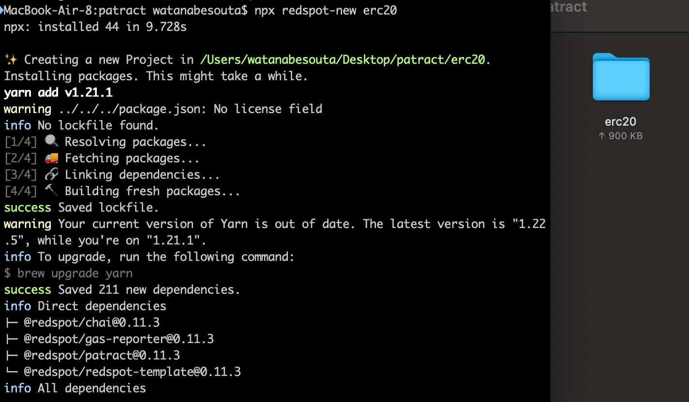

# Redspot by Patract Labs

## What is Redspot?

[Redspot ](https://docs.patract.io/en/redspot/introduction.html)is a contract integration builder that allows developers to simplify the process of testing and interacting with contracts by projecting the development of contracts such as ink! This tool is developed by [Patract Labs](https://patract.io/products). Kudos!


Checkout their tutorial [here.](https://docs.patract.io/en/redspot/tutorial.html#prepare-a-blockchain-node-that-can-run-contracts)


## Installation

First of all, let's install [Node.js](https://nodejs.org/). The version has to be version &gt;= 12.0. You can check your version by using the following command. `$ node --version`

Second, ink! contract requires a WASM compile environment. Let's install toolchain.

```text
rustup install nightly
rustup component add rust-src --toolchain nightly
rustup target add wasm32-unknown-unknown --toolchain nightly
rustup component add rust-src --toolchain nightly
```

And let's install `cargo-contract` provided by Patract  and `wasm-opt`

```text
cargo install cargo-contract --git https://github.com/patractlabs/cargo-contract --branch=v0.10.0 --force
npm i wasm-opt
```

## Create a Redspot Project

Redspot provides a sample contract like [Truffle](https://www.trufflesuite.com/) that accelerates secure smart contract developments.  


Currently, only ERC20 contract is supported but more templates will be provided by [Patract Labs](https://patract.io/). 


```text
npx redspot-new erc20
```



## Compile the Contract

Before compiling, install `yarn` dependencies first \(you can do `npm install` instead but yarn is recommended\).

```text
yarn
```

Then running the command `npx redspot compile .` in the erc20 root directory will compile the contract.

After the compilation is complete, you can find the compiled product in the artifacts directory.

##  Run the plasm node

To use a  local development environment, a Plasm node is necessary. Please install the latest Plasm node from [here](https://github.com/PlasmNetwork/Plasm/tree/dusty#building-from-source).

Then, run the local node via `plasm` in your terminal of choice


