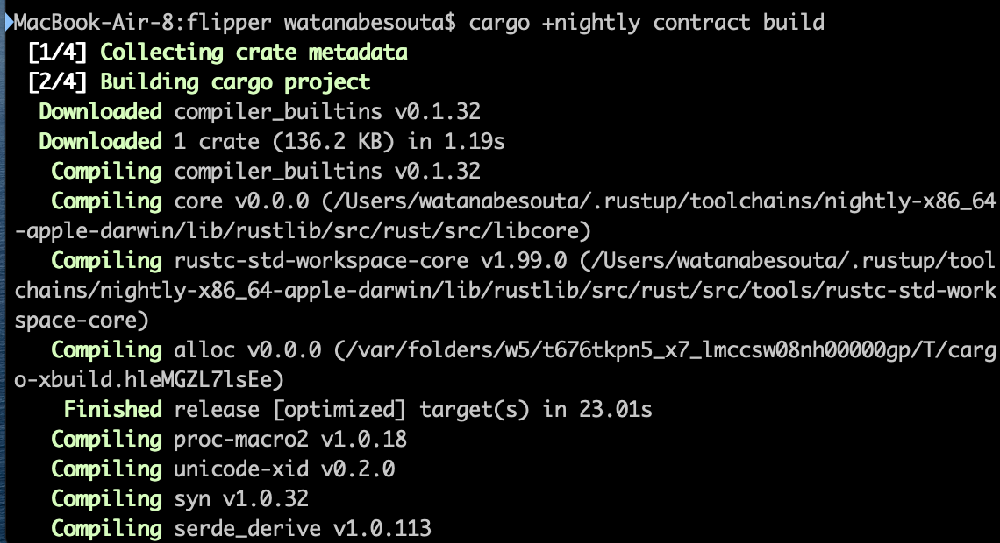

# Build

Let's compile the smart contract.

```text
cargo +nightly contract build
```

Then, you can see something like this: 



Once the compilation is completed, a `target` folder is created. In this folder, under the `ink` subdirectory, you will be able to see a `my_contract.wasm` file and a `metadata.json` file. `my_contract.wasm` is your contract that has been compiled to web assembly and the `metadata.json` is a JSON abstraction of your contract.


Any questions? Feel free to ask [us](https://discord.gg/kH3Njpr).

