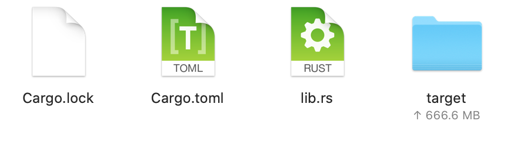

# Build

Let's compile the smart contract.

```text
cargo +nightly contract build
```

Then, you can see something like this: 


Once the compilation is completed, a `target` folder is created. In this folder, under the `ink` subdirectory, you can find the `myproj.wasm` file and the `metadata.json` files.



Any questions? Feel free to ask [us](https://discord.gg/kH3Njpr).

