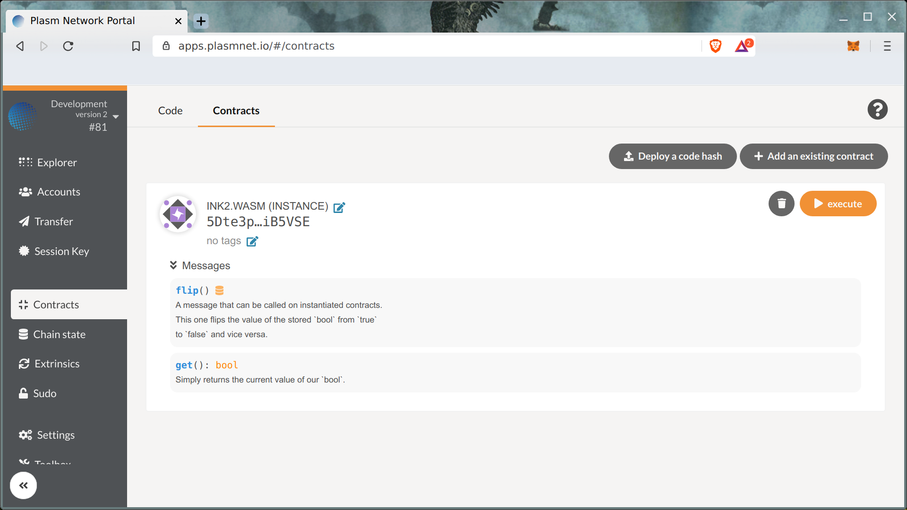
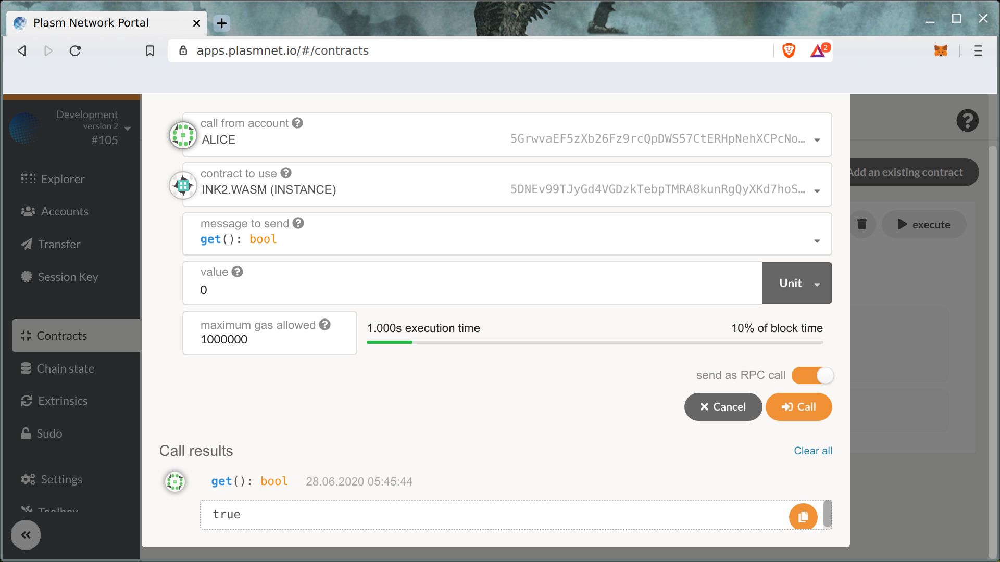
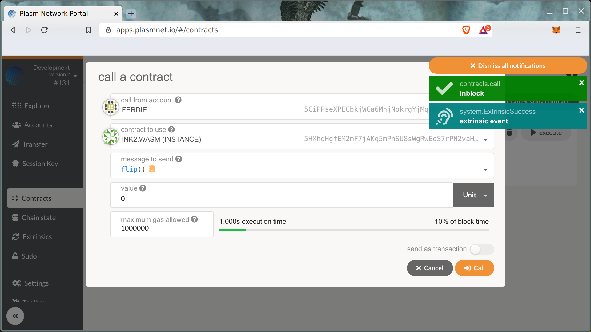
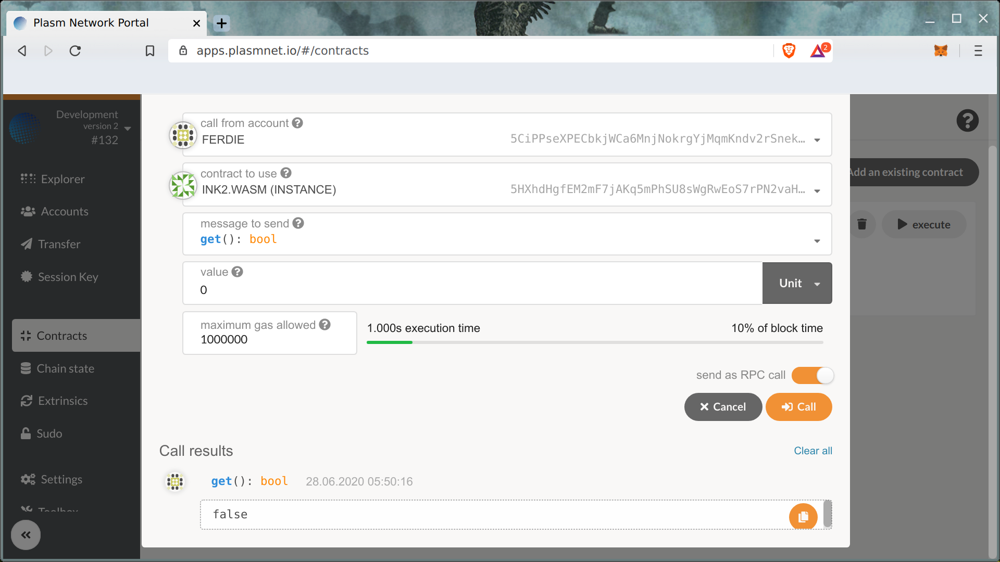

# Calling Your Contract

## Smart contract messages

To communicate with Smart contracts. We use "messages".

It's possible to pass two kinds of messages:

* messages that change a smart contract's state should be sent as transactions;
* messages that don't change a state could be called by using RPC calls.

Let's try to read our smart contract value by `get()` message call.

Second, let's change a smart contract state by sending a "message", send `flip()` message that flips smart contract boolean flag.

Using these two kinds of messages, your DApp can easily write and read the smart contract data. Have fun!

Any questions? Feel free to ask [us](https://discord.gg/kH3Njpr).

