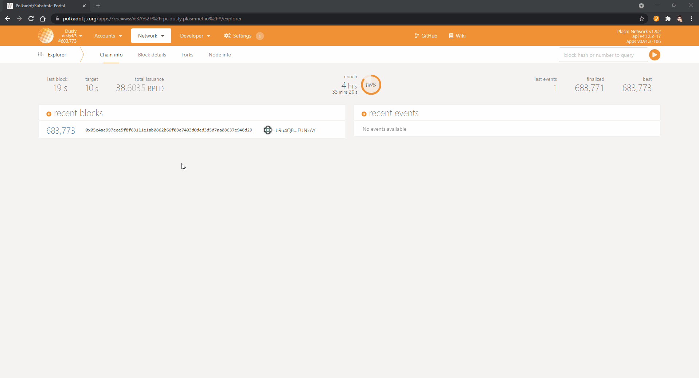
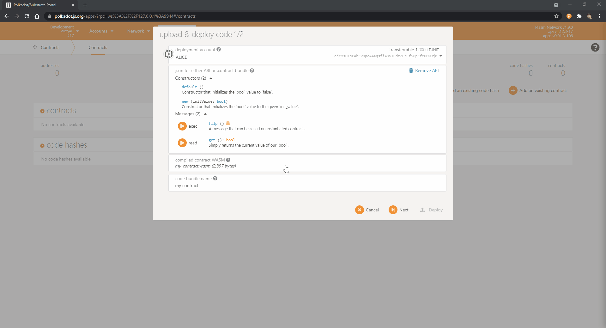

# Deploy Your Smart Contract on Plasm

It is highly recommended to deploy your smart contract on your local development chain, and subsequently on the [Dusty Network](https://medium.com/stake-technologies/the-dusty-plasm-93df289b3a5) for testing purposes prior to deploying it on the Plasm Mainnet.

### Local Development Network

#### Connecting to the network

First, let's open the Plasm Network Portal UI.

{% embed url="https://polkadot.js.org/apps/?rpc=wss%3A%2F%2Frpc.dusty.plasmnet.io%2F\#/explorer" %}

Next, click on the dropdown arrow on the top left corner of the page. Scroll all the way to the bottom and select the **DEVELOPMENT** sub category. Choose **Local Node** and click on the **Switch** button to change networks.

#### Deploying the smart contract

Under the **Developer** tab, select **Contracts** then click on the **Upload & deploy code** button. Look for your **metadata.json** and **my\_contract.wasm** files. 

After selecting these files, click on the **Next** button. The pop up will update and prompt you for a value to use for **endowment**. Input **7500** for endowment and click on the **Deploy** button. Finally, click on the **Sign and Submit** button to deploy your contract.

Congratulations, you deployed your first L1 Smart Contract! Let's learn how to interact with our newly deployed contract next!

Any questions? Feel free to ask [us](https://discord.gg/kH3Njpr).

