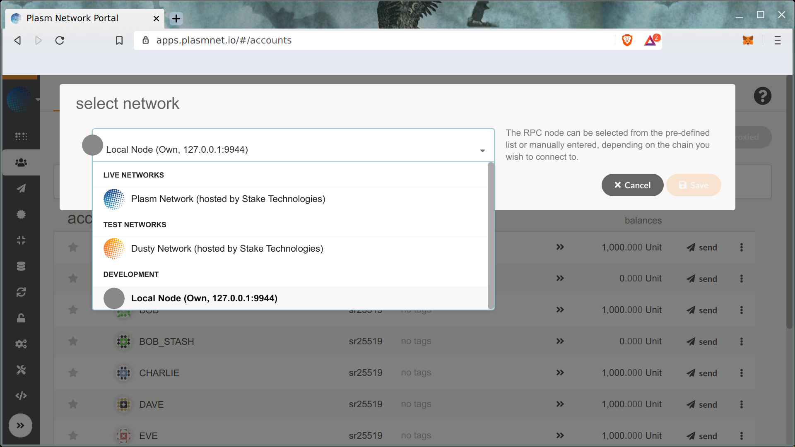
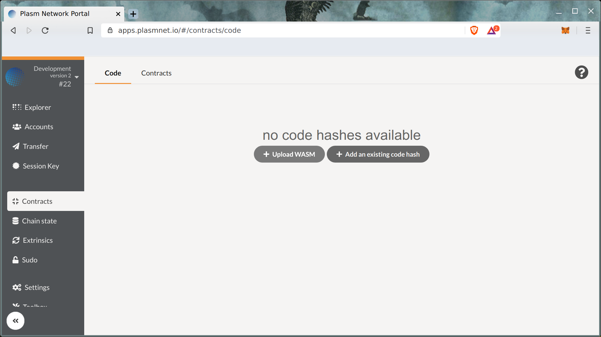
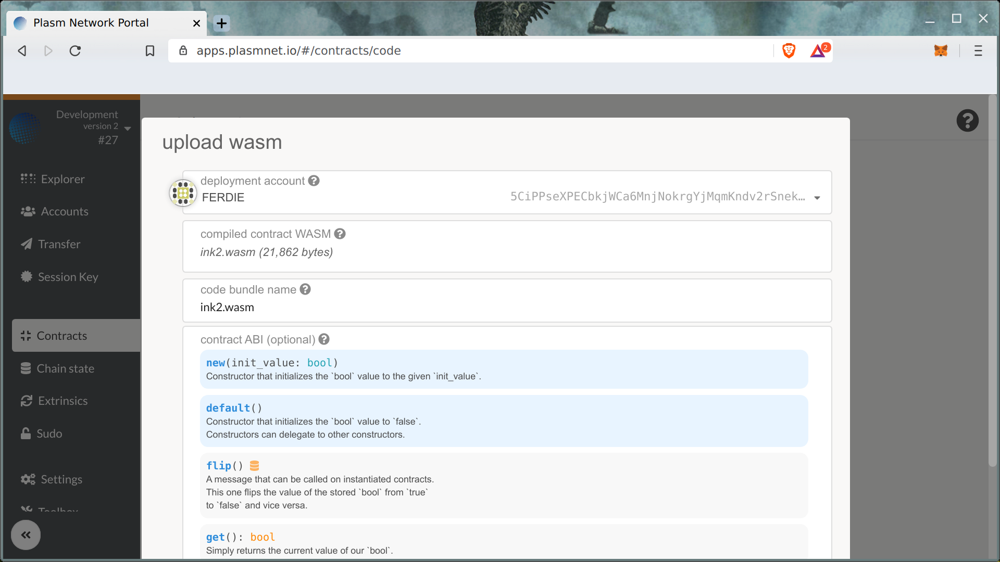
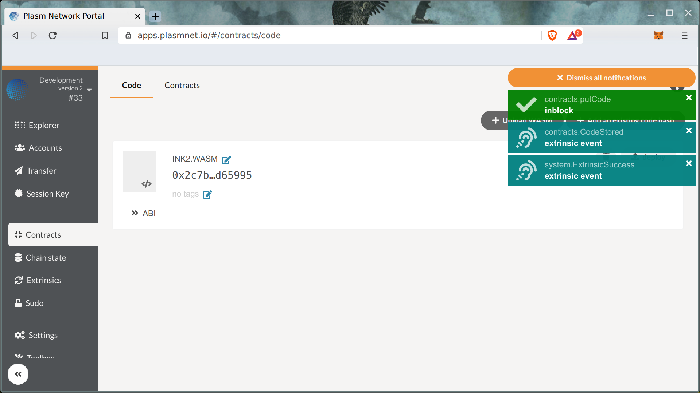
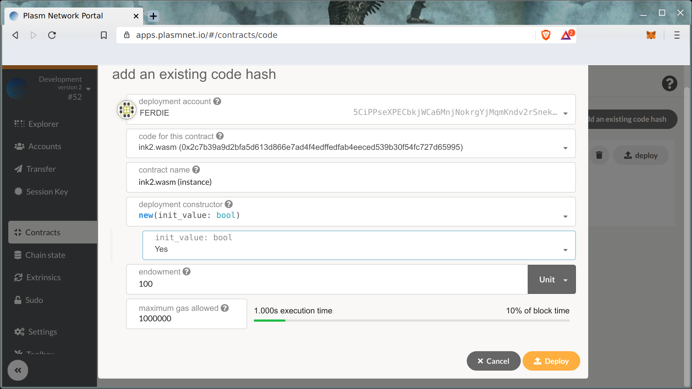
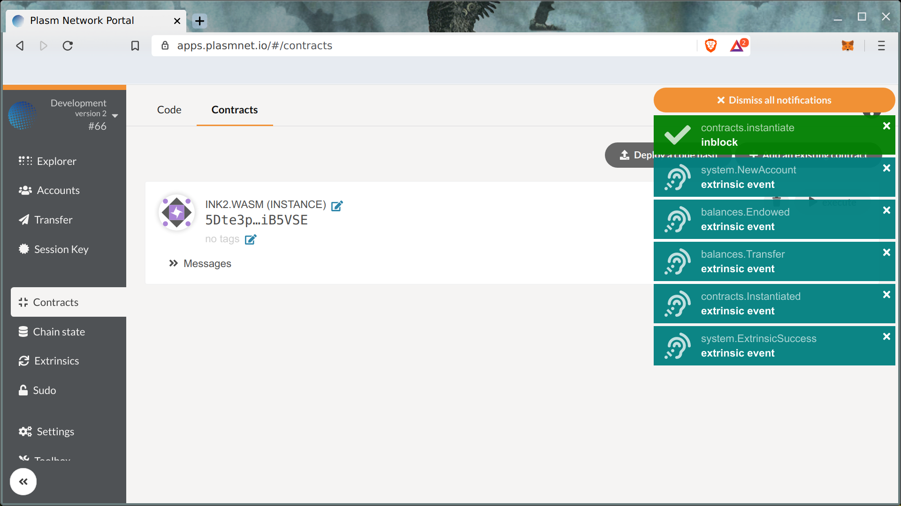

# Deploy Your Smart Contract on Plasm

Before deploying your smart contract on the Plasm Mainnet, you are recommended to deploy the contract on your local development chain, and after that on the [Dusty Network](https://medium.com/stake-technologies/the-dusty-plasm-93df289b3a5).

### Development Network

Try out your smart contract on the local chain looks like a good idea. Let's open Plasm Network Portal UI.



First, select **Local Node** on the top left of the chain selection menu.

Click **Contracts** tab and choose **Code** -&gt; **Upload WASM**.

Metadata and WASM code should be filled out in the form.

Uploading the code takes around 220 Units.

Congratulations! You uploaded your first L1 Smart contract! Let's create an instance of your code using "**Deploy"** button.

The transaction fee is around 1.6 units. As the result you can see the instance of your smart contract.

Contract interaction will be explained in the next chapter.

Any questions? Feel free to ask [us](https://discord.gg/kH3Njpr).

