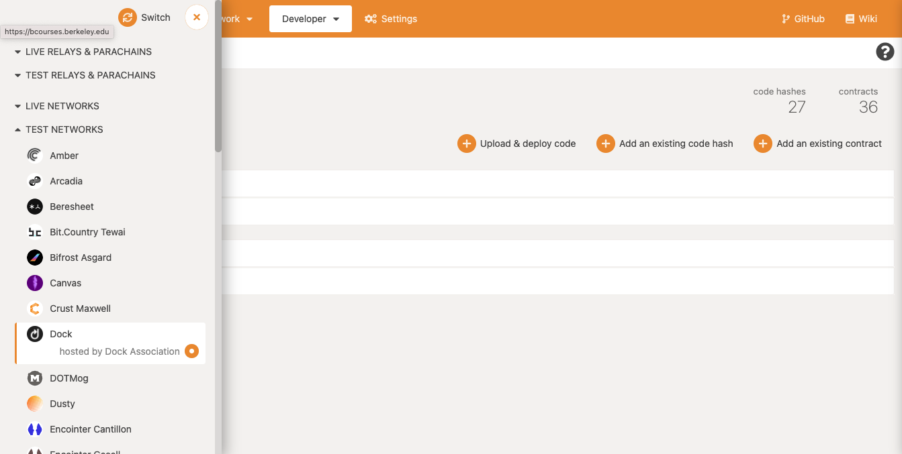
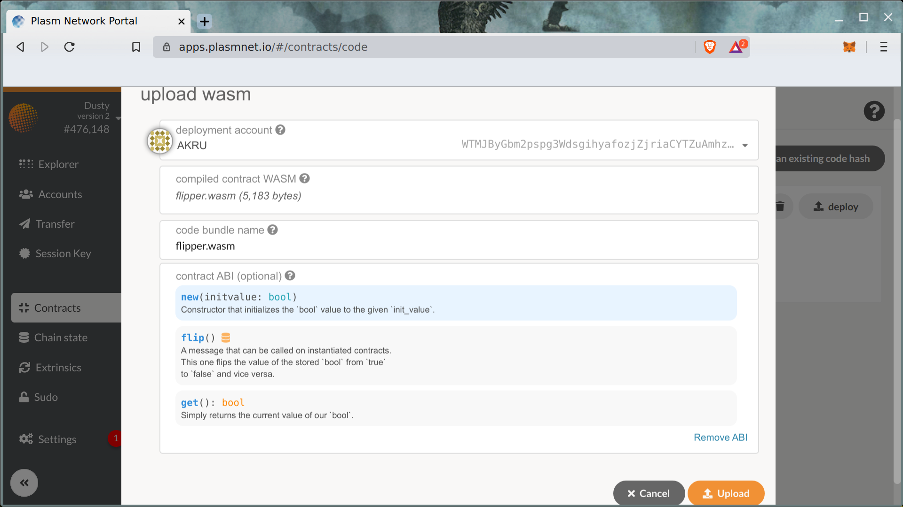
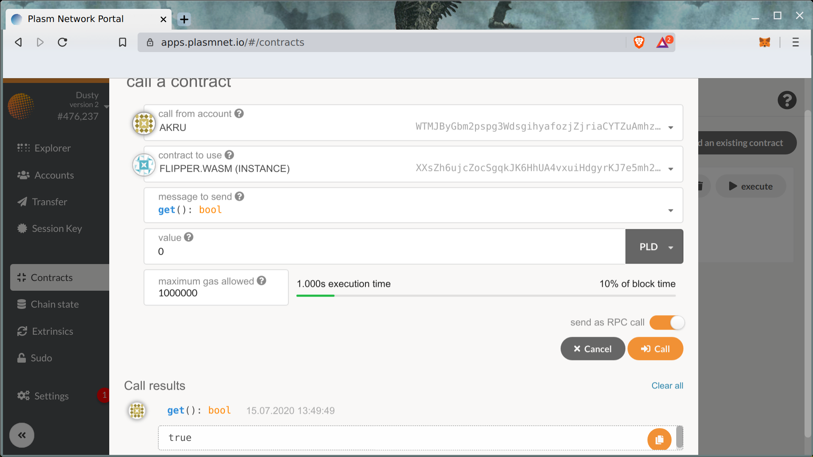

# Solidity to WASM Compiler


Here is a quick demo:

[https://youtu.be/VLQt37ob6a8](https://youtu.be/VLQt37ob6a8)


Plasm Network also supports solidity. Solidity is a smart contract language mainly used on Ethereum. If you have already built applications by using Solidity, you can also deploy the contracts on Plasm Network.

## Install

In this tutorial, we will use the [Solang compiler](https://github.com/hyperledger-labs/solang), a compiler for solidity language developed by Hyperledger Labs. Let's install the compiler using the original instruction below.



Or using the following cargo command:

```text
// linux users
sudo apt install llvm openssl libxml2-dev

// mac users
brew install llvm openssl libxml2-dev
cargo install --git https://github.com/hyperledger-labs/solang --tag m8
```


M1 chip macs may need to do build llvm from source:

See an example `installdir` or read more on the issue [here](https://github.com/hyperledger-labs/solang/issues/421)

```
git clone git://github.com/solana-labs/llvm-project
cd llvm-project

// install cmake, ninja, and any other dependencies //

cmake -G Ninja -DLLVM_ENABLE_ASSERTIONS=On '-DLLVM_ENABLE_PROJECTS=clang;lld'  \
        -DLLVM_ENABLE_TERMINFO=Off -DCMAKE_BUILD_TYPE=Release \
        -DCMAKE_INSTALL_PREFIX=installdir -B build llvm
        
cmake --build build --target install

//mac users do:
export PATH=installdir/bin:$PATH
```


The `solang` binary should be available in your environment.

## Compile

You can write any solidity contracts just like the development on Ethereum. Since this is a tutorial, we will use a `flipper` contract which is available below.



Let's compile it using `substrate` target to make it compatible with Plasm Network.

```text
wget https://raw.githubusercontent.com/hyperledger-labs/solang/master/examples/flipper.sol
solang flipper.sol
```

As a result, two files should be available in your current directory : `flipper.wasm` \(optimized WASM binary\) and `flipper.json` \(smart contract metadata\).


If you are having trouble generating the code download it [here.](https://github.com/PlasmNetwork/tutorials/tree/main/solang-wasm)


## Deploy

Let's deploy the compiled `flipper.wasm` and `flipper.json` using our standard [Plasm Portal UI](https://cloudflare-ipfs.com/ipns/dotapps.io/?rpc=wss%3A%2F%2Frpc.dusty.plasmnet.io%2F#/accounts).


Choose between ipfs or hosted apps wallet [here](https://polkadot.js.org/).

Additionally you can swap between various polkadot chains including plasm, dusty, and kusama on the application depending on where you want to deploy.





select the top left corner of the site to open this tab, select the chain you want to switch to and press switch in the upper right corner.




The next step is to create an instance of the uploaded smart contract WASM code.


After making the instance, we can interact with the smart contract using the UI portal just like an ink! smart contract described in the previous chapter.




More examples are available in the Solang repository:



Have fun and good luck!

## Windows setup

Here you will find a tutorial:




Any questions? Feel free to ask us on our [Discord tech channel](https://discord.com/invite/kH3Njpr).[  
](https://docs.plasmnet.io/workshop-and-tutorial/smart-contract/deploy-your-smart-contract-on-plasm)

