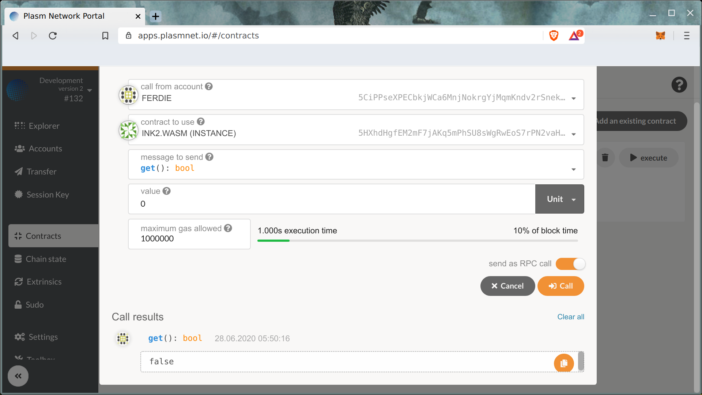

# コントラクトをcallする

## スマートコントラクトメッセージ

スマートコントラクトとのコミュニケーションには "messages"を使用しています。

2種類のmessagesを渡すことができます：

* スマートコントラクトの状態を変更するメッセージはトランザクションとして送信されます。
* スマートコントラクトの状態を変更しないメッセージはRPCコールを使って呼び出すことができます。

スマートコントラクトの値を`get()` メッセージコールで読み取ってみましょう。

次に、スマートコントラクトの真偽値を反転させる `flip()` メッセージを送信して、スマートコントラクトの状態を変更してみましょう。

この2種類のメッセージを使用して、DAppは簡単にスマートコントラクトデータを書き込んだり、読み込んだりすることができます。楽しんでください。

