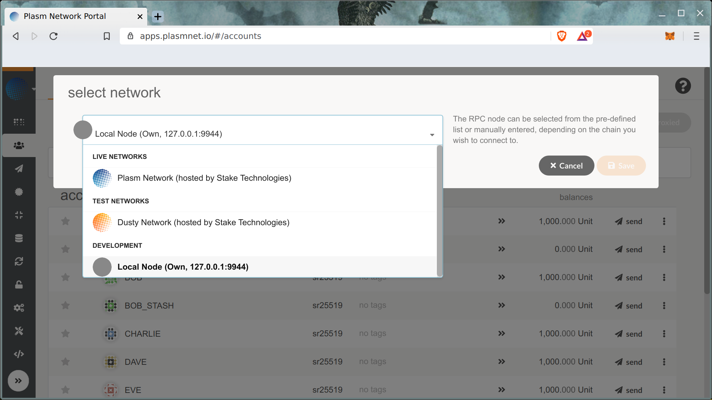

# デプロイ

[Plasm Network](https://www.plasmnet.io/)のメインネットにデプロイする前に、自身のローカルチェーンとDusty Networkにデプロイすることを推奨します。これは安全な開発を行なうためであり、ローカル環境とDusty Network上でテストを行なうことでデプロイするスマートコントラクトの動作を確認することができます。

### Development Network

ローカルチェーンでスマートコントラクトを試してみましょう。Plasm Network Portal UIを開いてください。



まず、左上のチェーン選択のセクションで、**Local Node** を選択してください。

**Contracts** タブをクリックして、 **Code** -&gt; **Upload WASM** を選択してください

Metadata と WASM コードは、フォームに記入する必要があります。

コードのアップロードには約220ユニットが必要です。

Congratulations! 最初のレイヤー1コントラクトをアップロードしました！ "**Deploy"** ボタンから、最初のインスタンスをつくりましょう。

取引手数料は1.6ユニット程度です。その結果、スマートコントラクトのインスタンスを見ることができます。

コントラクトとのやり取りについては次のチャプターで説明します。

