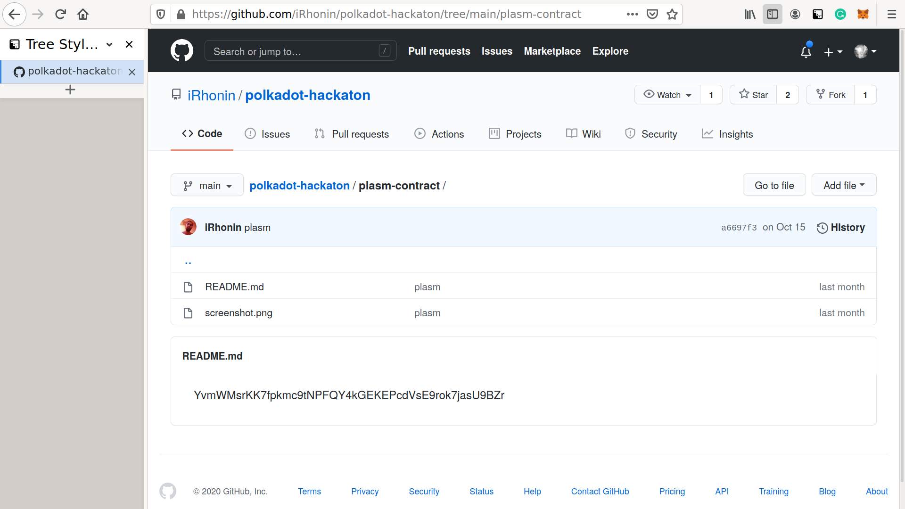
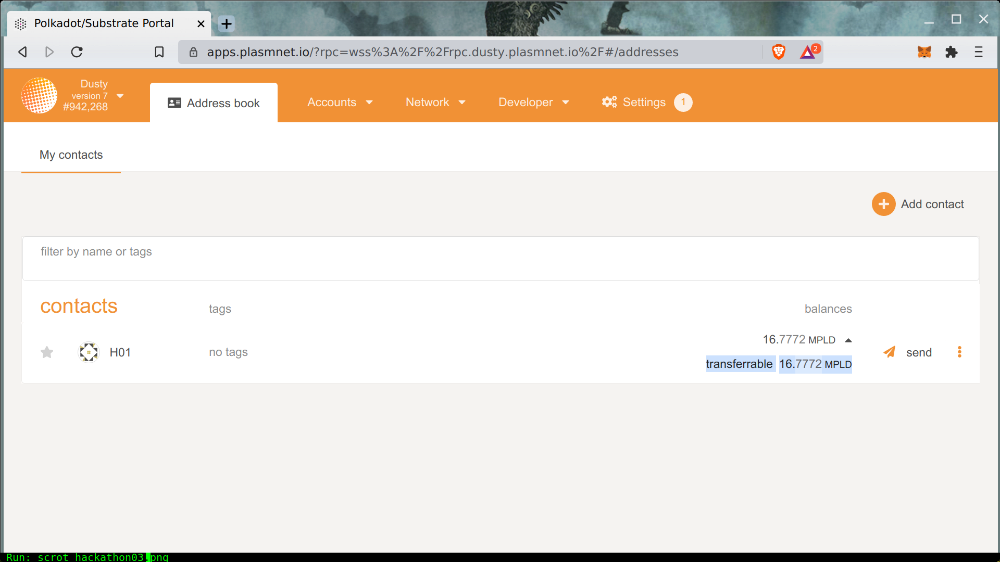

# スマートコントラクトを確認する

最初のステップは、デプロイされたコントラクトの正しいPlasmアドレスを抽出することです。正しいコントラクトアドレスは以下のようになります。

アドレスはアルファベット順になっており、 [Address Book](https://apps.plasmnet.io/#/addresses)に正しくインポートされている必要があります。


DustyかPlasmのポータルに接続してください


プラスの残高が確認できれば、コントラクトが正常にデプロイされたことを意味します。

2つ目のステップは、デプロイされたコントラクトが本当にスマートコントラクトなのかどうかを確認することです。   
この目的のために、以下のようなスマートコントラクトパレットを使用してみましょう。

`contractInfoOf` を呼び出すと、デプロイされたスマートコントラクトに関する多くの情報（codeHashやデプロイされたブロックなど）が表示されます。この情報が空でなければ、与えられたアドレスは Plasm や Dusty にデプロイされたスマートコントラクトです。

