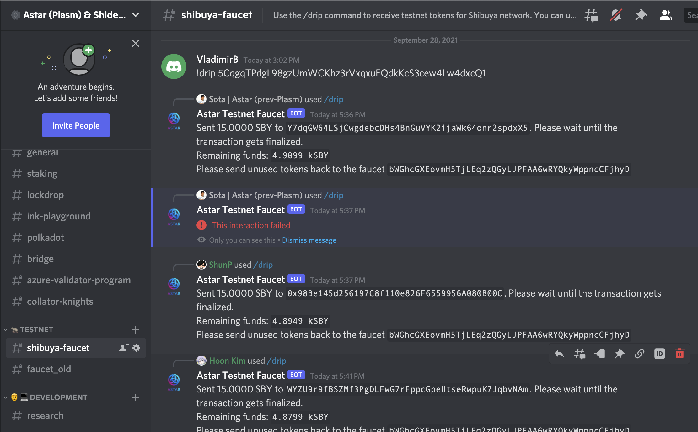
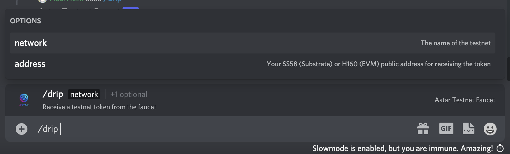
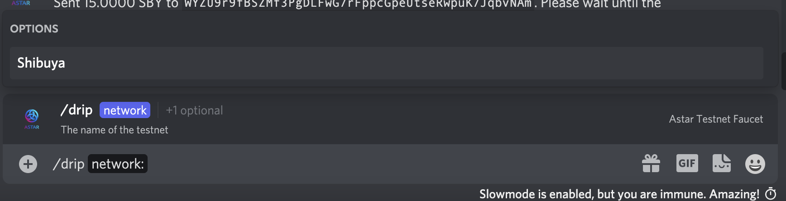
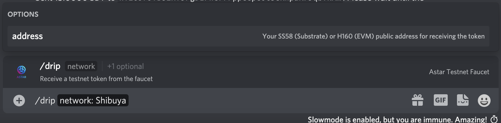
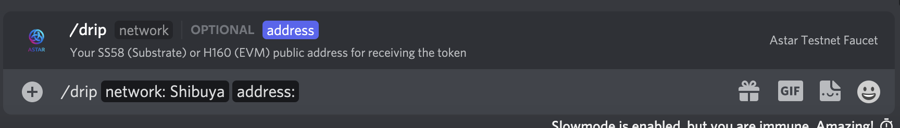
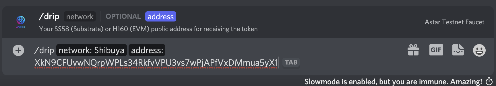
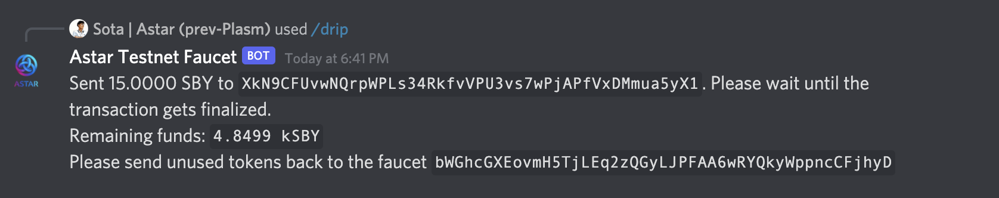
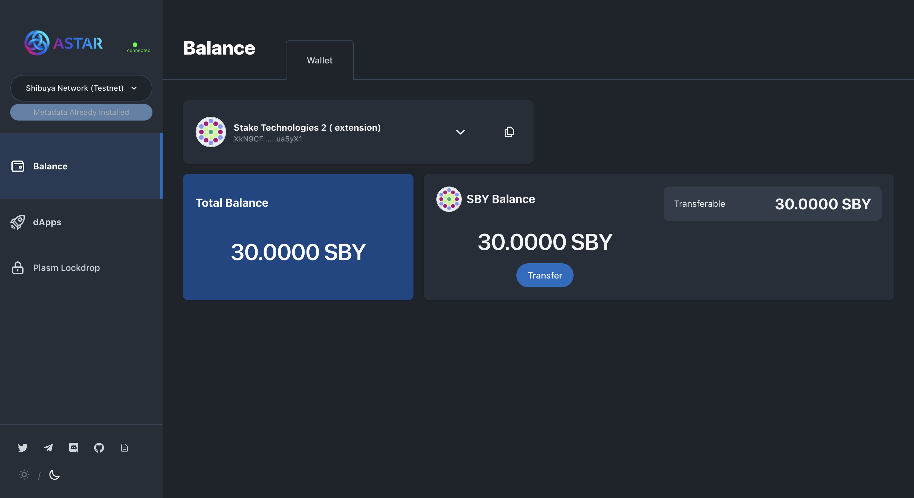

# Faucet

## Shiden

Visit our portal: [https://portal.astar.network/#/balance/wallet](https://portal.astar.network/#/balance/wallet)

Connect to the Shiden chain and click on the 'Faucet' button.&#x20;

 (1) (1) (1).png>)

## Shibuya

Shibuya is a testnet of both Shiden and Astar. We have created a faucet Discord bot that provides **SBY** (Testnet Token).&#x20;

### Join Our Discord



Once you join the Discord server, you will be able to see the **#shibuya-faucet** channel.

### Type The Following Commands

In the **#shibuya-faucet** channel, please type `/drip`. Then, you can see the following options. Please click **network**

&#x20;and **Shibuya**.

Lastly, please click **address** and **** paste your Shibuya address.&#x20;

If your inputs are valid, you can receive **SBY** tokens from the faucet.

Enjoy🚀
