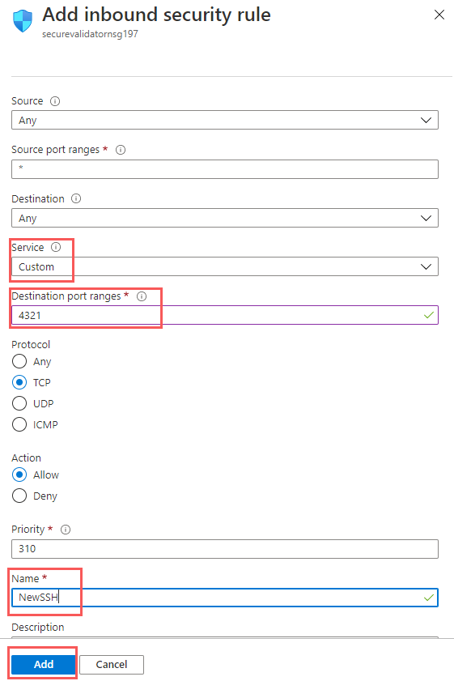

# Secure Your SSH Connection

**SSH access** is the most standard attack vector for an online server. An incredible number of robots and hackers scan the default port 22 and gain access, with basic and elaborated credentials.

In this part, we are going to build a **secure SSH connection with strong SSH keys.** We will also c**hange the default SSH port** to mitigate scans and brute-force attempts.

We will use the [`curve25519-sha256`](https://git.libssh.org/projects/libssh.git/tree/doc/curve25519-sha256@libssh.org.txt) protocol \(**ECDH over Curve25519 with SHA2**\) for our keys here as this is considered the most secure nowadays.

## Configuration


Follow this guide step-by-step, try to understand every step explained in this guide.



Be very careful to never close your actual session until you’ve tested the connection with your new key. You could lose access to your SSH connection.


Connect to your server using [PuTTy](https://www.chiark.greenend.org.uk/~sgtatham/putty/latest.html). 

1. Open PuTTY
2. Typ in the field of ‘**Host Name**’ the IP of your server on Azure
3. The terminal will open and you can log in with your username and password.

Let’s start by moving our actual unsecured host keys into a backup directory:

```text
cd /etc/ssh
sudo mkdir backup
sudo mv ssh_host_* ./backup/
```

Open the `ssh` config file:

```text
sudo nano /etc/ssh/ssh_config
```

Add the following lines in the `Host *` section and save:

```text
Host *
    KexAlgorithms curve25519-sha256@libssh.org
    HostKeyAlgorithms ssh-ed25519-cert-v01@openssh.com,ssh-ed25519
    Ciphers chacha20-poly1305@openssh.com,aes256-gcm@openssh.com,aes128-gcm@openssh.com,aes256-ctr,aes192-ctr,aes128-ctr
    MACs hmac-sha2-512-etm@openssh.com,hmac-sha2-256-etm@openssh.com,umac-128-etm@openssh.com,hmac-sha2-512,hmac-sha2-256,umac-128@openssh.com
    PasswordAuthentication no
    ChallengeResponseAuthentication no
    PubkeyAuthentication yes
    UseRoaming no
```

Save `CTRL+O` your file and close the editor `CTRL+X`

Open the `sshd` config file:

```text
sudo nano /etc/ssh/sshd_config
```


In the following lines, you see that I used port 4321, this is just an example. You can use any random port inside the range of 1024 and 49151. Copy these lines in your file:


```text
Port 22 
Port 4321 
KexAlgorithms curve25519-sha256@libssh.org 
HostKey /etc/ssh/ssh_host_ed25519_key 
Ciphers chacha20-poly1305@openssh.com,aes256-gcm@openssh.com,aes128-gcm@openssh.com,aes256-ctr,aes192-ctr,aes128-ctr 
MACs hmac-sha2-512-etm@openssh.com,hmac-sha2-256-etm@openssh.com,umac-128-etm@openssh.com,hmac-sha2-512,hmac-sha2-256,umac-128@openssh.com 
AllowGroups ssh-user 
PubkeyAuthentication yes 
PasswordAuthentication no 
ChallengeResponseAuthentication no
```

Save `CTRL+O` your file and close the editor `CTRL+X` .  
Now, what did you do? In details, by doing that, we tell the host to

* Use the port  instead 4321 of default 22: please use a different random port in the range 1024–49151
* Use the `curve25519` protocol for authentication
* Use `chacha20-poly1305` \(preferred\), `aes-gmc` and `aes-ctr` ciphers for data
* Enable _Message Authentication Code MAC_ for CTR ciphers
* Allow ssh group ssh-user
* Enable key authentication
* Disable password access


We left here the line `Port 22` for the first test on the new port. Once your tests are successful, we will remove this line.


Then, create the new SSH host key:

```text
sudo ssh-keygen -t ed25519 -f ssh_host_ed25519_key -N ""
```

Create the SSH user group and add your user to it. This will prevent any connection to an unexpected user:

```text
sudo groupadd ssh-user
sudo usermod -a -G ssh-user <username>
```

**Note**: you have to change `<username>` by the user, you use on your server.

### Azure firewall

Before continuing, it is very important to open the newly configured SSH port in your firewall \(4321 in our example\). Go to the Azure portal and add this port:




For the first tests, you should let port 22 open. Once you successfully connected to the new port, you can safely close port 22.

### Generate SSH keys


This guide is build around Azure and PuTTy, in case you want to use OpenSSH follow [this guide](https://medium.com/bld-nodes/securing-ssh-access-to-your-server-cc1324b9adf6).


Open PUTTYGen GUI:


Select the `Ed25519`key type and click on _Generate_:


Enter a strong passphrase and save both private and public key in a secure folder. Copy the public key from the text box.

Go back to the PuTTy session on your **server** and open the `authorized_keys`file.

```text
sudo nano ~/.ssh/authorized_keys
```

Paste the public key and save.

### Verify <a id="0f49"></a>

Let’s restart the `ssh` service without killing the current session:

```text
sudo kill -SIGHUP $(pgrep -f 'sshd -D')
```

**Attention**: you should not send a complete restart of `sshd` for the moment, this would close your open session and potentially lose access to your server if something is set wrong.

Check that the `sshd` service is still running correctly:

```text
systemctl status sshd
```

### Connect <a id="3255"></a>

Let’s load the private key in the Putty `Auth` section:


Don’t forget to use your custom port, then connect:


Congratulation, y**our SSH connection is secure**! 


Don’t forget to remove port 22 from `sshd_config` file and firewall, and check that no other key is allowed in `authorized_keys` file.



