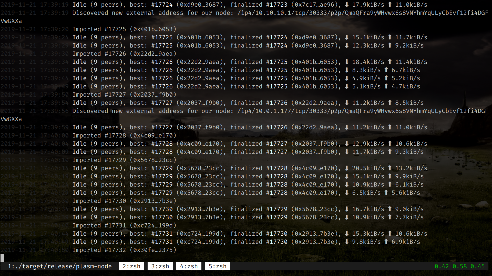
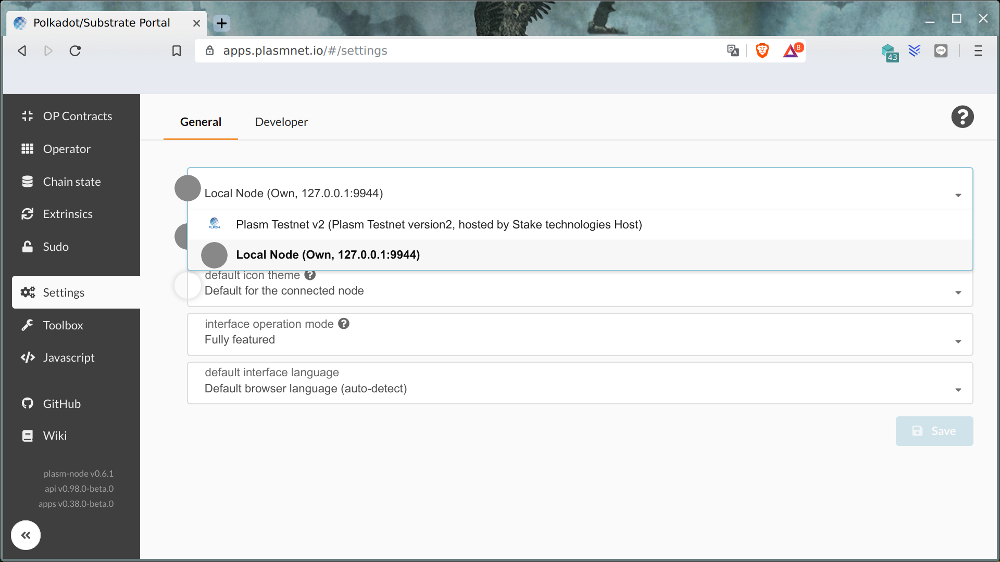
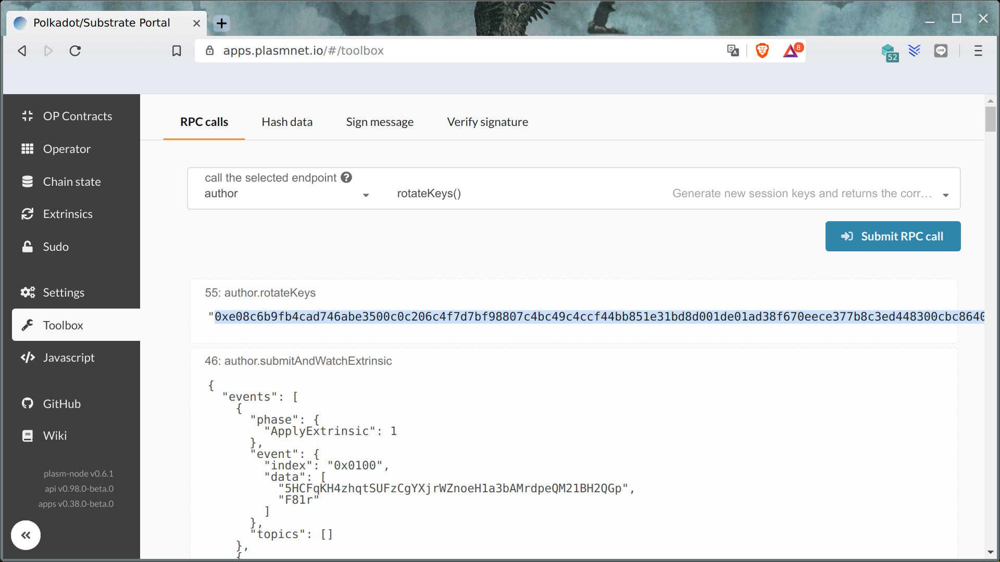

# バリデータ

Plasm Testnetのバリデータになるためのチュートリアルをいくつか用意しました。

* ローカルデバイスにDustyをインストールする
* VPSサーバ\([Microsoft Azure](https://fiex.medium.com/plasm-node-on-azure-32ec5a204b45), [Digital Ocean](https://fiex.medium.com/become-a-plasm-network-validator-c212085cc72e), ...\)にDustyをインストールする
* [Raspberry Pi4](https://github.com/bLd75/Plasm-RPi)にDustyをインストールする

バリデータになるには、以下の手順に従います。

1. Dusty ネットワーク上でノードを実行します
2. [Discord](https://discord.gg/Z3nC9U4) の**\#faucet**でトークンを要求して、トランザクションのトークンを獲得します。
3.  `rotateKey()` を取得し、バリデータアカウントに接続します。
4. あなたのバリデータアカウントのアドレスを[Google Form](https://docs.google.com/forms/d/e/1FAIpQLSday0ckkK43TzJgKtQmJdzkudQNFDXspZAuUGi5Y5vfjkis3Q/viewform).でStake Technologiesチームと共有します。 
5. Dusty バリデータシートであなたの投稿をフォローします。（[Dusty validator sheet](https://docs.google.com/spreadsheets/d/1AYsS6V_Ypwde5lYulhZBMAx1X2vZ1u1zDXni_ddz-6c/edit#gid=2013382367).）


チュートリアル動画はMicrosoft Azureを用いてノードを運営しています👇





この短いガイドでは、ローカルデバイスでDustyバリデータになる方法を順番に説明します。


* [binaries](https://github.com/PlasmNetwork/Plasm/releases/tag/v1.7.0-dusty) or [building from source code](https://github.com/staketechnologies/Plasm#building-from-source).を使って**v1.7.0-dusty** ノードをインストールする
*  `plasm-node --validator --name node-name --rpc-cors all`を入力して、ノードを立ち上げる
* 同期完了を待つ



*  "[Setting](https://apps.plasmnet.io/#/settings)" を開き、 "local node"を選択する



*  "[Accounts](https://apps.plasmnet.io/#/accounts)" を開き、新しいアカウントをつくる


*  [Google Form](https://docs.google.com/forms/d/e/1FAIpQLSday0ckkK43TzJgKtQmJdzkudQNFDXspZAuUGi5Y5vfjkis3Q/viewform).からあなたのバリデータアカウントアドレスを**Stake Technologies** チームに共有する
* [Discord](https://discord.gg/Z3nC9U4) の**\#faucet** チャンネルで、トークン受け取りを申請する
* Toolboxウィンドウを開き、 call `rotateKeys()` RPC call orもしくは curl commandで:

```bash
curl -H "Content-Type: application/json" -d '{"id":1, "jsonrpc":"2.0", "method": "author_rotateKeys", "params":[]}' http://localhost:9933
```



* 次のステップのために、resultを保存する
* "Session Key" ボタンをクリックし、バリデータアカウントに貼り付ける

## さいごに

このチュートリアルが終了したら、Stake Technologiesチームがあなたのアカウントをバリデータとして承認しますので、しばらくお待ちください。Plasm Networkへの貢献に感謝し、一緒にPlasmをより良いものにしていきましょう。 

すでにバリデータとして testnet V3 に参加されている方は、移行に興味があるかもしれません。以下のコマンドを実行して、testnet v3のキーストアからdustyキーストアにセッションキーをコピーしてから、node:exit: Ctrl+↩を起動してください。

```text
mkdir .local/share/plasm-node/chains/dustycp -r .local/share/plasm-node/chains/plasm_testnet_v3/keystore .local/share/plasm-node/chains/dusty
```

質問があれば、[Tech Chat](https://discord.gg/Cyjnrxv)の日本語チャネルでご質問ください。

