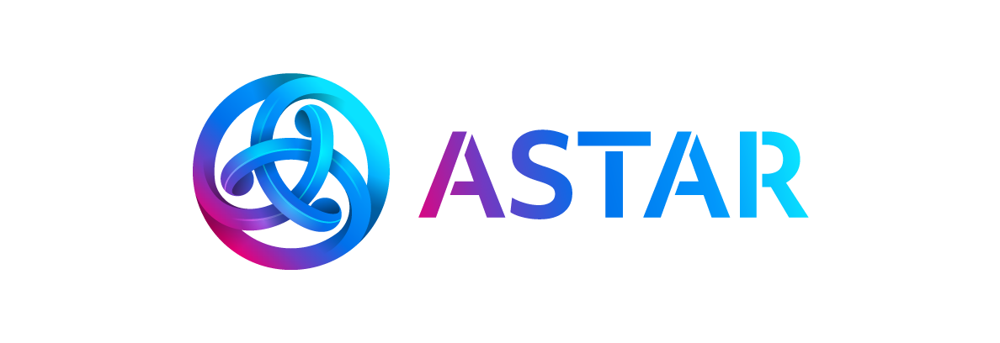
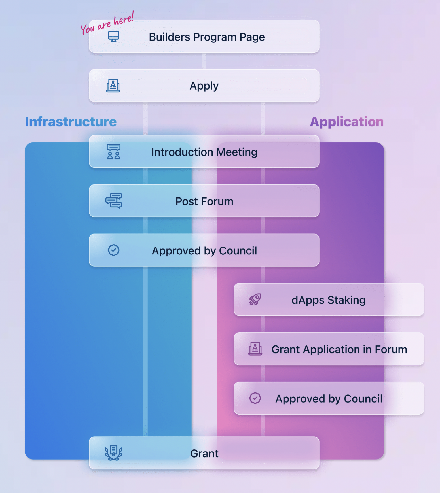

# Builders & Grants Program

## Introduction

The Astar / Shiden Network Builders Program was created to help further the development, growth, and adoption of our ecosystem by supporting teams who are building on it. The program is operated by Stake Technologies with guidance from Parity Technologies under the [Builders for Builders initiative](https://www.parity.io/substrate-builders-program-update-builders-for-builders/).

## Who and what are we looking for?

We are always focused on the community and on product development so we have designed the program in a similar fashion - we are interested in **high-quality teams** that are building **infrastructure/integrations to help our developers** and **applications that the community wants**. This can be broadly split into 2 different tracks, the infrastructure track, and the application track.

### Infrastructure Track

As the name suggests, the infrastructure track is an umbrella term to categorize all integrations or services that can help improve the adoption of the ecosystem. Some common examples include:

* developer tools \(libraries, pallets, debugging tools, ...\)
* infrastructure \(custodians, bridges, explorer, ...\)
* integration tools \(oracles, indexer, ...\)

### Application Track

The application track is geared primarily towards building dApps in the Astar ecosystem.

## Workflow

## Why should I apply for your Builders Program?

We understand that any talented teams will have no problems applying to other programs so aside from your typical financial support, we will also provide the following:

### Technical support

* In the onboarding phase, one of our devs will walk your team through how to develop and maintain applications on Astar / Shiden Network \(if required\).
* We will set up an exclusive discord group between your team and our devs for you to ask any questions.
* Ad-hoc meetings can be arranged with the core team to get help on more complex technical problems.
* We will also perform preliminary code reviews during your milestone submission.

### Network and Fundraising support

* We have access to a huge network of traditional/crypto investors, industry experts, blockchain mentors, exchanges, market makers etc. which we can link you up with to take your project to the next level.
* A very unique feature of the Astar / Shiden Network is dApps staking where developers can earn PLM / SDN tokens by developing and deploying applications. These tokens can act as supplementary income for your team. **The better the performance of your dApp \(determined by how many tokens are nominated to you\), the more tokens you will receive from each block.** Please take a look at this [forum post](https://forum.astar.network/t/faq-what-is-dapps-staking/1247) for a more detailed explanation.

### Marketing support

* We can help to promote your project on our various social media platforms like Twitter, Telegram etc.
* You will also be invited to our community meetups and conferences as a guest speaker to share more about your project and to grow your community.
* We are a big fan of cross-collaboration between projects in the ecosystem and will help to connect your team with other projects in the Builders Program to create something amazing.

### Post-graduation support

* It's hard to get into our Builders Program, even harder to graduate from it so if you made it through the entire process, congratulations! As a final gift from us, if you ever need help for your future projects, feel free to reach out to us and we will try our best to help you.

## Why build in the Astar ecosystem?

Aside from the Builders Program, there are 4 more compelling reasons why you would build on us instead of other smart contract enabled parachains.

1. X-VM \(cross virtual machine\) interoperability

   Contracts deployed on EVM and WASM are interoperable. In fact, through [XCMP](https://wiki.polkadot.network/docs/learn-crosschain/), we are also able to interact with other smart contracts on other parachains!

2. Full Ethereum compatibility

   We support all major Ethereum development tools like MetaMask, Remix, Truffle, Hardhat etc. so deploying contracts on Astar / Shiden is as simple as changing the RPC URL!

3. dApp staking

   As mentioned [previously](https://github.com/PlasmNetwork/builders-program/tree/update-with-new-workflow#network-and-fundraising-support), dApps staking is a unique feature of Astar / Shiden Network. There are no other parachains that naively support dApp developers!

4. Scalable from the get-go

   If your application requires a much higher throughput, you can easily take advantage of one of the layer 2 modules e.g. Plasma, OVM, or ZK rollups that we offer!

## How to apply?

* Fill in our application [form](https://share.hsforms.com/16d-UU2MuQtmKNeuH82-znwc2ryh)
* You will receive an email for an introduction meeting. The meeting is to introduce ourselves and explain more about the program.
* After your application is approved you will be informed of the next steps.

## FAQs

#### What is the Builders for Builders Program?

> Builders for Builders is a new initiative that aims to empower teams building Substrate-based parachains to develop and grow their own ecosystem of builders developing on top of their parachain. As part of the Builders for Builders initiative, the Substrate Builders Program team will share best practices gained from running the SBP for over a year now to help parachain teams build their own similar programs for teams building solutions on top of their parachain. These programs, called Parachain Builders Programs \(PBP\) will allow parachain teams to become mentors to others and develop their own thriving community of builders, enriching the Polkadot ecosystem as a whole.

Learn more from [here](https://www.parity.io/substrate-builders-program-update-builders-for-builders/)

#### When will the Builders Program commence and how long will it run for?

> The Builders Programs for both Astar Network and Shiden Network will go live soon after winning their respective parachain auctions i.e. Polkadot for Astar and Kusama for Shiden. We accept applications all year round.

#### What is the difference between Astar Network and Shiden Network?

> Shiden is to Astar what Kusama is to Polkadot. Shiden is our canary network.

#### Is this Builders Program for Astar Network or Shiden Network?

> The Builders Program is for both networks. Once we win the Kusama parachain auction, we will go live with Builders Program for Shiden Network. Subsequently, when we have acquired a slot on the Polkadot parachain, we will accept applications for Astar Network.

#### Are there any application fees?

> No.

#### What is the application process like?

> See the workflow.

#### How long will it take before I hear back from you?

> You should hear back from us within a few days of posting on the forum.

#### Who is on the Builders Program Committee?

> The Builders Program currently consists of 8 members, 4 from the Astar team and 4 ambassadors from our community. These 8 individuals will pull together their unique skillset and experiences to perform a comprehensive evaluation of your application. Note that if a consensus cannot be reached, the default behaviour is to reject the application.

#### What makes a good application?

> * A well thought out proposal.
> * Positive interaction on the forum with our community.
> * A technically capable team that is transparent and ambitious.
> * Your team has the community's best interest at heart.

#### Will grants be given out in the program?

> Yes. Prior to the commencement of any work, we \(you and the Builders Program committee\) have to come to an agreement as to:
>
> 1. how much will be disbursed upon delivering each milestone
> 2. the criteria that will be used to verify that the deliverables are correct
>
> There should be a detailed breakdown of this in your proposal.

#### How many grants can I apply for?

> There is no hardcap per se so you can request for any amount you want but please be reasonable and don't expect us to agree to a 1m USD proposal for minimal changes.

## Approved builders

* [Subscan](https://www.subscan.io/): Subscan plans to provide basic explorer customization services for Shiden Network, Dusty Network, and Astar \(prev-Plasm\) Network. [More information](https://forum.astar.network/t/subscan-explorer-application-proposal/1281)
* [OnFinality](https://onfinality.io/): OnFinality is proposing to run a geographically distributed public Shiden RPC API Service on our platform, allowing free community access. [More information](https://forum.astar.network/t/onfinality-builders-program-application-robust-reliable-public-infrastructure-for-the-shiden-network/1293)

