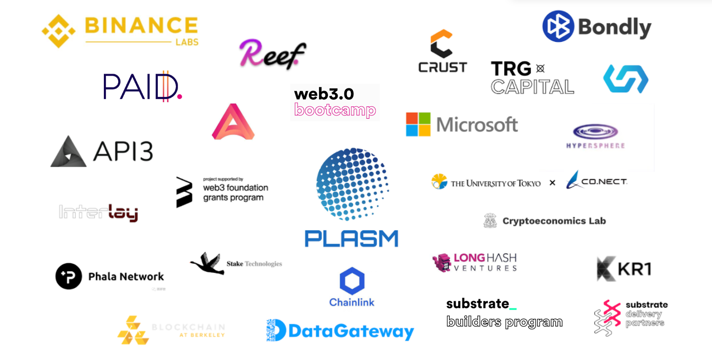

# Community

## Ecosystem Tool

### Acala Network

Acala is a strategic partner with Plasm Network offering a stable-coin platform built on Substrate.



### Subscan

Subscan is a Substrate-based blockchain explorer where you can search Plasm Network addresses and transactions.



## Ecosystem Program

Plasm Network is a participant of the **Substrate Builders Program**.



Plasm Network is a participant of the **UC Berkeley Blockchain Xcelerator.**



## Ecosystem and projects

An up-to-date list can be found on our forum:



