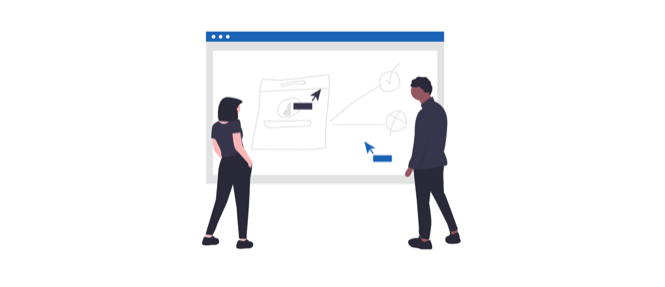

# Community

## Strumenti Ecosistema

### Acala Network

Acala è un partner strategico con Plasm Network, offrendo una piattaforma stable-coin sviluppata con Substrate.



### Subscan

Subscan è un blockchain explorer basato su Substrate, dove puoi cercare gli indirizzi e le transazioni di Plasm Network.



## Programmi Ecosistema

Plasm Network è uno dei partecipanti del **Substrate Builders Program**.



Plasm Network è uno dei partecipanti del **UC Berkeley Blockchain Xcelerator.**



