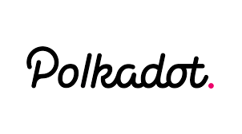
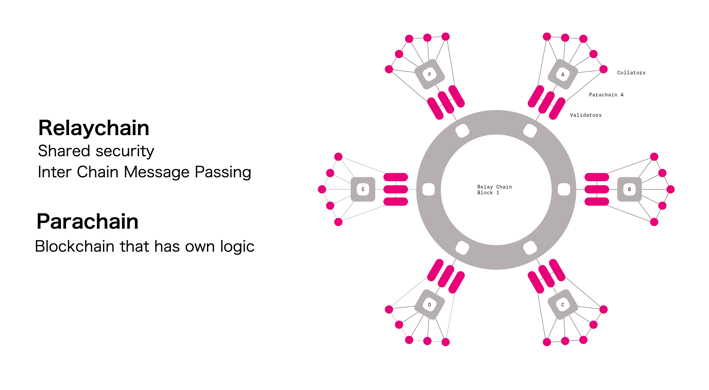
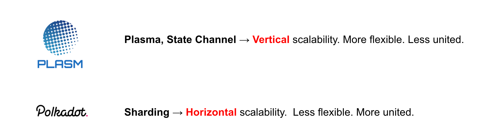
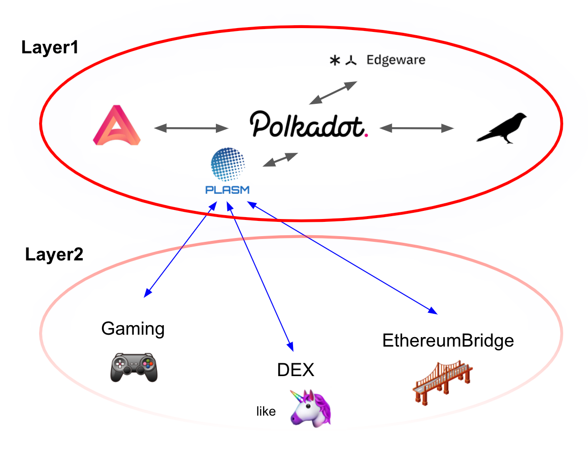

# Polkadot 🔴

[Polkadot](https://polkadot.network/) is a sharded protocol that enables blockchain networks to operate together seamlessly. It is an open-source project led by [Web3 Foundation](https://web3.foundation/). 

### Polkadot Basic

Polkadot mainly consists of two parts: Relaychain and Prachain. 

* **Relaychain:** The heart of Polkadot, responsible for the network’s security, consensus and cross-chain interoperability.
* **Parachain:** Sovereign blockchains that can have their own tokens and optimize their functionality for specific use cases. To connect to the Relay Chain, parachains can pay as they go or lease a slot for continuous connectivity.

\*\*\*\*[**Plasm Network**](https://www.plasmnet.io/) **aims to be the first SCALABLE smart contract Polkadot Parachain. \(**Plasm can be a Parachain since it is built on Parity Substrate\)



Through this architecture, Polkadot makes the following things possible. 

1. **By connecting Parachain to the Relaychain, the data and token can be transferable among Parachains seamlessly.**
2. **Parachain can import Relaychain's security.**

f you are interested in Polkadot, you can learn more from the following web pages.

* **Polkadot Lightpaper:** [https://polkadot.network/Polkadot-lightpaper.pdf](https://polkadot.network/Polkadot-lightpaper.pdf)
* **Polkadot web page:** [https://polkadot.network/](https://polkadot.network/)
* **Polkadot wiki:** [https://wiki.polkadot.network/](https://wiki.polkadot.network/)

##  Plasm Network and Polkadot

In this section, we will describe the roles of [Plasm Network ](https://www.plasmnet.io/)in the Polkadot ecosystem. [Plasm Network](https://www.plasmnet.io/) aims to be the first scalable smart contract Polkadot Parachain. 

### Smart Contract

The [Polkadot](https://polkadot.network/) Relaychain, by design, does not support smart contracts. This allows Plasm the opportunity to fill in this gap. Scalability is obviously one of the most crucial demands DApp developers have. Ideally, the developers can build whatever applications on Plasm Network without having to consider its scalability.

### Scalability

[Plasm Network](https://www.plasmnet.io/) is scalable because we are implementing layer2 solutions especially Optimistic Virtual Machine.



Scalability is one of the most crucial issues blockchain has. In order to make blockchain a social infrastructure, it needs high processing performance. Solving this scalability problem in the blockchain ecosystem is an urgent task for us.

When we say scalability, there are 2 types: 

* **Layer1 \(horizontal\) scalability:** The concept of layer1 scalability is to do more on layer1 blockchain. \(e.g. sharding and Segwit\)
* **Layer2 \(vertical\) scalability:** The concept of layer2 scalability is to do less on layer1 and to do more on layer2 or off-chain.  \(e.g. Plasma and State Channel\)

Polkadot has the layer1 scalability because it is a sharding ish architecture. [Plasm](https://www.plasmnet.io/) is also scalable because it has layer2 vertical scalabilities. 

Layer1 solution and layer2 solution is completely different and they complement each other. 

In addition to that, scalability is NOT just a benefit we can get through layer2 solutions. We can get the followings as well

* **First Finality**
* **Flexible DApps development**
* **Cheap transaction\(gas\) cost**

Trough layer1 smart contract and layer2 solutions, we are looking forward to seeing various use cases on [Plasm Network](https://www.plasmnet.io/). \(e.g. Gamin, IoT, Payment, DEX, and Bridge\) 

Any questions? Feel free  to ask us on [Discord Tech Channel](https://discord.gg/Z3nC9U4).

