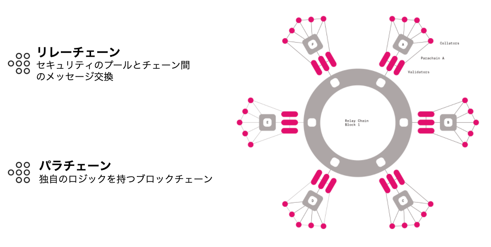
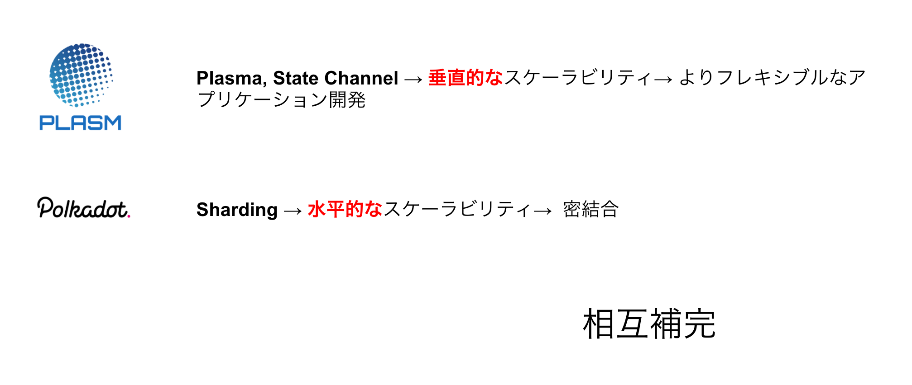
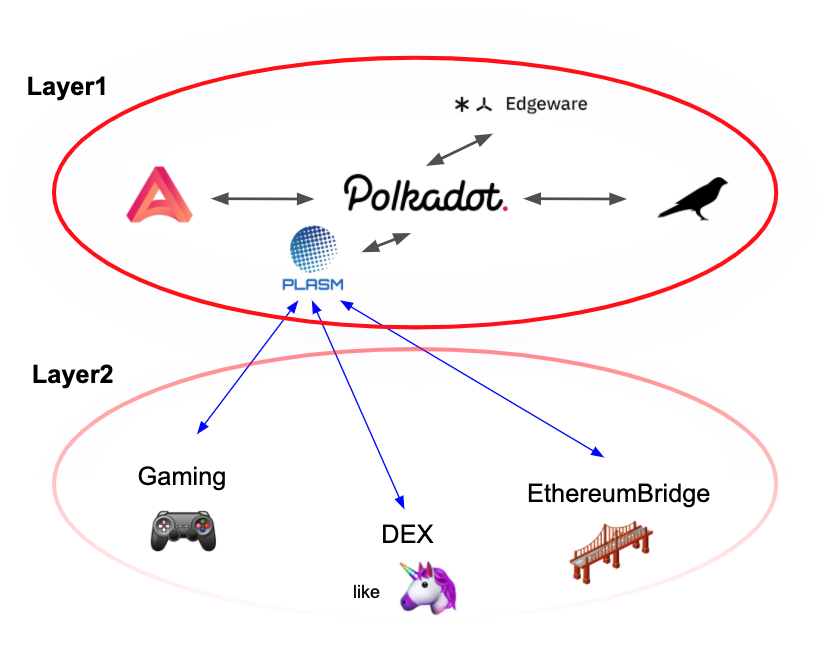

# Polkadotについて

​[Polkadot](https://polkadot.network/)とは[Ethereum](https://ethereum.org/ja/)の共同創業者兼CTOであるGavin Wood氏によって設立された[Web3 Foundation](https://web3.foundation/)の開発するパブリックブロックチェーンです。[Polkadot](https://polkadot.network/)に接続する異なるブロックチェーンとのインターオペラビリティ（相互運用性）を実現することができます。‌

### Polkadotベーシック‌ 

[Polkadot](https://polkadot.network/)は大きく2つの特徴を保有しています。‌

1. **Polkadotに接続する異なるブロックチェーンとインターオペラビリティを有すること**
2. **Polkadotに接続することで接続したブロックチェーンはPolkadotのセキュリティをインポートすることができること**

この2つの特徴を実現するために[Polkadot](https://polkadot.network/)は以下のアーキテクチャーを持っています。‌

**リレーチェーン**とは中心に位置する[Polkadot](https://polkadot.network/)の大本を成すブロックチェーンであり繋がっているブロックチェーン（**パラチェーン**）間でのデータorトークンのメッセージ交換、パラチェーンへのセキュリティのエクスポートを行います。また、**パラチェーン**‌とは独自のロジックを持つブロックチェーンであり、IoTや電力、金融など業界に特化したブロックチェーンやスケーラビリティ、秘匿化など性能に特化したブロックチェーンなどがあります。

Polkadotエコシステム [https://forum.web3.foundation/t/teams-building-on-polkadot/67](https://forum.web3.foundation/t/teams-building-on-polkadot/67)​‌

## PolkadotエコシステムにおけるPlasm Networkの立ち位置 

[Polkadot](https://polkadot.network/)と[Plasm Network](https://www.plasmnet.io/)は相互補助の関係性にあります。[Plasm Network](https://www.plasmnet.io/)が高いスケーラビリティーを持つことは 「Welcome」のセッションで述べましたが、これは**レイヤー2ソリューションがPlasm Network上に実装されているため**です。

一般的にブロックチェーンはその性質上スケールしません。しかし、ブロックチェーンが社会のインフラになるためには高い処理性能が必要であり、ブロックチェーンエコシステムにおいてこのスケーラビリティーの問題を解決することは急務となっています。

このスケーラビリティの解決策は大きく分けて2つあります。

* 1つは**レイヤー1でできることを増やそうというスケーリングソリューション**（これにはシャーディングやSegWitなどが含まれます。）
* もう1つは**レイヤー1でやることを減らして、レイヤー2（オフチェーン）でやることを増やそう**というスケーリングソリューションです。（これにはPlasmaやState Channelなどが含まれます。



[Polkadot](https://polkadot.network/)はParachainごとにアプリケーションを実装するといった点でシャーディングのようなレイヤー1スケーリングソリューション**（水平的なスケーリング）**です。一方で[Plasm Network](https://www.plasmnet.io/)はレイヤー2のスケーリングソリューション**（垂直的なスケーリング）**を有しており、この2つのソリューションが相互補完することでより柔軟な開発ができるようになります。

また、**Polkadotリレーチェーン自体はスマート・コントラクトを意図的にサポートしていません。故に、アプリケーション/スマート・コントラクト開発者はPolkadotに接続されているパラチェーン上でアプリケーションを作成する必要があります。**その際に高いスケーラビリティを有するということは比較優位であり開発者が[Plasm Network](https://www.plasmnet.io/)を選ぶ大きな理由の1つになります。

[Plasm Network](https://www.plasmnet.io/)に従来のレイヤー1のスマートコントラクト及び、レイヤー2ソリューションを通して、様々なアプリケーションが構築されることを楽しみにしています。

質問があれば、[Tech Chat](https://discord.gg/Cyjnrxv)の日本語チャネルでご質問ください。

