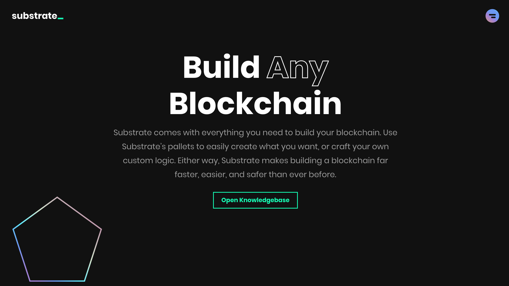

# Substrateについて 📣

[Substrate](https://www.substrate.io/)はParity Technologies社によって開発されるブロックチェーン開発のフレームワークです。（やや強引ですが、ホームページを作るためのワードプレスと置き換えるとイメージしやすくなるかもしれません。）[Substrate](https://www.substrate.io/)を用いることで、低レイヤーのアルゴリズムやネットワーク、ストレージなどを意識せずにブロックチェーンを作成することができます。

開発を行っているParity Technologiesによれば、**「Substrateは拡張性を最大限に高め、複雑さを最小限にしたブロックチェーン開発フレームワーク」**と言われています。

### Substrateの魅力的なポイント

* コンセンサスアルゴリズムなどのロジックを変更しても**ハードフォーク**が起こらない
* カスタマイズが可能でありユースケースに合わせてブロックチェーンを作成できる
* パブリックブロックチェーンも、コンソーシアム、プライベートチェーンも作成可能であり、セキュリティレベルが選択できる
* Lightクライアントを想定しており、モバイルやIoTと相性が良い
* Polkadotとデフォルトで接続可能

などがあります。

### 参考リンク





