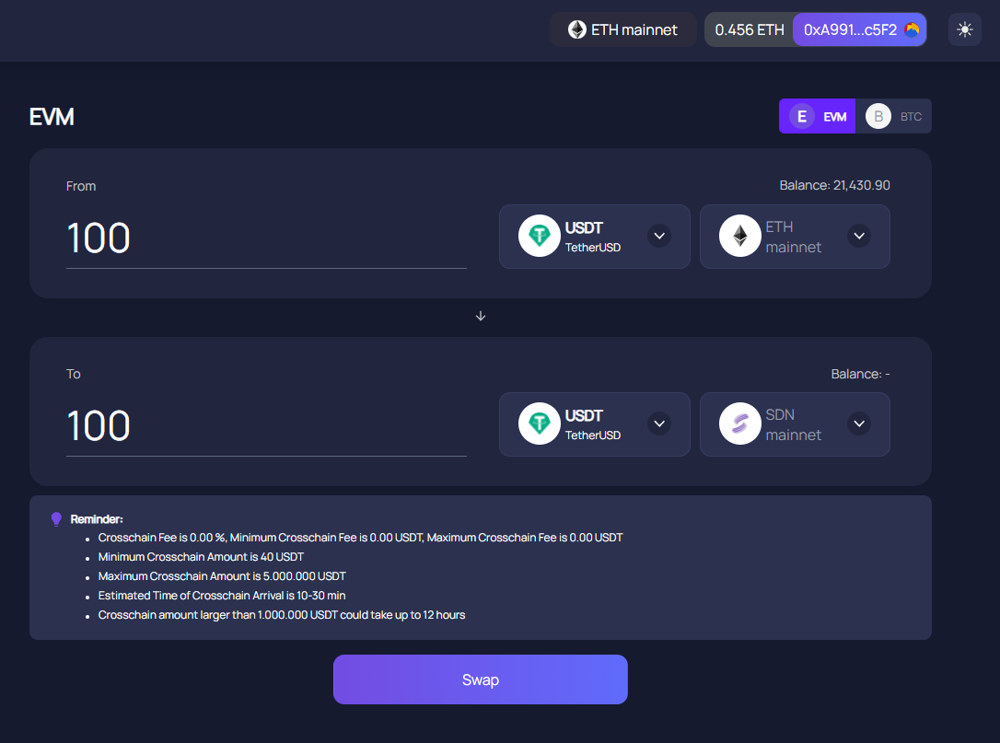
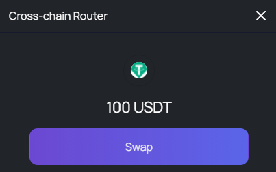
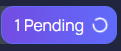
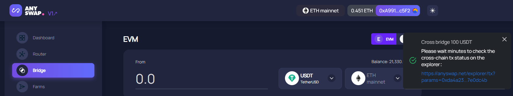

# Anyswap Bridge

## Overview

A guide on how to transfer assets from Ethereum & Binance to the Shiden ecosystem. Make sure you have SDN to pay for the fees before bridging. You can buy SDN on exchanges.


SDN market overview


## Contracts

`USDC: 0xfa9343c3897324496a05fc75abed6bac29f8a40f`

`USDT:`[0xefaeee334f0fd1712f9a8cc375f427d9cdd40d73](https://astar.subscan.io/account/0xefaeee334f0fd1712f9a8cc375f427d9cdd40d73)

`ETH: 0x765277eebeca2e31912c9946eae1021199b39c61`

`WBTC: 0x818ec0a7fe18ff94269904fced6ae3dae6d6dc0b`

`BNB： 0x332730a4f6e03d9c55829435f10360e13cfa41ff`

`BUSD: 0x65e66a61d0a8f1e686c2d6083ad611a10d84d97a`

More contracts will be added in the future. If you want to list your token in the bridge, please check out our announcement on how to contact Anyswap.

## How to bridge

In this tutorial I will show you how to bridge USDT from Ethereum to Shiden. By doing so, you will add liquidity to our network. We can't thank you enough for helping us.


**Reminder:**&#x20;

* Crosschain fee is 0.00 %, minimum crosschain Fee is 0.00 USDT, maximum crosschain fee is 0.00 USDT
* Minimum crosschain amount is 40 USDT
* Maximum crosschain amount is 5.000.000 USDT
* &#x20;Estimated time of crosschain arrival is 10-30 min&#x20;
* Crosschain amount larger than 1.000.000 USDT could take up to 12 hours


### Step 1

Go to the following website: [https://anyswap.exchange/#/bridge](https://anyswap.exchange/#/bridge) and connect to your MetaMask. Select the Ethereum network.

We will transfer USDT on ETH (mainnet) -> USDT on SDN (mainnet).

### Step 2

Click on '**Swap**' to start with the transfer. You will receive a popup where you again need to click on '**Swap**', MetaMask will open for you to sign the transaction.

### Step 3

In your top-right corner, you will see that your transaction is pending. This can take up to 15-30 minutes.&#x20;

### Step 4

Add the token contract in your MetaMask. Click below in the screen of MetaMask on '**import tokens**', add the contract you find above in this tutorial and that's it.&#x20;

## Support

In case you have any problems. Join our community and our Ambassadors will support you. Please remember that we will never DM you first! If you get approached by someone pretending to be part of the team, do not trust them.
