# Metamask Support

Substrate does not allow the users to sign custom transactions with arbitrary data using Metamask or any other Ethereum wallet to use the standard API calls. For example, JSON-RPC API defines the `eth_sign` call which is used for signing arbitrary data. However, this call requires a standard [prefix](https://web3js.readthedocs.io/en/v1.2.11/web3-eth-personal.html#sign) to all data by `\0x19Ethereum Signed Message` due to security concerns. This is done to prevent users from unknowingly sign transactions, and by design, it is impossible to sign binary data, like Substrate Extrinsic.

### Custom signatures pallet

To mitigate the limitations in `eth_sign`, we created the [Custom Signatures pallet](https://github.com/PlasmNetwork/Plasm/tree/08c4a9211836b929abcbad4ed33ede0f616a6423/frame/custom-signatures). The main idea is to move the transaction signature validation out of the Substrate core and provide a custom signature method for runtime developers. Because the signature is expected to be prefixed, this call can be used with the `personal_sign` method as well, which is recommended by the Ethereum community.

```rust
impl pallet_custom_signatures::Trait for Runtime {
    type Event = Event;
    type Call = Call;
    type Signature = EthereumSignature;
    type Signer = <Signature as Verify>::Signer;
    type UnsignedPriority = EcdsaUnsignedPriority;
}
```

Here, the developer will have to define the implementation for the [EthereumSignature signing method](https://github.com/PlasmNetwork/Plasm/blob/08c4a9211836b929abcbad4ed33ede0f616a6423/frame/custom-signatures/src/ethereum.rs#L42), prefixed by `Ethereum Signed Message` string. Using this pallet the users can send unsigned transactions with a dedicated parameter - signature, generated by any Ethereum-compatible wallet. The chain will check if the sender account \(that is included in the method parameter\) has the correct assets to execute this call or not and send it accordingly.

### User interface application

The Plasm team extends standard PolkadotJS Apps by adding a custom signature transaction page. The Custom Signature page allows the user to submit a transaction that was signed with an Ethereum private key and use it as a native ECDSA account in Substrate. Plus, you are able to use MetaMask for signature requests, which allows users to use their Ethereum address inside Ledger and Trezor to create a transaction. This page will look for any `window.ethereum` object being injected by a dApp browser extension \(ex: MetaMask\) and send a signature request to the extension which can be confirmed by the user. Because this is a light-weight zero-dependency implementation of MetaMask, we kept the ECDSA account data only available within the Custom Signature page. This can be improved to add global support for Web3js injected accounts if required.

### Usage: Ledger

**Step 1:**

To start, connect your Ledger hardware wallet to your PC and go to the Ethereum app from the dashboard.


**Step 2:**

Once you have connected your device and it's running the Ethereum app, you can now open MetaMask to import your account. You can import by opening the account list menu and clicking on the 'Import Account' button.

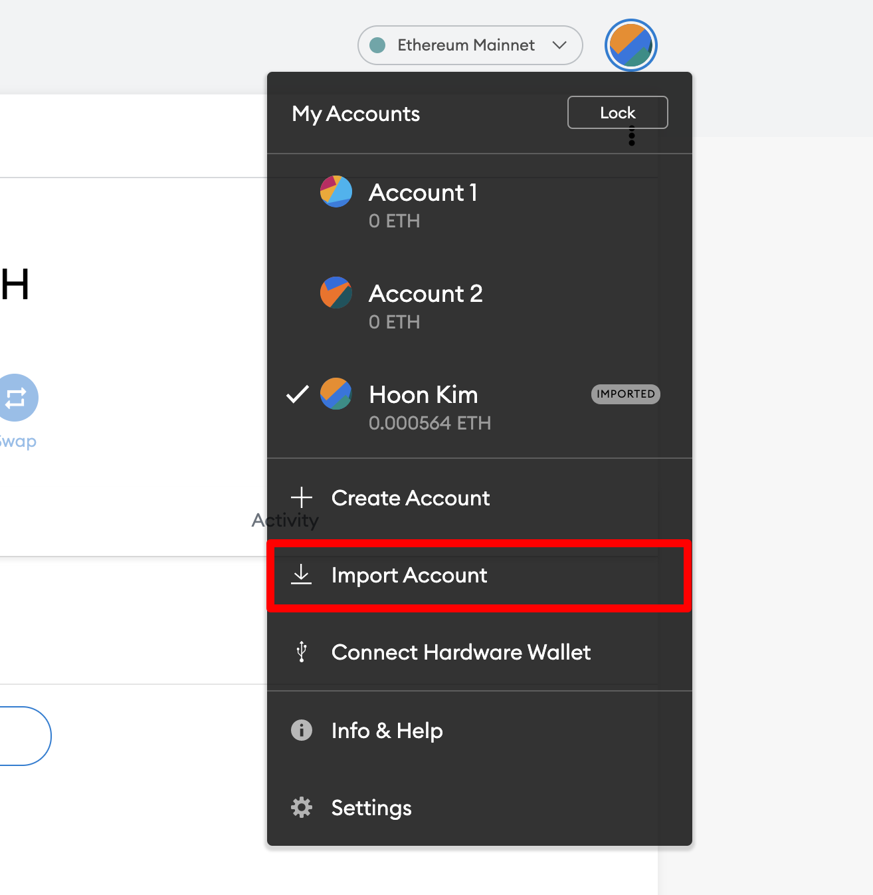

Choose Ledger to read your accounts from your connected Ledger device.

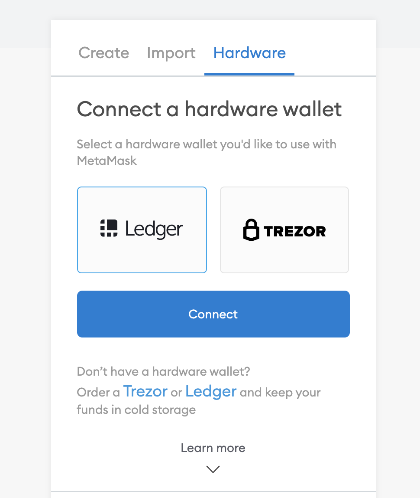

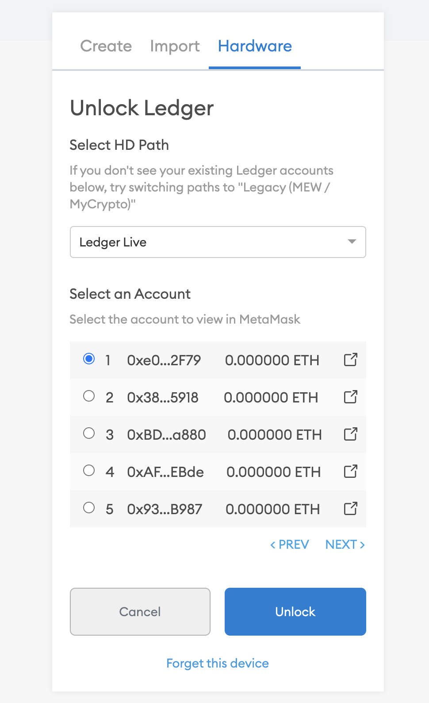

**Step 3:**

If you have successfully imported your Ledger accounts to MetaMask, please visit the official Polkadot/Substrate Portal and navigate to the "Custom Signature" page, which is under the "Accounts" tab.

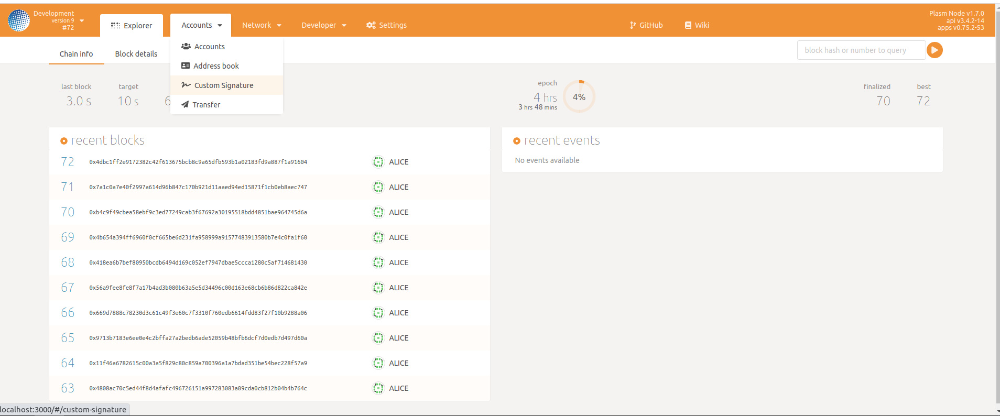

You will be presented with a 'Load account from MetaMask' button if you haven't loaded your account.

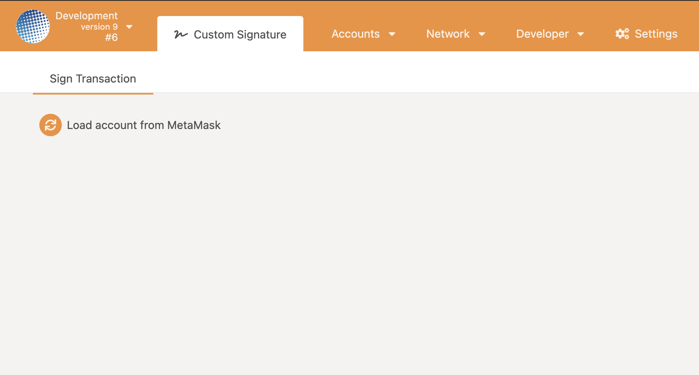

Before clicking the button, make sure that you're MetaMask is connected with the browser, and it's the main account that the app can read from.

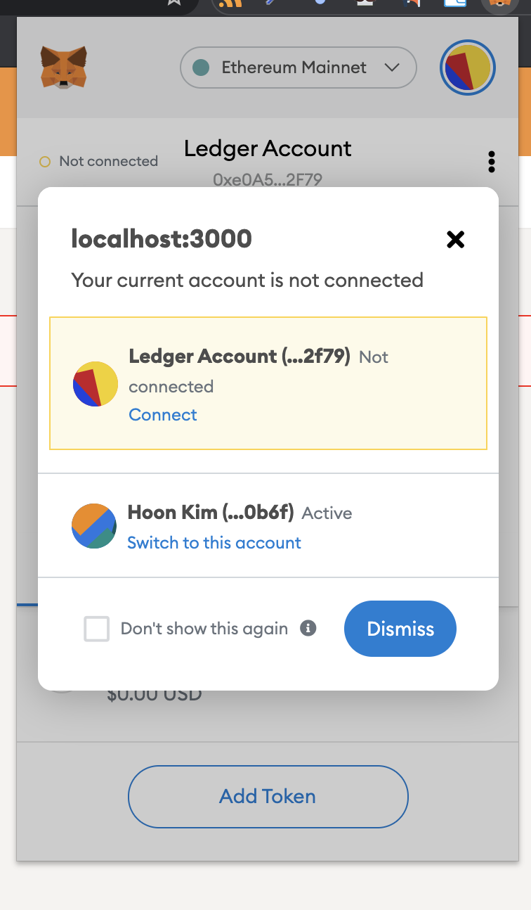

**Step 4:**

After confirming your main account, click the 'Load account from MetaMask' button to send a 'request account' and 'personal sign' request to your Ethereum account. This allows the page to recover your public key and encode that to a Substrate-compatible ECDSA SS58 address.

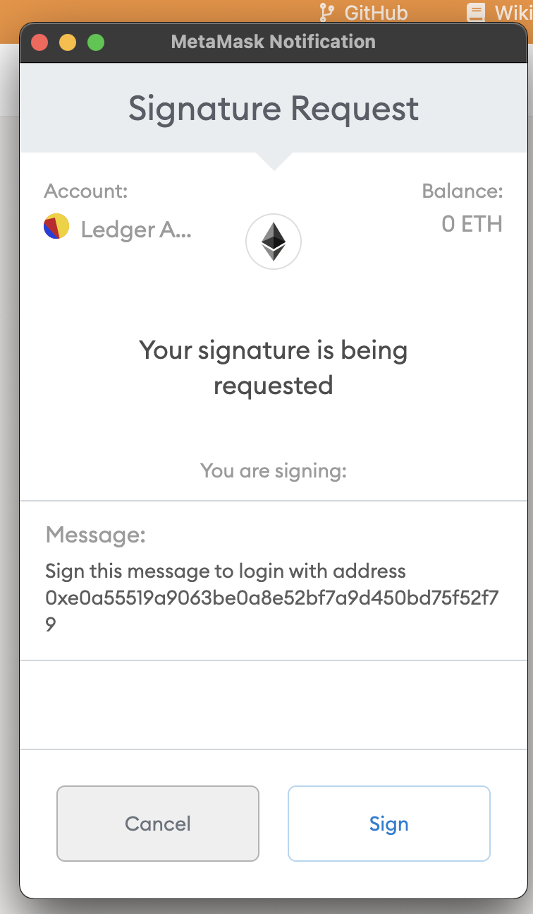


Note: After MetaMask asks to sign this message, you will receive another signature request from your Ledger device. You must confirm both of them to sign the message



**Step 5:**

If everything went well and you have correctly signed the message, the Custom Signature page will change to display your SS58 address on top with an extrinsic input form on the bottom half.

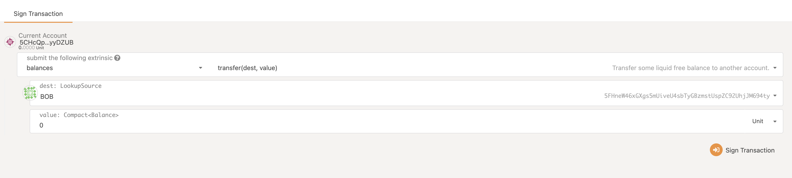

Provide the call method you wish to submit to the chain and click the 'Sign Transaction' button on the bottom right corner. Clicking this will show a prompt from MetaMask to sign this message. Similar to the login function, you must confirm the sign from both MetaMask and Ledger.

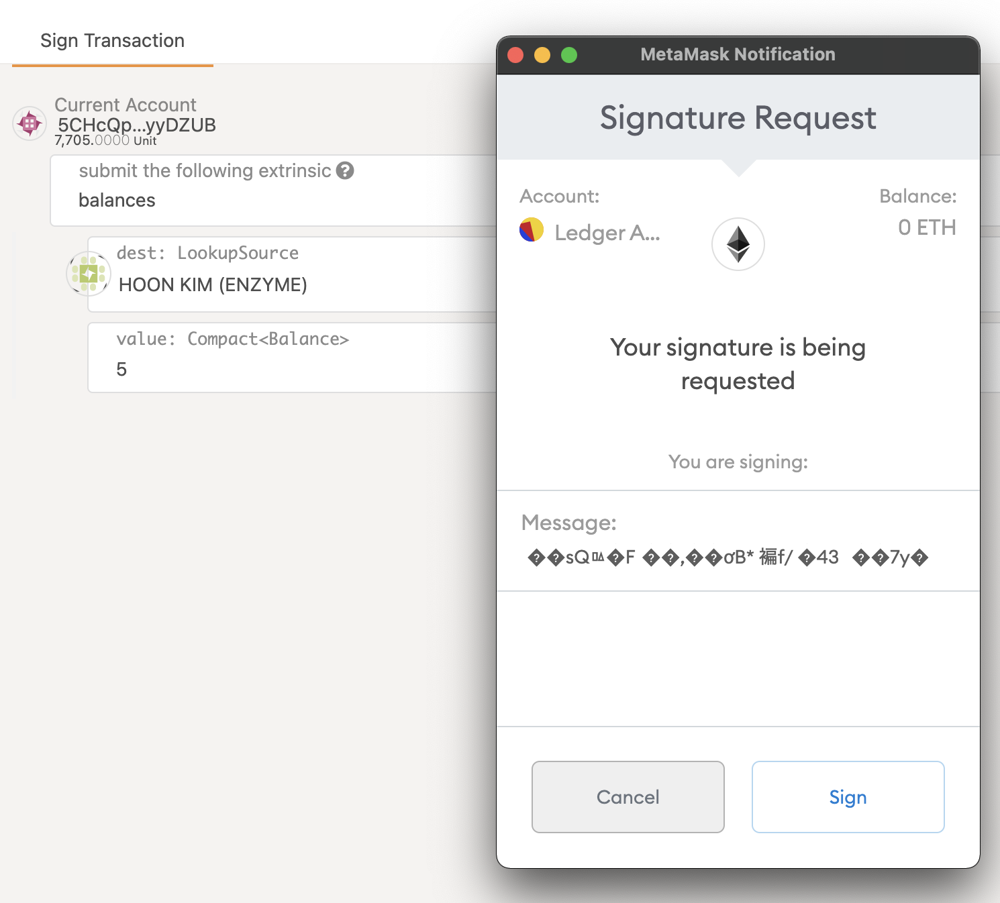


**Step 6:**

Once you confirm the transaction signature, there will be a modal popup that asks you to confirm the transaction.  Click the 'Send Transaction' button to send a request.

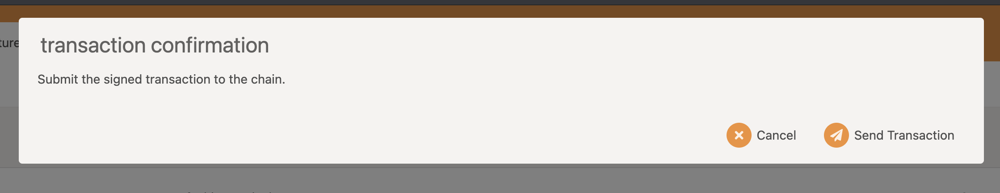

After you confirm the transaction, there will be another modal that will ask you to submit an unsigned transaction to the network. Click the 'Submit \(no signature\)' button to confirm. This will request the network to execute the call with the loaded Ethereum account as the sender.

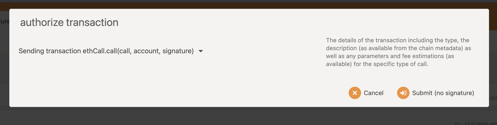


You may notice that we have three different confirmation modals to submit this transaction; Ethereum signature confirmation, transaction confirmation, and authorize transaction modal.

The first confirmation is required to obtain the signature from MetaMask, and the second confirmation is used to build the `ethCall.call` method arguments which will be sent to the network. The final confirmation modal is the default behavior for submitting transactions within the Polkadot/Substrate Portal.


**Ending:**

After a few seconds, your transaction should have been completed. You can confirm this by looking at the event history for the event `ethCall.Executed` with the event emitted by the call you requested.

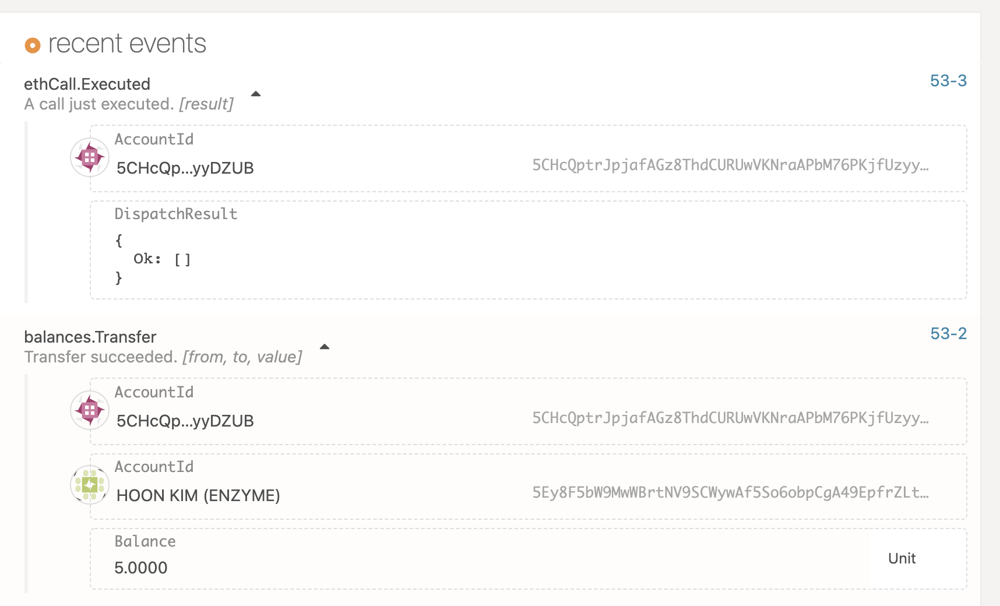


