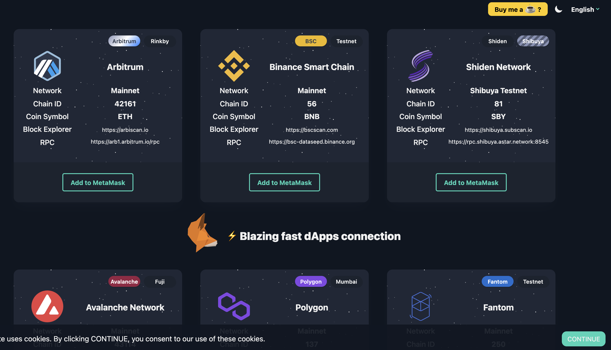

# Adding Networks

Roy Kure, an ecosystem software engineer created Web3 Gateway that allows developers to add Astar, Shiden, and Shibuya networks to your Metamask within a click.



Choose Shiden or Shibuya and click "Add to Metamask"

All credit goes to Roy Kure.

