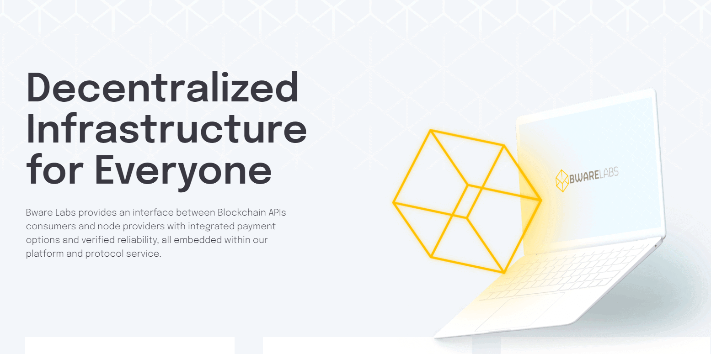

# Bware Labs

## Overview

The goal of Bware Labs is to build a decentralized platform where full node owners and endpoint users such as developers and organizations can collaborate in a secure and trustful manner.

As a user of Bware Labs, you will be able to obtain endpoints, allowing you to interact with multiple blockchain networks, from the MVP release of their Decentralized Blockchain API platform. Endpoints for Dusty, Shiden, and Astar can be obtained just by performing a few simple clicks within a user-friendly interface. You will be required to connect your Metamask wallet to log in and will be asked to sign every operation via the same wallet.

The Bware Labs Decentralized Blockchain API platform can be accessed at app.bwarelabs.com

Bware Labs is a new startup founded to address what they see as a gap in the current interactions between DeFi platforms, exchanges, and wallet providers. On the one hand, the currently available commercial solutions to obtain an endpoint are costly and centralized. On the other hand, the option of creating and maintaining your virtual machine is technically challenging and time-consuming.

Therefore, Bware Labs wants to provide a solution for bringing together node providers and end-users in a decentralized, user-friendly platform. This brings about new opportunities for dApps developers, wallet providers, centralized and decentralized exchanges, and even business intelligence for blockchain organizations and analytics companies building in the Astar ecosystem.

Bware Labs has an extensive record of deploying and maintaining validators on different ecosystems. Besides having this record, they also have a lot of blockchain experience and are a perfect match for our first phase of Collators on Shiden Network.

Developers who want to use end-points for their dApps can rely on the services of Bware Labs. You can find excellent tutorials in their extended documentation.





## Instructions

### Step 1

Launch their app on:



### Step 2

Connect to your MetaMask. This is to prevent users from spamming the network. You only need to connect to create an account in their app.

 (1) (1) (1) (1) (1).png>)

### **Step 3**

Now you can create your API endpoint. Click on **'API Endpoints**' and select Shiden Network.

 (1) (1).png>)

Name your endpoint and choose the correct network. Shiden Mainnet on Kusama or our one for our testnet Shibuya. Sign the message and wait for your endpoint to be created.

 (1) (1) (1) (1) (1).png>)

### Step 4

After your endpoint is created, you can use the RPC Endpoint to connect to Shiden Network through MetaMask or the WSS Endpoint to be used for other applications. Those endpoints are only for you to be used.

How to add your endpoint to MetaMask:

1. Open MetaMask
2. Click on Custom RPC
3. Add all the information
