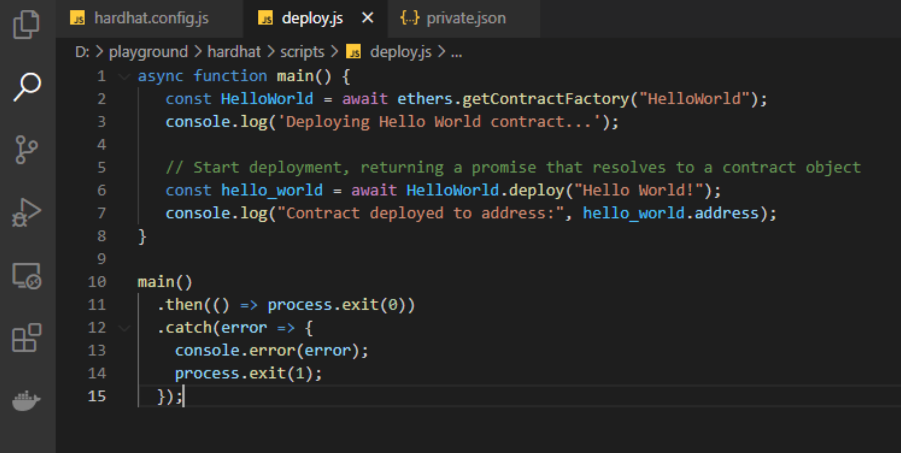

# Using Hardhat


## **What’s** [**Hardhat**](https://hardhat.org/)**?**

> Hardhat is a development environment to compile, deploy, test, and debug your dApps. It helps developers manage and automate the recurring tasks that are inherent to the process of building smart contracts and dApps, as well as easily introducing more functionality around this workflow. This means compiling, running, and testing smart contracts at the very core.
>
> Hardhat comes built-in with Hardhat Network, a local Ethereum network designed for development. It functionality focuses around Solidity debugging, featuring stack traces, console.log\(\), and explicit error messages when transactions fail.   
>   
> __Learn more from [here](https://hardhat.org/).

Hardhat can directly interact with Plasm ecosystem Ethereum API so it can be used to deploy smart contracts into our ecosystem.  
****

## **Hardhat vs Truffle**

Hardhat and Truffle are both development environments for building on Ethereum and have similar functionality so it's totally up to you to decide which you want to use. Hardhat is the newer kid on the block and tends to be a bit cleaner/easier to use, they also have lots of plugins to make it more customizable. 

## **Follow Along**

**follow along the tutorial by typing everything out or clone our repo** [**here**](https://github.com/PlasmNetwork/Hardhat-tutorial/tree/main) **and view the demo below!**



## **Installation**

We need to install Node.js and npm package manager. You can download directly from [Node.js](https://nodejs.org/en/download/) or in your terminal. You can verify that everything is installed correctly by querying the version for each package:

```text
node -v
npm -v
```

Make sure you have MetaMask ready:

* Have MetaMask installed and [connected to Dusty](https://docs.plasmnet.io/build/smart-contracts/ethereum-virtual-machine/ethereum-contract-on-dusty-network)
* Make sure that your account has PLD \(test tokens\)

## **Quick Start**

To start a new project, create a directory for it and change to that directory:

```text
mkdir test && cd test
```

Initialize the project by running:

```text
npm init -y
```

You will notice a newly created package.json, which will continue to grow as you install project dependencies.


To get started with Hardhat, you have to install it in our newly created project directory:

```text
npm install hardhat
npx hardhat //create your Hardhat project
```

Then, you will see


After running the command, choose: _`Create an empty hardhat.config.js`_. Now, let’s configure the file.

## **Hardhat configuration file**

We need to modify our Hardhat configuration file so we can compile and deploy contracts into the Plasm ecosystem.

If you have not yet done so, connect your MetaMask Account to our ecosystem. We will use the private key of the account created to deploy the contract. If you don’t know the private key, you can export it from MetaMask.


First, we need to install the [ethers plugin](https://hardhat.org/plugins/nomiclabs-hardhat-ethers.html), this allows you to interact with the blockchain in a simple way. We can install ethers plugin by running:

```text
npm install @nomiclabs/hardhat-ethers ethers
```


**Alert: Never save or commit your private keys inside your repositories. Be careful!**


 Then, please open the `hardhat.config.js` file to assign the Solidity version and RPC server. In my case I use Visual Studio Code.

**RPC server Dusty:**  
Network Name: Dusty  
New RPC URL: https://rpc.dusty.plasmnet.io:8545  
Chain ID: 80  
Currency Symbol: PLD  
  
**Localhost:**  
Network name: Dusty Local  
New RPC URL: http://localhost:9933  
Chain ID: 80  
Currency Symbol: PLD  
  
**Developer account \(private key\):** 0x60ed0dd24087f00faea4e2b556c74ebfa2f0e705f8169733b01530ce4c619883


Next, let's create a `private.json`, where we store the private key. Never reveal your private key. The private.json looks like this:

```text
{
    "privateKey": "YOUR-PRIVATE-KEY-HERE"
}
```


## **Smart Contract Example**

We will create a simple ‘Hello World’ smart contract in this introduction. We will store our contract in the contracts directory. 

```text
mkdir contracts && cd contracts
```

Navigate to the “contracts” folder and create a new file called `HelloWorld.sol`

Below is a sample Hello World smart contract from the[ Ethereum Foundation](https://ethereum.org/en/) that we will be using for this tutorial. Copy and paste the contents below into your `HelloWorld.sol`file, and be sure to read the comments to understand what this contract does:


This is a super simple smart contract that stores a message upon creation and can be updated by calling the update function.

## **Compiling Solidity**

Our contract, `HelloWorld.sol`, uses Solidity 0.8.1. Make sure the Hardhat configuration file \(`hardhat.config.js`\) is correctly set up with this solidity version. When everything meets the criteria, we can compile the contract by running:

```text
npx hardhat compile
```

If you don’t have the correct compiler installed, Hardhat will install this for you before compiling the contract. When the contract is compiled your directory will look like this:


## **Deploy Your Contract**

Now that our contract is written and our configuration file is good to go, it’s time to write our contract deploy script.

Create a scripts folder and navigate to the folder.

```text
mkdir scripts && cd scripts
```

Create a new file called `deploy.js` , adding the following contents to it:



Hardhat does an amazing job of explaining what each of these lines of code does in their[ Contracts tutorial](https://hardhat.org/tutorial/testing-contracts.html#writing-tests), we’ve adopted their explanations here.

```text
const HelloWorld = await ethers.getContractFactory("HelloWorld");
```

A `ContractFactory` in `ethers.js` is an abstraction used to deploy new smart contracts, so HelloWorld here is a factory for instances of our `hello world` contract. When using the `hardhat-ethers` plugin ContractFactory and Contract instances are connected to the first signer by default.

```text
const hello_world = await HelloWorld.deploy();
```

Calling `deploy( )`on a `ContractFactory` will start the deployment, and return a `Promise` that resolves to a `Contract`. This is the object that has a method for each of our smart contract functions.

We can now deploy the `HelloWorld` contract to Dusty:

```text
npx hardhat run --network dusty scripts/deploy.js
```


The RPC connection can be unstable, so if it doesn't connect try deploying to a local node. Replace `dusty` with `local` and  set the `url` field to [http://localhost:9933](http://localhost:9933) in `hardhat.config.js.`

Then [install the plasm node](https://github.com/PlasmNetwork/Plasm#building-from-source) if you haven't already and run with `plasm`


\`\`

After a few seconds, the contract is deployed, and you should see the address in the terminal.


Congratulations, your contract is live on Dusty! Visit our example page to see how we deploy an asset with Hardhat and interact with this contract.  


