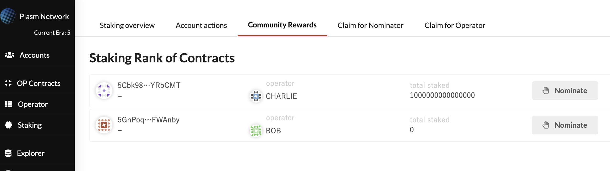

# Community Rewards

The idea behind Community Rewards is to provide incentives with community members who contribute to the Plasm Network early on. We make it happen by using the staking mechanism. In this mechanism, the early adopters can get rewards.

### Overview

The structure of Community Rewards is very simple.

1. A community member creates a simple smart contract and deploys it on Plasm Network.
2. PLM \(Testnet: PLD\) holder evaluates her performance and stakes his tokens on the smart contract.
3. Both of them get rewards based on her performance.

Let's take a look at one by one.

### How to deploy your contract

First, community members need to deploy a simple contract. The way how to deploy the contract is described on the following page. 



After deploying the smart contract, you can check it in the Community Rewards section below.

### How to nominate your contract

The next step is staking. You can stake on a smart contract as usual. The details are described on the following page.



In addition to that, you can check the community rewards page in the Staking section where you can check the status of staking volume and the ranking.

[https://dusty.plasmnet.io](https://dusty.plasmnet.io/#/accounts)

### How to get rewards

PLM holders stake their tokens on your smart contract. By doing so, the nominator and the smart contract creator get a reward.

See the link below for more information.



