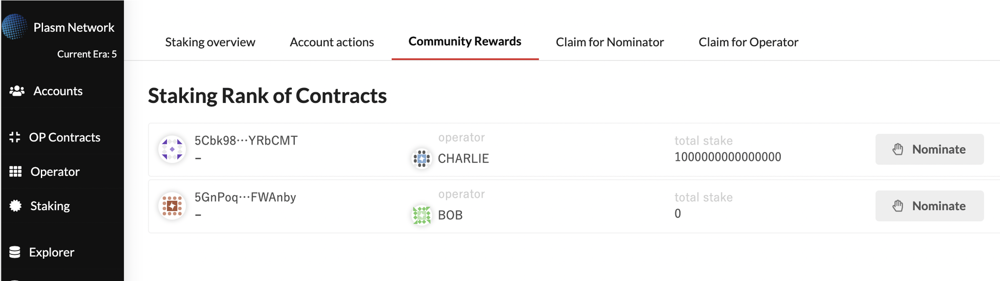

# Community Rewards

The idea behind Community Rewards is to provide incentives with community members who contribute to the Plasm Network early on. We make it happen by using the staking mechanism. In this mechanism, the early adopters can get rewards.

### Overview

The structure of Community Rewards is very simple.

1. A community member creates a simple smart contract and deploys it on Plasm Network.
2. PLM \(Testnet: PLD\) holder evaluates her performance and stakes his tokens on the smart contract.
3. Both of them get rewards based on her performance.

Let's take a look at one by one.

### How to deploy your contract

First, community members need to deploy a simple contract. The way how to deploy the contract is described on the following page. 



After deploying the smart contract, you can check it in the Community Rewards section below.

### How to nominate your contract

The next step is staking. You can stake on a smart contract as usual. The details are described on the following page.



In addition to that, you can check the community rewards page in the Staking section where you can check the status of staking volume and the ranking.

[https://dusty.plasmnet.io](https://dusty.plasmnet.io/#/accounts)

### How to get rewards

PLM holders stake their tokens on your smart contract. By doing so, the nominator and the smart contract creator get a reward.

See the link below for more information.



Next, we are going to learn some formulas to calculate the rewards.


This content includes math. You can skip this section below if you are not good at math. 


### Rewards Calculation

The target infration rate of the maximum token supply is $$I ≤ I_0 = 2.5%$$per a year. $$I_0$$ is the minimum token supply that should be paid to the block validators to ensure a sufficient number of validators \(We assume the sufficient number of validators is 100\). Validator compensation per each Era is strictly defined as the following. 

First, we define the meaning of each variable.

* $$TotalForSecurityRewards$$ is the total amount of compensation paid for the validator.
* $$TotalForDAppsRewards$$ is the total amount of compensation paid for the dApps. 
* $$TotalAmountOfIssue$$ is the total number of PLM tokens issued by Plasm Network. 
* $$I_0$$ ****is the minimum token supply that should be paid to the validators to ensure a sufficient number of nodes. 
* $$EraDuration$$ is the length of the duration of each Era. 
* $$NumberOfValidators$$ _****_is the actual number of validators in the Network.
*  $$TargetsNumber$$ is 100 that is the sufficient number of validators on Plasm Network.

If $$TargetsNumber$$&lt; $$NumberOfValidators$$:

$$
TotalForSecurityRewards = TotalAmoutOfIssue \times I_0\% \times \frac{EraDuration}{1 year}
$$

Otherwise:

$$
TotalForSecurityRewards = TotalAmoutOfIssue \times I_0\% \times \frac{EraDuration}{1 year}
$$

On Community Rewards, the amount of tokens allocated to the dApps is equal to the total amount of tokens allocated to the validator. 

$$
TotalForDappsRewards = TotalForSecurityRewards
$$

And the $$TotalForDAppsRewards$$ is distributed equally to operators and nominators. $$RewardsForOperators$$ is the total amount of rewards assigned for operators. $$RewardsForNominators$$ is the total amount of rewards assigned for nominators.

$$
RewardsForOperators = RewardsForNominators = \frac{TotalForDAppsRewards}{2}
$$

The reward for each operator is given by the following formula, where $$RewardForOperators_{i}$$ is the reward for the $$i$$-th operator and $$C_{operator_i}$$is the set of contracts deployed by the $$i$$-th operator. $$TotalStake$$ represents the total amount of stake and $$Stake_{contract_j}$$ represents the amount of stake in $$contract_j$$.

$$
RewardForOperators_{i} = \sum_{contract_j\ \in 
\ C_{operator_i}} \frac{Stake_{contract_j}}{TotalStake} \times RewardsForOperators
$$

Calculating compensation for a nominator is a bit more complicated: a nominator can only get paid on contracts that are staked 3% or more of the $$TotalStake$$. This is to prevent rampant nominating of themselves. In the following equation, let $$WeightedStake_i$$ be the sum of $$i$$-th nominator's stake amount that is weighted specifically for Community Rewards, and $$C_{nominator_i}$$ be the set of contracts nominated by the $$nominator_i$$. $$RewardForNominators_i$$ is the reward for the ith nominator. We'll get into the details of function $$f$$ in a moment.

$$
threshold = TotalStake \times \frac{3}{100}
$$

$$
WeightedStake_{i} = \sum_{contract_j\ \in \ C_{nominator_i}} \left\{ \array{f(contract_j) & threshold \leq Stake_{contract_j} \cr 0 & otherwize} \right.
$$

$$
RewardForNominators_i = \frac{WeightedStake_i}{TotalStake} \times RewardsForNominators
$$

The formula for the compensation received is expressed as $$f$$. This means that the more you nominate a contract with a small amount of stake, the more reward you get. This is expected to disperse the contract to be nominated.

$$
f(contract_j) = 0.197 \times -log_{2}(\frac{Stake_{contract_j}}{TotalStake})  \times Stake_{nominator_i}
$$

The magic number, 0.197, is used to make the coefficient close to 1 when $$\frac{Stake_{contract_j}}{TotalStake}$$ is 3% \(the smallest allowable fraction\).

$$
0.197 \times -log_{2}(\frac{3}{100}) = 0.996602... \simeq 1
$$

